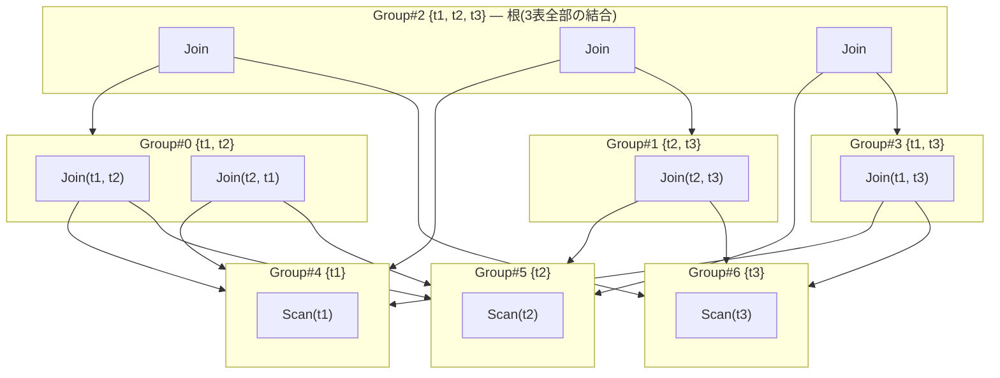
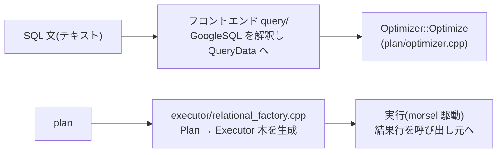
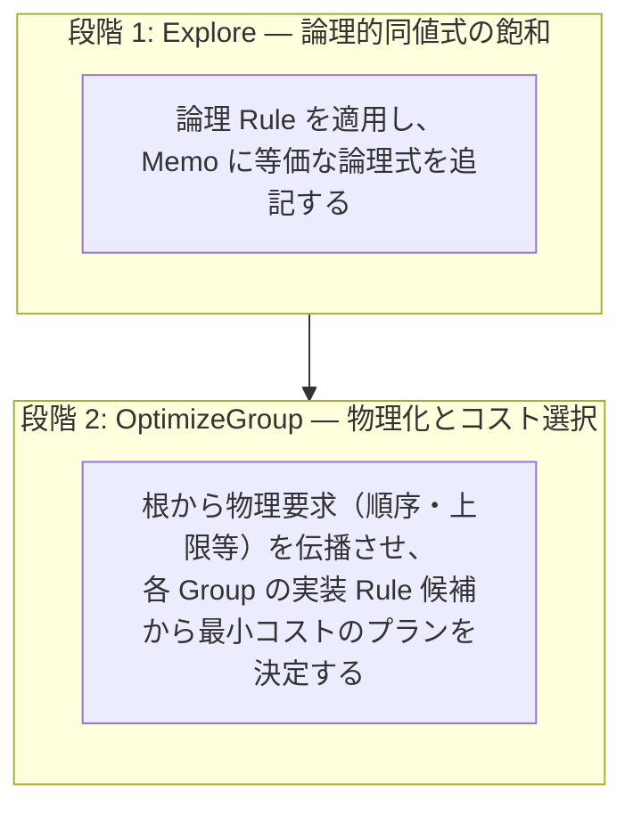

# 第1章 Cascades オプティマイザの全体像

- 状態: draft / 執筆基準リビジョン: `3880673` (2026-09-12)
- 状態: draft / 執筆基準リビジョン: `3880673` (2026-09-12)

本書の導入として、まずは tinylamb のオプティマイザが果たす役割と全体の処理の流れを整理する。探索空間の管理構造（Memo）や最適化規則（Rule）の個別の実装は次章以降で詳述するため、ここではシステム全体がどのようにクエリを物理実行計画へ落とし込むのかを概観する。

## 1-1. オプティマイザの役割 — 手順の探索

RDBMS が `SELECT` 文を受け取ったとき、SQL 文が指定しているのは取得すべき行の条件だけであり、行を収集する具体的な手順は指定されていない。この実行手順を決定するのがオプティマイザ（最適化器）である。

たとえば次のクエリを考える。

```sql
SELECT o.order_id, c.name
FROM orders AS o JOIN customers AS c ON o.customer_id = c.id
WHERE c.region = 'APAC';
```

得られる結果行の集合は一意に定まるが、収集する手順には複数の選択肢が存在する。

- `orders` を走査してから `customers` と突き合わせるか、その逆の順序にするか。
- 突き合わせの方式として、ハッシュ表を構築する手法（HashJoin）、両者を整列させて併合する手法（MergeJoin）、あるいは一方の行ごとに他方を走査・探索する手法（NestedLoop / IndexJoin）のどれを採用するか。
- `c.region = 'APAC'` というフィルタ条件を、結合処理の前に `customers` の読み込み段階で適用するか、結合の後に適用するか。
- `customers` の `region` 列にインデックスがあるとき、インデックス経由で走査するか、テーブル全体を順次走査するか。

どの手順を選んでも出力される結果は同一であるが、対象データ量やインデックスの有無によって所要時間は大きく異なる。オプティマイザの仕事は、結果が等価となる実行手順の候補の中から、推定コストが最小となる計画を見つけ出すことである。

ただし、実行手順の候補数は関係（テーブル）の数に応じて急激に増加する。結合操作を二分木で表現すると、木の形状と葉の順列の組み合わせだけで、3 テーブルでは 12 通り、4 テーブルでは 120 通り、5 テーブルでは 1680 通りに達する。各結合ノードにおけるアルゴリズムの選択肢や、各テーブルへのアクセスパス（インデックス走査や全表走査）の選択肢も加わるため、すべての実行計画を個別の木として列挙することは現実的ではない。Cascades フレームワークは、この探索空間を等価な部分構造の共有によってコンパクトに管理する手法であり、tinylamb もこの設計を採用している。

## 1-2. Cascades の基本構造 — Group による同値式の共有

Cascades は、探索空間の増大を次の 2 つの機構によって抑制する。

1. **同値な式の集約（Group）**: 「`t1` と `t2` の結合」のように、結果として同じ関係を出力する表現群を **Group（グループ）** という単位で一括して管理する。Group の内部には等価な式のリストが保持され、各式の子ノードは個別の式ではなく別の Group を参照する。
2. **要求に応じた段階的な物理化**: 論理的な同値変換（論理 Rule）は、Group に新たな等価式を登録する操作として進める。一方、具体的な演算子（HashJoin や IndexScan など）の割り当てとコスト計算は、出力に対して要求される物理特性（ソート順や上限件数）が定まってから行う。Group ごとに要求特性に対する最良の実行計画をメモ化するため、同一の部分構造を重複して評価しない。

3 テーブル `t1`, `t2`, `t3` の結合を例にとると、Memo の構造は次のように表現される。



ポイントは 2 つあります。

- `Join(t1, t2)` と `Join(t2, t1)` が**同じ Group#0 の中に並んでいる**。
この図には 2 つの重要な性質が現れている。

- `Join(t1, t2)` と `Join(t2, t1)` が**同一の Group#0 に同居している**。これらは「t1 と t2 の結合」という論理的な意味が共通しているため、グループを新設せず、既存グループ内の等価な選択肢として管理される。
- `(t1 ⋈ t2)` を子に持つ式と `(t2 ⋈ t3)` を子に持つ式が、**共通の葉グループ（Group#5 {t2} など）を共有している**。各プラン木を独立したノードとして保持すると `Scan(t2)` が大量に複製されるが、グループ参照によって部分構造の重複を完全に排除している。

図中の Group 番号は説明の便宜上の表記である。tinylamb では、Group の同一性を「含まれる関係の集合と識別タグ」の組で判定し、各 Group が自身に閉じたスキャン述語を保持する。この Memo 構造の実装詳細は第 20 章で解説する。

## 1-3. クエリ処理パイプラインにおける位置づけ

tinylamb におけるクエリ実行は、次のパイプラインに沿って進む（アーキテクチャの全体構成はリポジトリ直下の `ARCHITECTURE.md` を参照）。



本書が対象とするのは中央の `Optimizer::Optimize` である。ヘッダ `plan/optimizer.hpp` における宣言は次のとおりである。

```cpp
class Optimizer {
 public:
  explicit Optimizer() = default;

  static StatusOr<Plan> Optimize(const QueryData& query,
                                 TransactionContext& ctx);
  static StatusOr<Plan> Optimize(const QueryData& query,
                                 TransactionContext& ctx,
                                 const OptimizerOptions& options);
  // ...(省略: OptimizeRelational)...
};
```

入力は構文解析済みの論理クエリ情報である `QueryData` と、カタログや統計情報へのアクセスを提供する `TransactionContext` である。出力は物理プラン木を包む `StatusOr<Plan>` である。tinylamb の内部ロジックは C++ 例外を用いず `StatusOr<T>` でエラーを伝播させる規律を採用しており、最適化の失敗時もエラーステータスが返され、呼び出し側で代替の実行経路への切り替えが行われる。

## 1-4. 3 層の Rule セット — 最適化ルールの値渡し

tinylamb の最適化処理は、独立した 3 つの規則セット（Rule セット）で構成される。本書が順に解説していく対象である。

| 層 | 定義場所 | 本数 | 役割 |
|---|---|---|---|
| 式書き換え `ExpressionRuleSet` | `expression/rewrite.cpp` の `ExpressionRuleSet::Default()` | 74 回の `Add`（重複登録 1 件を除き実効 73 種） | スカラー式の正規化および定数畳み込み（例: `1 + 2` を `3` に変換、`NOT (a AND b)` の展開） |
| 論理同値 `cascades::RuleSet` | `plan/cascades.cpp` の `RuleSet::Default()` | 有効 116（無効化コメント 1 件を除く） | Memo に結果が等価となる別の論理表現を追加（結合順序の交換、述語の押し込みなど） |
| 物理 `cascades::ImplementationRuleSet` | `plan/implementation_rules.cpp` の `DefaultImplementationRules()` | 52 | 論理式を具体的な物理演算子（HashJoin や IndexScan など）へ変換し、コスト評価対象とする |

論理 Rule の典型例である結合順序の交換（`join_commutativity`）の登録コードを以下に示す（`plan/cascades.cpp` の `RuleSet::Default()`）。

```cpp
built.Add(Rule(
    "join_commutativity", Join(Any("left"), Any("right")),
    [](const Bindings&, Memo& memo, GroupId group,
       const LogicalExpression& expression) {
      memo.AddExpression(group, memo.NewJoin(expression.children[1],
                                             expression.children[0]));
    },
    LogicalOperator::kJoin));
```

この登録コードは次のように構成されている（DSL とパターンの構文規則は第 30 章で詳述する）。

- 第 2 引数の `Join(Any("left"), Any("right"))` は**パターン**の宣言である。2 つの子を持つ任意の `kJoin` 式に一致し、それぞれに `left` および `right` という名前を対応づける。
- ラムダ式の本体が**適用時の動作**である。一致した式の左右の子グループを入れ替えた新たな Join 式を生成し、`memo.AddExpression` によって**同一グループへ追記**する。既存の式を上書き・削除しない（追記のみ）点が Cascades の不変条件である。
- この適用により、前節の図における `Group#0` の内部に `Join(t1, t2)` と `Join(t2, t1)` の双方が併存する状態が作られる。

3 番目の物理 Rule は、論理式 `kJoin` に対して HashJoin、MergeJoin、NestedLoopJoin、IndexJoin といった**物理実装の候補**を `PlanAlternative` として列挙する。これらの候補からどれを選択するかは、後段のコストモデルに基づいて決定される（第 40 章）。

tinylamb の特徴的な設計として、**Rule は大域的な単一の登録簿で管理されるのではなく、値として `OptimizerOptions` に格納されて渡される**点が挙げられる（`plan/optimizer.hpp` の `OptimizerOptions` 構造体）。

```cpp
struct OptimizerOptions {
  cascades::RuleSet relational_rules;
  ExpressionRuleSet expression_rules;
  std::vector<cascades::ImplementationRule> extra_implementation_rules;
  std::unordered_set<std::string> disabled_implementation_rules;
  // ...(省略: access_method / dump_memo / search_step_budget などの診断・予算フィールド)...

  [[nodiscard]] static const OptimizerOptions& Default() {
    static const OptimizerOptions options = [] {
      OptimizerOptions built;
      built.relational_rules = cascades::RuleSet::Default();
      built.expression_rules = ExpressionRuleSet::Default();
      return built;
    }();
    return options;
  }
};
```

`Default()` は 3 層の標準 Rule セットを構築して返す。呼び出し元はこのオプション構造体を複製した上で、特定の Rule を識別名によって除外できる。

```cpp
tinylamb::OptimizerOptions options = tinylamb::OptimizerOptions::Default();
options.relational_rules.Remove("join_commutativity");      // 論理 Rule を除外
options.expression_rules.Remove("de_morgan");               // 式書き換え Rule を除外
options.disabled_implementation_rules.insert("index_join"); // 物理 Rule を無効化
```

Rule セットが値として扱える設計は、最適化の検証において特定の Rule の寄与度を個別に単離・観察することを可能にする。さらに、後述するように「出力値の評価文脈では危険な推論規則を実行時に外す」といった意味論的保護の基盤としても機能している。

## 1-5. 最適化の前半処理 — 式の正規化から Memo の初期構築まで

関数 `Optimizer::Optimize`（`plan/optimizer.cpp`）の処理手順を、前処理から Memo 構築までの段階に分けて追う。

**1. スカラー式の正規化**: SELECT 句や ORDER BY 句に含まれる式を `ExpressionRuleSet` によって正規化する。この段階で、評価文脈に応じた安全性の制限が適用される。

```cpp
  // Value contexts (select items, ORDER BY keys) must not gain inferred
  // predicates: `x IS NOT NULL AND ...` changes a NULL projection/sort key
  // into FALSE.  The inference rule is only sound in a filter context, so
  // it is stripped for these rewrites (WHERE keeps the full rule set).
  ExpressionRuleSet value_context_rules = options.expression_rules;
  value_context_rules.Remove("inner_join_not_null_inference");
  const ExpressionRewriter value_rewriter(value_context_rules);
```

値をそのまま出力する文脈（射影リストやソートキー）において `inner_join_not_null_inference`（非 NULL 推論）を適用すると、元の値が NULL であった場合に `x IS NOT NULL AND ...` が FALSE と評価され、出力値の意味が変化してしまう。WHERE 句のような真偽値フィルタ文脈では安全な推論であっても、射影値の文脈では結果を破壊する。Rule セットが値として切り離せる設計になっているのは、こうした文脈依存の安全性制御を静的かつ局所的に行うためである。

**2. クエリレベルの冗長結合削除**: FROM 句に 2 以上のテーブルが含まれる場合、不要な結合を事前に検出して除去する。内側結合に対する `TryEliminateUnusedJoins` や、外部結合に対する `TryEliminateUnusedOuterJoin` がこれに該当する。これらは Memo による全探索の前に実行される構造単純化である。

`TryEliminateUnusedJoins` は、射影句や ORDER BY 句から一切参照されず、かつ一意キーによる等値結合で 1 行のみが対応することが証明できるテーブル（参照整合性または実データスキャンによる包含証明が成立する次元テーブル）を除去する。証明が成立しない場合は安全側に倒してテーブルを保持する。一方、`TryEliminateUnusedOuterJoin` は LEFT / RIGHT 外部結合の NULL 供給側テーブルを対象とする。保存側テーブルの行数は外部結合によって減少しないため、内側結合のような包含証明を必要とせず、一意キー条件のみで安全に除去できる。

**3. カタログ情報と統計情報の注入**: `RuleContext` に対して、クエリが参照する各テーブルのスキーマ情報（`Table`）および統計情報（`TableStatistics`）を渡す。これらは後の物理 Rule において演算子ごとの推定コストを算出する入力となる。

**4. Memo の初期構築**: WHERE 句の述語を連言（AND で結ばれた個別の述語単位、conjuncts）へと分解し、`memo.Build(from, conjuncts)` を呼び出して Memo の骨格を生成する。

```cpp
  cascades::Memo memo;
  cascades::GroupId search_root = cascades::kInvalidGroup;
  if (!is_outer) {
    search_root = memo.Build(query.from_, conjuncts);
  } else {
    // ...(省略: outer join の場合は、inner join を含む既定のグループ構築
    // (`TryBuild`)はスキャンフィルタの再利用のためだけに行い、outer join 自体は
    // タグ付きの別グループ(derived group)に置く。inner と outer を Group
    // レベルで分離する)...
  }
```

`conjuncts` には「どの述語がどの表にまたがるか」の情報が入っており、
`Build`(`TryBuild` の非例外ラッパー)は各表のスキャングループを作るとともに、単一表の述語はスキャンの
フィルタとして、複数表にまたがる述語はそれを覆う最も深い結合に付与します。
outer join を特別扱いするのは、「1 つのグループは 1 つの意味だけを持つ」
(D1)という規律のためです。この辺りの構造は第 20 章の主題です。

**(5) 論理レイヤーの積み上げ。** メモの上に、SELECT 文の構造をそのまま
論理演算子として積み上げます。WHERE が残っていれば `kSelection`、集約が
あれば `kAggregation`(なければ `kProjection`)、`DISTINCT` なら `kDistinct`、
ORDER BY + LIMIT がそろえば `kTopN`、ORDER BY だけなら `kSort`、LIMIT だけなら
`kLimit` を、それぞれ派生グループ(derived group)として根の上に追加し、
`search_root` を差し替えていきます。射影の部分は次のようなコードです
(`plan/optimizer.cpp` の `Optimizer::Optimize`)。

```cpp
  } else {
    const cascades::GroupId projection =
        memo.EnsureDerivedGroup(query.from_, "projection");
    memo.AddExpression(projection,
                       cascades::LogicalExpression{
                           .operation = cascades::LogicalOperator::kProjection,
                           .children = {search_root},
                           .table = "",
                           .predicate = std::nullopt,
                           .target_list = projection_items});
    search_root = projection;
  }
```

  } else {
    const cascades::GroupId projection =
        memo.EnsureDerivedGroup(query.from_, "projection");
    memo.AddExpression(projection,
                       cascades::LogicalExpression{
                           .operation = cascades::LogicalOperator::kProjection,
                           .children = {search_root},
                           .table = "",
                           .predicate = std::nullopt,
                           .target_list = projection_items});
    search_root = projection;
  }
```

`EnsureDerivedGroup` の第 2 引数に渡される文字列 `"projection"` は派生グループを識別するタグである。同一のリレーション集合であっても、射影適用後の出力スキーマや行の意味論は射影前と異なるため、異なるグループとして分離して管理する。

このようにして、根のグループから葉のスキャングループまでが `GroupId` を介して木状に結合された初期 Memo が構築される。

## 1-6. 探索エンジン — Explore と OptimizeGroup

構築された Memo は、探索エンジン（`SearchEngine`）に渡されて最適化される（`plan/optimizer.cpp` の `Optimizer::Optimize`）。

```cpp
  cascades::SearchEngine search(std::move(memo), options.relational_rules);
  search.SetStepBudget(options.search_step_budget);
  std::optional<cascades::BestPlan> best = search.Optimize(
      search_root, properties, *implementation_rules, rule_context);
  if (!best) {
    return Status::kNotImplemented;
  }
```

`SearchEngine::Optimize` の処理は 2 つの段階に分かれている（`plan/cascades.cpp`）。

```cpp
std::optional<BestPlan> SearchEngine::Optimize(
    GroupId root, const PhysicalProperties& properties,
    const Implement& implement, const RuleContext& context) {
  Explore(root);
  return OptimizeGroup(root, properties, implement, context);
}
```

- **論理的同値式の飽和（Explore）**: 論理 Rule を可能な限り適用し、Memo 内に等価な論理式を追加し続ける。探索回数には上限が設けられており、ステップ予算（`search_step_budget`）を使い切った場合は探索を打ち切り、その時点までに登録された式の中で最適化を継続する。
- **要求駆動の物理化とコスト選択（OptimizeGroup）**: 要求された物理特性（ソート順、上限行数、アクセス手法など）を満たす最良の物理プランを、根グループから再帰的に決定する。各グループにおいて実装 Rule が物理候補（`PlanAlternative`）を生成し、子グループへ下位の要求を伝播させる。同一の「Group と物理要求」の組み合わせに対する探索結果はキャッシュされ、既に判明している最小コストを上回る探索枝は打ち切られる。



この 2 段階の構成により、論理式の変形と物理コストの算出が明確に分離される。また、結合対象テーブル数が 16 を超えるような極端なケースでは、全列挙を停止して貪欲法による順序決定（`greedy_join_order_fallback`）へ切り替えるなど、探索コスト自体の肥大化を防止するガードが組み込まれている。

なお、オプティマイザがサポート外の構文や演算子を検知して `Status::kNotImplemented` を返した場合、システムは Memo 探索を伴わない簡易な実行計画生成へ切り替えて処理を継続する。

## 1-7. 最適化における正しさの保証

オプティマイザの変更において不可欠な不変条件は、「**出力される行の多重集合（multiset）と順序保証を変更しない**」ことである。処理速度が向上しても、取得される行が欠落したり NULL の評価結果が変わったりすれば、それは誤った変換である。tinylamb では、この正しさを維持するために以下の設計規律を設けている。

- **事前条件ゲートの設置**: 各論理 Rule は、その変換が完全に安全であると証明可能な事前条件（guard）を持ち、条件が満たされない場合は変形を実行しない。
- **不完全な規則の無効化**: 事前条件の安全性が完全に証明できない規則は、コード上で無効化され、反例を示すテストケースとともに管理される。たとえば LIMIT を結合の下層へ押し込む規則（`push_down_limit_through_join`）は、左側の各行が右側と 1 行以上マッチすることを保証できない限り結果行を不当に減らすため、現在は無効化されている。
- **文脈に応じた規則の除外**: 前述の `inner_join_not_null_inference` のように、フィルタ条件としては安全であっても射影値の算出としては不安全な規則は、処理文脈に応じて適用対象から除外される。
- **差分テストとファジングによる検証**: 網羅的なオラクル走行器（`plan/rule_fuzzer.cpp`）やランダムクエリを用いたファザー（`sql_oracle_fuzzer_libfuzzer`）を実行し、最適化の前後で結果が一致することを継続的に検証している。

特に注意を要するのは、単一テーブルのスキャングループである。tinylamb ではスキャン述語が Group 内で集約されるため、単一テーブルに対するフィルタの変形は、後段で再評価されない唯一の評価点となる。したがって、単一テーブルのフィルタ変更はコストの最適化ではなく結果の正しさに直結する。各 Rule の解説においても、この安全条件の根拠を重点的に記述する。

## 1-8. 表記上の約束と本書の構成

本書で用いる図表・コード表記の規則は以下のとおりである。

- **Group の表記**: `Group#2 {t1, t2, t3}` のように、識別番号と含まれるリレーション集合を併記する。番号は説明のための仮番である。派生グループは `Group#n {…} (tag: projection)` のようにタグを付与して区別する。
- **プラン構造の図示**: Mermaid によるグラフ描画を用いる。`subgraph` が Group を、内部のノードが論理式または物理プランの演算子を表す。
- **コード引用**: 原則として実装ファイルからの抜粋をそのまま掲載する。本質的でない処理の省略は `// ...(省略)...` と明記する。理解の補助として単純化した擬似コードを示す場合は、その旨を付記する。
- **コード位置の指定**: 行番号の陳腐化を避けるため、原則として `plan/cascades.cpp` の `RuleSet::Default()` のようにファイルパスとシンボル名で特定する。

次章以降の基礎編の構成は以下のとおりである。

- 第 20 章: Memo / Group / `LogicalExpression` のデータ構造。関係集合とタグによる同一性判定、スキャン述語の管理、探索上限と縮退動作。
- 第 30 章: `Pattern` DSL と `Bindings`。規則の適用パターンを宣言する DSL とマッチングの仕組み。
- 第 40 章: `SearchEngine`。ワークリストによる飽和探索、物理要求駆動の再帰探索、コストモデルと枝刈り。
- 第 50 章: `PhysicalProperties`。ソート順や LIMIT の要求と、それを満たすための物理演算子の強制（enforcement）。
- 第 60 章: Rule の追加と安全基準。事前条件ゲート（D5）の設計と無効化の規律。
- 第 70 章: 式書き換えフレームワークと基本規則。

次章では、本章で触れた Memo の概念がどのような C++ データ構造として実装されているかを順に確認する。

