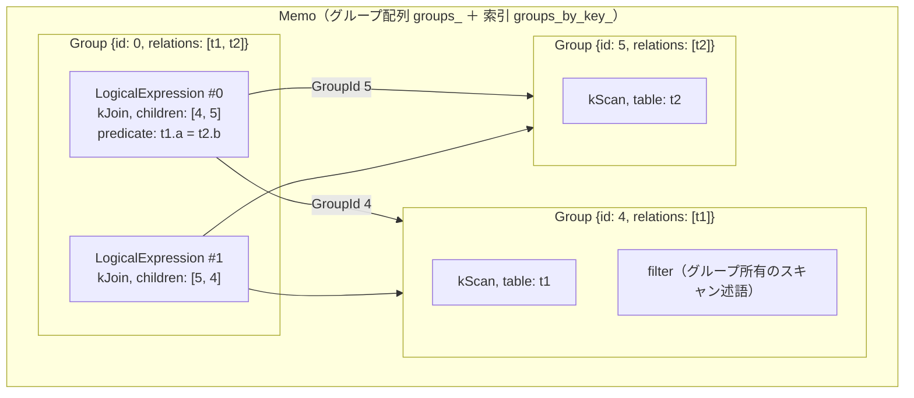
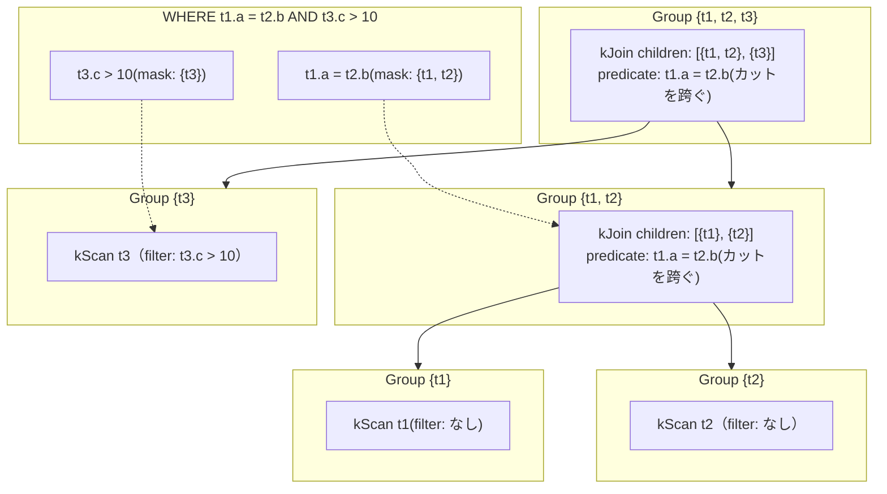

# 第20章 Memo / Group / LogicalExpression — メモのデータ構造

- 状態: draft / 執筆基準リビジョン: `3880673` (2026-09-12)
- 状態: draft / 執筆基準リビジョン: `3880673` (2026-09-12)

第 1 章で示した「Group による同値式の共有」を実現する C++ データ構造を整理する。対象は構造定義を行う `plan/cascades.hpp` と、Memo 管理の実装を担う `plan/cascades.cpp` である。

## 20-1. Memo の基本概念と C++ 実装の対応

Cascades の主要概念と、tinylamb における対応型の一覧を以下に示す。

| 概念 | C++ 型 | 定義位置 |
|---|---|---|
| グループの識別子 | `GroupId`（`size_t` の別名） | `plan/cascades.hpp` |
| グループ（等価表現の束） | `Group` 構造体 | 同上 |
| グループ内の論理式 1 件 | `LogicalExpression` 構造体 | 同上 |
| 論理演算の種類 | `LogicalOperator` 列挙型 | 同上 |
| Memo 全体（グループの管理簿） | `Memo` クラス | `plan/cascades.hpp`, `plan/cascades.cpp` |
| 一意性・非 NULL などの推論知識 | `LogicalProperties` 構造体 | `plan/cascades.hpp` |



式ノードが下位の式への生ポインタを保持せず、子ノードの所属する `GroupId`（整数添字）を保持する点が構造の核である。各式がグループの識別番号のみを参照するため、1 つのグループを無数の親式から共有でき、部分式の複製が発生しない。

## 20-2. 論理識別子と演算子型

識別子と演算子の定義は以下のとおりである（`plan/cascades.hpp`）。

```cpp
using GroupId = size_t;
constexpr GroupId kInvalidGroup = static_cast<GroupId>(-1);
```

`GroupId` は `groups_` 配列へのインデックスであり、未割り当てや無効値は `kInvalidGroup` で表される。軽量な整数値であるため、式の複製や移動にオーバーヘッドが生じない。

論理演算子の種類を表す列挙型は以下のとおりである（`plan/cascades.hpp` の `LogicalOperator`）。

```cpp
enum class LogicalOperator : uint8_t {
  kScan,
  kJoin,
  kOuterJoin,
  kCrossJoin,
  kSemiJoin,
  kAntiJoin,
  kSingleJoin,
  kMarkJoin,
  kSelection,
  kProjection,
  kAggregation,
  kSort,
  kTopN,
  kDistinct,
  kMax1Row,
  kUnion,
  kUnionAll,
  kIntersect,
  kIntersectAll,
  kExcept,
  kExceptAll,
  kLimit,
  kEmpty,
  kValues,
  kConstantTable,
  kDummyScan,
  // ...(省略: kWindow / kUnnest / kGenerateSeries / kRecursiveCte 等)...
  kRelational,
};
```

これらは役割ごとに以下の系統に整理できる。

- **データソース**: `kScan` / `kValues` / `kConstantTable` / `kDummyScan` / `kGenerateSeries` / `kWorkTableScan`（葉ノードであり子を持たない）
- **結合演算**: `kJoin`（内側結合）/ `kCrossJoin` / `kSemiJoin` / `kAntiJoin` / `kSingleJoin` / `kMarkJoin` / `kOuterJoin`（LEFT / RIGHT / FULL を `join_type` で区別）
- **単項の変換演算**: `kSelection` / `kProjection` / `kAggregation` / `kSort` / `kTopN` / `kDistinct` / `kMax1Row` / `kLimit` / `kEmpty` / `kWindow` / `kUnnest`（子を 1 つ持つ）
- **集合演算**: `kUnion` / `kUnionAll` / `kIntersect` / `kIntersectAll` / `kExcept` / `kExceptAll`（子を 2 つ以上持つ）
- **中間表現**: `kRelational`（外部結合や CTE 等を含む未分解の関係式を包括する特殊演算子）

`kRelational` は、Cascades 内部でまだ個別の論理式へ分解されていない複雑な文構造（相関サブクエリや再帰 CTE など）を単一ノードとして内包するための不透明（opaque）な演算子である。Memo はこのノードに対してもコスト評価とプラン選択を行うことができ、実際の物理化は専用の変換パスへ委ねられる。

## 20-3. `LogicalExpression` — グループ内の式ノード

グループ内に保持される式 1 件の実体は `LogicalExpression` 構造体である（`plan/cascades.hpp`）。

```cpp
// One logical expression inside a memo group. `predicate` carries the
// Selection predicate or the Join condition; `target_list` carries the
// Projection / Aggregation outputs; the limit fields configure kLimit.
// Scans keep their filter on the owning Group (see Group::filter) so every
// alternative of the group stays semantically consistent.
struct LogicalExpression {
  LogicalOperator operation{LogicalOperator::kScan};
  std::vector<GroupId> children{};
  std::string table{};
  std::optional<Expression> predicate{std::nullopt};
  std::vector<NamedExpression> target_list{};
  std::vector<bool> sort_ascending{};
  std::vector<std::optional<bool>> sort_nulls_first{};
  std::vector<Row> values{};
  size_t limit_count{0};
  size_t limit_offset{0};
  bool with_ties{false};
  uint8_t join_type{0};
  std::shared_ptr<const SelectStatement> relational_statement{};
  Schema output_schema{};

  // Extended payload fields for Window / Grouping / Marker / Assertion:
  std::string marker_column{};
  std::vector<Expression> partition_by{};
  std::vector<Expression> grouping_sets{};
  std::string unnest_alias{};
  std::string offset_alias{};
  std::string cte_name{};
  double sample_rate{1.0};
  bool is_bernoulli{false};
  size_t depth_limit{0};
  std::optional<RecursiveDepthSpec> depth_spec{};

  [[nodiscard]] std::string Fingerprint() const;
};
```

この構造体における重要な設計要素は以下のとおりである。

- **`children` は `GroupId` の列である**: 式の直接の子ノードは常に別のグループを指す。単項演算子であれば要素数は 1、結合であれば 2、集合演算であれば 2 以上となる。
- **`predicate` の役割の限定**: `kSelection` のフィルタ条件、または `kJoin` の結合述語を保持する。ただし、テーブルスキャンに対するフィルタ述語はここには格納されない。スキャン述語はグループ自身（`Group::filter`）が所有する。
- **演算子固有フィールドの集約**: 演算子の種類ごとに構造体を派生させず、射影列リスト（`target_list`）、整列方向（`sort_ascending`）、上限行数（`limit_count`）などを単一の構造体に平坦化して保持している。これにより、Memo 内における式の値としての移動や複製が容易になっている。
- **`Fingerprint()` による同一性判定**: 演算子種別、子の GroupId、述語、射影列、ソート方向、LIMIT パラメータなどを文字列として直列化し、式の指紋（fingerprint）を生成する。この指紋は Memo への重複登録を検知して排除するために使用される。

## 20-4. `Group` — 等価な論理式の束と述語の管理

グループの実体は `Group` 構造体である（`plan/cascades.hpp`）。

```cpp
struct Group {
  GroupId id{kInvalidGroup};
  std::vector<std::string> relations{};
  std::vector<LogicalExpression> expressions{};
  // Single-relation conjuncts of the query predicate, applied by every scan
  // implementation of this group (D1: the group, not the expression, owns the
  // scan filter so all alternatives filter identically).
  Expression filter{};
  // Bitset over the memo-wide relation index (D5 join-graph metadata).
  uint64_t relation_mask{0};
  // Non-empty for derived root-layer groups (Selection/Projection/
  // Aggregation/Limit chains); distinguishes groups that share a relation set.
  std::string tag{};
  LogicalProperties logical_properties{};
};
```

各フィールドの設計上の意味は以下のとおりである。

- **`relations`**: このグループが参照する関係（テーブル名またはエイリアス）のリストである。ソートおよび重複排除された正規化形式で保持される。自己結合クエリ `FROM t AS a, t AS b` の場合、参照名は `["a", "b"]` となり、同一の物理テーブルであってもエイリアス単位で区別される。
- **`expressions`**: このグループに属する等価な `LogicalExpression` の配列である。規則の適用によって新たな等価表現が発見されるたびに、この配列へ追記される。
- **`filter`**: このグループが単一テーブルの走査を表す場合に適用されるスキャン述語（連言）である。スキャン述語を式ノードではなくグループが所有する点には明確な理由がある。同一グループ内に複数のアクセスパス（全表走査や各種インデックス走査）が存在する場合、いずれの物理代替案が選択されても、評価されるフィルタ条件は厳密に同一でなければならない。述語の所有をグループ単位に統一することで、代替案間でのフィルタ条件の不一致や欠落を構造的に防止している。
- **`relation_mask`**: 参照関係の集合を 64 ビット整数で表現したビットセットである。Memo 全体の関係索引（`relation_index_`）におけるビット位置に対応する。「述語がどのテーブル間にまたがっているか」の交差判定や結合木の分割判定を、ビット演算で高速に評価するために用いられる。このため、同時に Memo 最適化の対象とできる最大テーブル数は 63 個に制限される。
- **`tag`**: 派生グループ（derived group）を識別する補助文字列である。同一のリレーション集合を参照していても、射影後、集約後、ソート後では関係の意味論や出力スキーマが異なる。タグを付与することで、同一リレーション集合に対する別階層のグループを分離して管理する。
- **`logical_properties`**: 演算結果における一意性制約や非 NULL 制約など、論理特性の推論結果を保持する。

## 20-5. `Memo` — グループの登録簿

`Memo` クラスの非公開フィールドを見ると、全体の仕掛けがつかめます
(`plan/cascades.hpp` の `Memo`)。

```cpp
 private:
  [[nodiscard]] static std::string GroupKey(
      const std::vector<std::string>& relations);

  std::vector<Group> groups_;
  std::unordered_map<std::string, GroupId> groups_by_key_;
  std::unordered_map<std::string, size_t> relation_index_;
  std::vector<Expression> conjuncts_;
  std::vector<uint64_t> conjunct_masks_;
  std::vector<GroupId> touched_groups_;
  std::unordered_map<std::string, Schema> table_schemas_;
  const size_t expression_cap_;
  bool degraded_{false};
```

- `groups_` が本体の配列、`groups_by_key_` が「キー → GroupId」の索引。
- `relation_index_` がリレーション名 → ビット位置の対応表。
- `conjuncts_` / `conjunct_masks_` が WHERE 句から分解された述語(連言)の
  保管庫と、それぞれの「またがる表」のマスク。メモ全体で 1 つの結合グラフ
  (どの表とどの表が述語で結ばれているか)を形成し、`NewJoin` や接続性判断の
  情報源になります。
- `touched_groups_` は「式が追加されたグループ」の記録で、探索エンジンの
  ワークリストに供給します(第 40 章)。
- `expression_cap_` と `degraded_` は式数上限と縮退フラグ(20-7 節)。
## 20-5. `Memo` — グループの管理構造

`Memo` クラスは、Group の配列と検索用インデックス、および述語情報を一元管理する（`plan/cascades.hpp`）。

```cpp
 private:
  [[nodiscard]] static std::string GroupKey(
      const std::vector<std::string>& relations);

  std::vector<Group> groups_;
  std::unordered_map<std::string, GroupId> groups_by_key_;
  std::unordered_map<std::string, size_t> relation_index_;
  std::vector<Expression> conjuncts_;
  std::vector<uint64_t> conjunct_masks_;
  std::vector<GroupId> touched_groups_;
  std::unordered_map<std::string, Schema> table_schemas_;
  const size_t expression_cap_;
  bool degraded_{false};
```

各内部メンバの役割は以下のとおりである。

- `groups_` と `groups_by_key_`: `groups_` が実体の配列であり、`groups_by_key_` が関係集合キーから `GroupId` を引くハッシュマップである。
- `relation_index_`: クエリ内の各テーブル名（エイリアス）に 0 から始まる一意のビット位置を割り当てる対応表である。
- `conjuncts_` と `conjunct_masks_`: WHERE 句から抽出された連言述語のリストと、各述語が参照するテーブル群のビットマスクである。Memo 全体でどのテーブル間に結合条件が存在するかを示す結合グラフのメタデータを構成する。
- `touched_groups_`: 探索中に新たな式が追加されたグループの記録であり、探索エンジンの作業リスト（ワークリスト）へ渡される。
- `expression_cap_` と `degraded_`: Memo に登録可能な式の総数上限と、上限到達による探索打ち切り（縮退）を示すフラグである。

### 20-5.1 初期 Memo の構築 — `Memo::TryBuild`

クエリ全体の結合グラフから Memo の初期状態を組み立てる関数が `Memo::TryBuild` である（`plan/cascades.cpp`）。

```cpp
StatusOr<GroupId> Memo::TryBuild(const std::vector<std::string>& relations,
                                 const std::vector<ConjunctInfo>& conjuncts) {
  if (relations.empty()) {
    return StatusError(StatusCode::kInvalidArgument, "empty join graph");
  }
  if (Normalize(relations).size() != relations.size()) {
    return StatusError(StatusCode::kInvalidArgument,
                       "duplicate relation in join graph");
  }
  if (relations.size() >= std::numeric_limits<uint64_t>::digits) {
    return StatusError(StatusCode::kInvalidArgument,
                       "join graph is too large for enumeration");
  }
  relation_index_.clear();
  const std::vector<std::string> normalized = Normalize(relations);
  for (size_t i = 0; i < normalized.size(); ++i) {
    relation_index_.emplace(normalized[i], i);
  }
  conjuncts_.clear();
  conjunct_masks_.clear();
  for (const ConjunctInfo& info : conjuncts) {
    uint64_t mask = 0;
    bool outside = false;
    for (const std::string& relation : info.relations) {
      const auto found = relation_index_.find(relation);
      if (found == relation_index_.end()) {
        outside = true;
        continue;
      }
      mask |= uint64_t{1} << found->second;
    }
    // A conjunct that references something outside the join graph stays at
    // the root join (it can never be pushed below).
    conjunct_masks_.push_back(outside ? ~uint64_t{0} : mask);
    conjuncts_.push_back(info.conjunct);
  }
  return EnsureGroup(relations);
}
```

この処理は以下の順序で進行する。

1. **制約の検証**: テーブルリストが空でないこと、重複テーブル名（同名エイリアス）が存在しないこと、テーブル数が 63 以下であることを検証する。テーブル数が 64（`uint64_t` のビット幅）以上の場合は、ビットマスクによる探索管理が行えないためエラーを返し、フォールバック経路へ誘導する。
2. **関係インデックスの構築**: 正規化されたテーブル名列に対して 0 からの連続整数をビット位置として割り当てる。
3. **述語ビットマスクの算出**: 各連言述語が参照するテーブルのビットを立てて `conjunct_masks_` に記録する。サブクエリ由来などで FROM 句の外側を参照する述語は、下位結合へ押し下げられないため全ビットを立てたマスク（`~uint64_t{0}`）を割り当て、常に根の結合グループで保持させる。
4. **グループの再帰生成**: `EnsureGroup(relations)` を呼び出し、初期の結合木に対応する Group 群を生成する。

### 20-5.2 グループの検索と生成 — `EnsureGroup` と `EnsureDerivedGroup`

`EnsureGroup` は、指定されたテーブル集合に対応する Group を取得、または新規生成する（`plan/cascades.cpp`）。

```cpp
GroupId Memo::EnsureGroup(std::vector<std::string> relations) {
  relations = Normalize(std::move(relations));
  if (relations.empty()) {
    CHECK_MSG(false, "empty memo group");
  }
  const std::string key = GroupKey(relations);
  if (const auto found = groups_by_key_.find(key);
      found != groups_by_key_.end()) {
    return found->second;
  }

  const GroupId id = groups_.size();
  groups_by_key_.emplace(key, id);
  const uint64_t mask = RelationMask(relations);
  groups_.push_back(Group{.id = id,
                          .relations = relations,
                          .expressions = {},
                          .filter = nullptr,
                          .relation_mask = mask,
                          .tag = "",
                          .logical_properties = {}});
  if (relations.size() == 1) {
    groups_.back().filter = ScanFilterFor(groups_.back());
    AddExpression(id, LogicalExpression{.operation = LogicalOperator::kScan,
                                        .table = relations.front()});
    return id;
  }

  auto [left, right] = relations.size() > 16
                           ? GreedyConnectedSplit(*this, relations)
                           : ConnectedSplit(*this, relations);
  const GroupId left_group = EnsureGroup(std::move(left));
  const GroupId right_group = EnsureGroup(std::move(right));
  AddExpression(id, NewJoin(left_group, right_group));
  return id;
}
```

この実装における設計判断は以下のとおりである。

- **キーによる同一性の一元管理**: `GroupKey` はテーブル名一覧を決定論的な区切り文字形式で結合した文字列であり、同一のテーブル集合に対する要求は必ず同一の `GroupId` に解決される。
- **単一テーブルにおけるスキャン述語の束縛**: 対象テーブルが 1 つである場合、そのテーブルのみを参照する述語群を `ScanFilterFor` で集約して `Group::filter` へ格納し、`kScan` 式を登録して終了する。
- **初期結合における接続性の維持**: テーブル数が 2 以上の場合はテーブル集合を 2 分割して再帰呼び出しを行う。このとき `ConnectedSplit` は、両グループ間に結合述語が存在するような分割を優先して選択する。結合条件のないクロス積を初期プランとして生成することを避けるためである。なおテーブル数が 16 を超える場合は、組み合わせ爆発を避けるため多項式時間の貪欲分割（`GreedyConnectedSplit`）へ自動的に切り替える。

タグ付きの派生グループを生成する関数は `EnsureDerivedGroup` である（`plan/cascades.cpp`）。

```cpp
GroupId Memo::EnsureDerivedGroup(const std::vector<std::string>& relations,
                                 std::string_view tag) {
  const std::vector<std::string> normalized = Normalize(relations);
  std::string key(tag);
  key.push_back('|');
  key.append(GroupKey(normalized));
  if (const auto found = groups_by_key_.find(key);
      found != groups_by_key_.end()) {
    return found->second;
  }
  const GroupId id = groups_.size();
  groups_by_key_.emplace(std::move(key), id);
  groups_.push_back(Group{.id = id,
                          .relations = normalized,
                          .expressions = {},
                          .filter = nullptr,
                          .relation_mask = RelationMask(normalized),
                          .tag = std::string(tag),
                          .logical_properties = {}});
  return id;
}
```

検索キーは `"タグ|GroupKey"` の形式で構築される。これにより、同一のテーブル集合を対象とする場合であっても、タグが異なれば独立した別の Group として Memo に登録される。第 1 章で確認した射影グループ `EnsureDerivedGroup(query.from_, "projection")` は、この機構によって結合グループと分離されている。

## 20-6. 述語の配置決定 — `ScanFilterFor` と `JoinConditionFor`

分解された連言述語は、その参照先テーブルのビットマスクに応じて、スキャンフィルタまたは結合条件のいずれか一方に決定論的に配置される。

**1. 単一テーブルに対する述語の割り当て**: 述語のマスクがグループの `relation_mask` と完全に一致する場合、その述語はテーブル走査時のスキャンフィルタ（`Group::filter`）へ格納される（`plan/cascades.cpp` の `Memo::ScanFilterFor`）。

```cpp
Expression Memo::ScanFilterFor(const Group& group) const {
  std::vector<Expression> matching;
  for (size_t i = 0; i < conjuncts_.size(); ++i) {
    if (conjunct_masks_[i] == group.relation_mask) {
      matching.push_back(conjuncts_[i]);
    }
  }
  if (matching.empty()) {
    return nullptr;
  }
  return CanonicalizeConjuncts(CombineConjuncts(matching));
}
```

**2. 2 つのグループにまたがる述語の割り当て**: 左右の子グループの境界（カット）をまたぐ述語は、結合ノードの条件（`LogicalExpression::predicate`）として抽出される（`plan/cascades.cpp` の `Memo::JoinConditionFor`）。

```cpp
Expression Memo::JoinConditionFor(const Group& left, const Group& right) const {
  const uint64_t union_mask = left.relation_mask | right.relation_mask;
  std::vector<Expression> spanning;
  for (size_t i = 0; i < conjuncts_.size(); ++i) {
    const uint64_t mask = conjunct_masks_[i];
    if ((mask & ~union_mask) != 0) {
      continue;  // 結合外部のテーブルを参照しているため除外
    }
    if (mask == 0) {
      continue;  // テーブルを参照しない定数条件
    }
    if ((mask & ~left.relation_mask) == 0) {
      continue;  // 左側グループ内部で閉起している述語
    }
    if ((mask & ~right.relation_mask) == 0) {
      continue;  // 右側グループ内部で閉起している述語
    }
    spanning.push_back(conjuncts_[i]);
  }
  if (spanning.empty()) {
    return nullptr;
  }
  return CanonicalizeConjuncts(CombineConjuncts(spanning));
}
```

新たな結合式を生成する際は、直接 `LogicalExpression` を組み立てるのではなく、ヘルパー関数 `NewJoin` を経由する（`plan/cascades.cpp`）。

```cpp
LogicalExpression Memo::NewJoin(GroupId left, GroupId right) const {
  LogicalExpression join{.operation = LogicalOperator::kJoin,
                         .children = {left, right}};
  const Expression condition = JoinConditionFor(Get(left), Get(right));
  if (condition) {
    join.predicate = condition;
  }
  return join;
}
```

結合生成を `NewJoin` に統一する設計意図は、`plan/cascades.hpp` のコメントに明記されている。左右の和集合が包括し、かつ左右いずれか一方のみでは包括できない連言のみを結合条件として割り当てることで、**すべての述語が実行木の各走査経路において重複なく、ちょうど 1 回だけ評価される**ことが保証される。

これにより、結合順序の交換規則（`join_commutativity` など）によってプラン木の構造がどのように組み替えられても、個々の規則が述語の移動処理を個別に行う必要がなくなり、述語の評価漏れや二重適用を構造的に防止できる。



`t1.a = t2.b` は `{t1}` と `{t2}` の境界をまたぐため、Group#12 の結合述語に割り当てられる。一方、根の結合である `{t1, t2}` と `{t3}` の境界においては、`t1.a = t2.b` は左側の子グループ内部で閉起しているため除外され、根ノードの結合条件には現れない。また `t3.c > 10` は `{t3}` 内部で完結するため、スキャングループの `filter` にのみ配置される。

外部結合は、WHERE 句の連言とは独立した専用の生成関数 `NewOuterJoin` を経由する（`plan/cascades.cpp`）。

```cpp
LogicalExpression Memo::NewOuterJoin(GroupId left, GroupId right,
                                     Expression on_condition,
                                     uint8_t join_type) {
  LogicalExpression join{.operation = LogicalOperator::kOuterJoin,
                         .children = {left, right}};
  if (on_condition) {
    join.predicate = std::move(on_condition);
  }
  join.join_type = join_type;
  return join;
}
```

この処理において重要な制約は、**WHERE 句の連言述語を ON 句の条件へ混入させない**ことである。LEFT JOIN において ON 条件は NULL 拡張の適用前に評価され、WHERE 条件は NULL 拡張の適用後に評価されるため、両者を混同するとクエリの意味論が変化する。外部結合に関する最適化規則が厳格な事前条件ガードを要求するのはこのためである。

スキャン述語の押し下げ規則（`push_selection_into_scan` など）によって既存グループのスキャン述語を更新する際は、`MergeScanFilter` を呼び出す（`plan/cascades.cpp`）。

```cpp
void Memo::MergeScanFilter(GroupId group, const Expression& predicate) {
  Group& target = Get(group);
  if (target.relations.size() != 1) {
    CHECK_MSG(false, "scan filter requires a single-relation group");
  }
  const Expression next = CanonicalizeConjuncts(
      target.filter
          ? BinaryExpressionExp(target.filter, BinaryOperation::kAnd, predicate)
          : predicate);
  target.filter = next;
}
```

既存の述語と引数の述語を AND 結合した上で正規化（`CanonicalizeConjuncts`）して格納する。同一の述語が複数回押し下げられた場合でも、連言の正規化によって重複が除去されるため、操作の冪等性が保たれる。

## 20-7. `AddExpression` — 不変条件の検証・重複排除・縮退制御

探索規則によって生成された新しい論理式は、すべて `Memo::AddExpression` を経由して Group に追加される。この処理は 3 つの段階で構成される（`plan/cascades.cpp`）。

**1. 演算子契約の検証**: 追加される論理式が、対象グループの制約や意味論に適合しているかを静的に検査する。代表例として `kScan` と `kJoin` の検証コードを抜粋する。

```cpp
    switch (expression.operation) {
      case LogicalOperator::kScan:
        if (expression.table.empty() || !expression.children.empty() ||
            expression.predicate ||
            (target.relations.size() == 1
                ? (target.relations.front() != expression.table &&
                    !IsSameTable(target.relations.front(), expression.table))
                : !std::ranges::all_of(
                      target.relations, [&](const std::string& rel) {
                        return IsSameTable(rel, expression.table);
                      }))) {
          CHECK_MSG(false, "scan does not belong to memo group");
        }
        break;
      case LogicalOperator::kJoin:
      {
        if (expression.children.size() == 1) {
          if (expression.children[0] == target.id) {
            CHECK_MSG(false, "logical operator references its own group");
          }
          break;
        }
        if (expression.children.size() != 2) {
          CHECK_MSG(false, "apply must have one or two child groups");
        }
        const Group& left = Get(expression.children[0]);
        const Group& right = Get(expression.children[1]);
        std::vector<std::string> intersection;
        std::ranges::set_intersection(left.relations, right.relations,
                                      std::back_inserter(intersection));
        if (!intersection.empty() ||
            UnionRelations(left.relations, right.relations) != target.relations) {
          CHECK_MSG(false, "apply children are not equivalent to group");
        }
        break;
      }
    }
```

ここで検証される不変条件には以下のものが含まれる。

- `kScan`: 子ノードおよび述語を持たず、参照テーブル名がグループの関係定義と一致すること。
- `kJoin`: 左右の子グループが参照する関係集合に共通部分が存在せず（交差が空）、かつ両者の和集合が対象グループの関係集合と完全に一致すること。
- 単項演算子・集約・ソート等: 述語の有無、射影出力リストの整合性、ソートキーと整列方向の要素数の一致などが確認される。

これらの検査に抵触した場合、プログラムは `CHECK_MSG` によってアボートする。tinylamb において規則の実装不備はエラーコードによる回復対象ではなく、実装上の致命的な不具合として扱われる。

**2. 指紋による重複排除**: 同一の式が既に登録されていないかを判定する。

```cpp
  // Duplicate rejection runs BEFORE the cap check counts against it, but a
  // rejected duplicate must not trip the degradation flag either (§6.10):
  // mirrored associativity rotations re-derive existing expressions by
  // design and those retries have to stay free.
  const std::string fingerprint = expression.Fingerprint();
  const bool duplicate =

      std::ranges::any_of(target.expressions, [&](const auto& existing) {
        return existing.Fingerprint() == fingerprint;
      });
  if (!duplicate && target.expressions.size() >= expression_cap_) {
    degraded_ = true;
  }
  if (duplicate || target.expressions.size() >= expression_cap_) {
    return false;
  }
  target.expressions.push_back(std::move(expression));
  touched_groups_.push_back(group);
  DeriveLogicalProperties(group);
  return true;
}
```

指紋の一致する式が既にグループ内に存在する場合、追加処理は直ちに `false` を返して終了する。左右の結合律規則（`join_associativity_left` と `join_associativity_right`）が同一の結合形状を独立して導出する場合でも、指紋検査によって重複登録が排除されるため、後述の式数上限を無駄に消費しない。

**3. 式数上限の監視と縮退制御**: グループ内の式数が `expression_cap_`（既定値 4096、`Memo::kDefaultExpressionCap`）に達した場合、以降の式の追加を停止し、`degraded_` フラグを有効化する。探索処理全体をアボートさせるのではなく、その時点で収集された候補群の中から最良のプランを選択して処理を完結させる。

正常に追加されたグループは `touched_groups_` に追記される。探索エンジンは `DrainTouchedGroups()` を通じてこれらの更新グループを取得し、新たな式から派生する規則適用のためにワークリストへ再投入する（第 40 章）。

## 20-8. `LogicalProperties` — 論理特性の伝播と事前条件への利用

各 Group は、演算結果の行集合が満たす論理的制約を `LogicalProperties` 構造体に保持する（`plan/cascades.hpp`）。

```cpp
struct LogicalProperties {
  std::vector<std::unordered_set<std::string>> candidate_keys{};
  std::unordered_set<std::string> not_null_columns{};
  std::vector<std::unordered_set<std::string>> equivalence_classes{};
  bool max_1_row{false};

  [[nodiscard]] bool IsUniqueOn(
      const std::unordered_set<std::string>& columns) const;
  [[nodiscard]] bool HasKey(const std::string& column) const;
  [[nodiscard]] bool IsNotNull(const std::string& column) const;
  [[nodiscard]] bool AreEqual(const std::string& col_a,
                              const std::string& col_b) const;
};
```

各フィールドの定義は以下のとおりである。

- `candidate_keys`: 行を一意に特定できる列の組み合わせ（候補キー）の集合。
- `not_null_columns`: NULL 値を取り得ないことが保証されている列の集合。
- `equivalence_classes`: 等価結合条件によって互いに等しいことが確定している列の集合（同値類）。
- `max_1_row`: 演算結果の行数が最大 1 行であることを示す真偽値。

これらの特性値は、式が追加されるたびに `Memo::DeriveLogicalProperties` によってボトムアップに更新される（`plan/cascades.cpp`）。

```cpp
  if (group.relations.size() == 1) {
    const std::string& rel = group.relations.front();
    auto it = table_schemas_.find(rel);
    if (it != table_schemas_.end()) {
      const Schema& schema = it->second;
      std::unordered_set<std::string> pk_cols;
      for (size_t i = 0; i < schema.ColumnCount(); ++i) {
        const Column& col = schema.GetColumn(i);
        // ...(省略: 列名を「テーブル名.列名」に正規化)...
        if (col.GetConstraint().ctype == Constraint::kPrimaryKey) {
          pk_cols.insert(col_name);
        } else if (col.GetConstraint().IsUnique()) {
          props.candidate_keys.push_back({col_name});
        }
        if (col.GetConstraint().ctype == Constraint::kNotNull ||
            col.GetConstraint().ctype == Constraint::kPrimaryKey ||
            col.GetConstraint().ctype == Constraint::kForeign) {
          props.not_null_columns.insert(col_name);
        }
      }
      if (!pk_cols.empty()) {
        props.candidate_keys.push_back(std::move(pk_cols));
      }
    }
  }
```

単一テーブルのスキャングループでは、ベーステーブルのスキーマ定義から PRIMARY KEY、UNIQUE、NOT NULL 制約を読み取って初期値を設定する。結合や射影、集約のグループでは、子グループの特性と演算子の性質（集約の GROUP BY 列は出力の候補キーとなる、GROUP BY のない集約は最大 1 行となる、など）を組み合わせて新たな特性を導出する。

この推論情報は、第 2 部で詳述する削除・簡約系規則（`self_join_elimination` や `fk_join_elimination` など）における事前条件（guard）の検証に用いられる。一意性や非 NULL 性の証明が成立しない状況での安易な削除を防止し、最適化の安全性を論理レベルで担保する。

## 20-9. まとめ

本章で整理した Memo の実装構造は以下のとおりである。

- Memo は、全体管理を行う `Memo`、等価な関係表現をまとめる `Group`、個々の式を表す `LogicalExpression` の 3 階層で構成される。式間の親子リンクを `GroupId` で保持することで、部分構造の共有を実現する。
- Group の同一性は正規化された関係集合（派生グループの場合はタグを含む）によって判定され、ハッシュインデックスによって一意に管理される。
- スキャン述語はグループ自身（`Group::filter`）が所有し、結合述語は左右グループの境界をまたぐ連言のみを `NewJoin` が抽出して配置する。これにより、述語評価の重複や脱落を構造的に防止する。
- 式の追記を担う `AddExpression` は、演算子ごとの不変条件検証、指紋による重複排除、および登録上限到達時の縮退処理を担う。
- 各グループは `LogicalProperties` を通じて一意性や非 NULL 性の推論情報を保持し、安全な簡約規則の適用基盤として提供する。

第 30 章では、これらの論理式に対して最適化規則を適用するためのパターンマッチング機構（`Pattern` DSL と `Bindings`）の実装を解説する。

