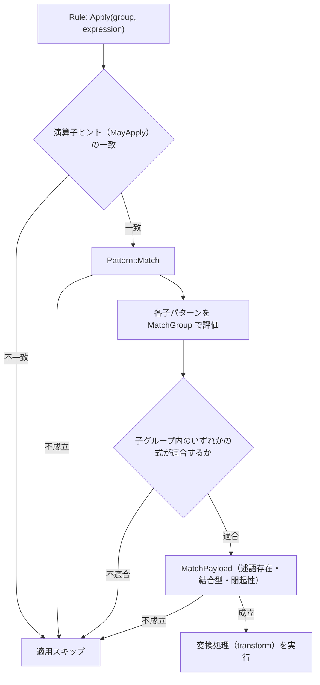

# 第30章 Pattern DSL と Bindings — Rule の「条件」を宣言する

- 状態: draft / 執筆基準リビジョン: `3880673` (2026-09-12)
- 状態: draft / 執筆基準リビジョン: `3880673` (2026-09-12)

本章では、論理規則の適用可否を判定するパターン記述の仕組みを整理する。対象は `plan/cascades.hpp` の `Pattern`、`PayloadConstraint`、`Bindings`、および `plan/cascades.cpp` における照合処理（`Pattern::Match` 等）である。

## 30-1. 規則における適用条件と変換処理の分離

論理 Rule は `Rule(name, pattern, transform, target)` という 4 つの要素で定義される（第 1 章 1-4 節）。**パターン（pattern）** は式に対する適用条件を静的に宣言し、**変換関数（transform）** は条件を満たした際に行う Memo への追加操作を記述する。適用条件と変換動作を分離することで、以下の利点が生じる。

- 各規則が要求する前提条件がパターン構造として明示され、コードレビューや静的解析による検査が容易になる。
- 探索エンジンは個々の規則の内部変換ロジックに依存せず、パターンの合致判定のみに基づいて規則のディスパッチを行える。

パターンが宣言する条件は、次の 4 要素で構成される。

1. **演算子型**: 対象とする論理演算子（`kJoin`、`kSelection` 等）。
2. **子の構造**: 許容される子パターンの個数および各子の形状。
3. **キャプチャ**: 適合した子グループ（または親グループ）を変換関数へ受け渡すための識別名。
4. **ペイロード制約**: 述語の存在や、述語が参照するテーブルの範囲（特定の子グループ内に閉起していること）に関する制約。

これらの条件を表現するクラスが `Pattern` である（`plan/cascades.hpp`）。

```cpp
class Pattern {
 public:
  static Pattern Any(std::string capture = {});
  static Pattern Op(LogicalOperator operation, std::vector<Pattern> children,
                    std::string capture = {});
  static Pattern Op(LogicalOperator operation, std::vector<Pattern> children,
                    std::string capture, PayloadConstraint payload);

  [[nodiscard]] bool Match(const Memo& memo, GroupId group,
                           const LogicalExpression& expression,
                           Bindings* bindings) const;

 private:
  [[nodiscard]] bool MatchGroup(const Memo& memo, GroupId group,
                                Bindings* bindings) const;
  [[nodiscard]] bool MatchPayload(const Memo& memo,
                                  const LogicalExpression& expression,
                                  const Bindings& bindings) const;
  std::optional<LogicalOperator> operation_;
  std::vector<Pattern> children_;
  std::string capture_;
  PayloadConstraint payload_;
};
```

キャプチャされたグループを保持する型は `Bindings` である（`plan/cascades.hpp`）。

```cpp
using Bindings = std::unordered_map<std::string, GroupId>;
```

キャプチャの対象が式ではなく `GroupId` に限定されている点は重要である。Cascades における規則の適用は既存の式を直接書き換えるのではなく、既存のグループへ新たな等価式を追加する操作であるため、変換処理に必要な引数は常に部分式が属する子グループの識別子（`GroupId`）のみとなる。

## 30-2. パターン記述 DSL

`Pattern` インスタンスの構築を簡潔にするため、`cascades::dsl` 名前空間において生成関数群が提供されている（`plan/cascades.hpp`）。これらは主に以下の 3 つの形式に分類される。

| 形式 | 代表例 | 判定内容 |
|---|---|---|
| 任意（ワイルドカード） | `Any("left")` | 演算子を問わず適合し、対象グループを `"left"` として束縛 |
| 演算子指定 | `Scan("scan")`, `Join(l, r)` | 指定された `LogicalOperator` および子パターン列に適合 |
| ペイロード制約付き | `LeftOuterJoin(l, r)`, `SelectionWithin(0, child)` | 演算子に加え、述語の閉起性や結合型の制約を課す |

代表例として `Join` およびペイロード制約を伴う関数の実装を示す（`plan/cascades.hpp` の `namespace dsl`）。

```cpp
inline Pattern Join(Pattern left = Any(), Pattern right = Any(),
                    std::string capture = {}) {
  std::vector<Pattern> children;
  children.push_back(std::move(left));
  children.push_back(std::move(right));
  return Pattern::Op(LogicalOperator::kJoin, std::move(children),
                     std::move(capture));
}

inline Pattern LeftOuterJoin(Pattern left = Any(), Pattern right = Any(),
                             std::string capture = {}) {
  PayloadConstraint payload;
  payload.outer_join_type = 0;  // 0 = LEFT
  return Pattern::Op(LogicalOperator::kOuterJoin,
                     {std::move(left), std::move(right)}, std::move(capture),
                     payload);
}

inline Pattern SelectionWithin(size_t predicate_within_child,
                               Pattern child = Any(),
                               std::string capture = {}) {
  PayloadConstraint payload;
  payload.requires_predicate = true;
  payload.predicate_within_child = predicate_within_child;
  return Pattern::Op(LogicalOperator::kSelection, {std::move(child)},
                     std::move(capture), payload);
}
```

`LeftOuterJoin` のように結合型の検証をパターン層に持たせることで、変換ラムダの内部で個別に結合型を再検査する重複を排除し、不適切な結合型に対する誤適用を未然に防止している。

## 30-3. パターン照合の評価手順

照合処理は `Match`、`MatchGroup`、`MatchPayload` の 3 段階で再帰的に進行する。最上位のエントリポイントは `Pattern::Match` である（`plan/cascades.cpp`）。

```cpp
bool Pattern::Match(
    const Memo& memo, GroupId group,
    const LogicalExpression& expression, Bindings* bindings) const {
  if (operation_ && expression.operation != *operation_) {
    return false;
  }
  if (!children_.empty() && children_.size() != expression.children.size()) {
    return false;
  }
  Bindings local = *bindings;
  if (!capture_.empty()) {
    auto [iter, inserted] = local.emplace(capture_, group);
    if (!inserted && iter->second != group) {
      return false;
    }
  }
  for (size_t i = 0; i < children_.size(); ++i) {
    if (!children_[i].MatchGroup(memo, expression.children[i], &local)) {
      return false;
    }
  }
  if (!MatchPayload(memo, expression, local)) {
    return false;
  }
  *bindings = std::move(local);
  return true;
}
```

`Match` は渡された単一の論理式 `expression` に対し、以下の順序で判定を行う。

1. **演算子の一致判定**: パターンに演算子が指定されている場合、式の演算子と完全一致するかを検証する。
2. **子ノード数の比較**: 子パターン列が明示されている場合、子の要素数が一致するかを確認する（未指定の場合は任意の個数に適合する）。
3. **キャプチャの登録と同一性検証**: パターンにキャプチャ名が存在する場合、現在の `group` を束縛する。既に同名のキャプチャが存在し、かつ異なる `GroupId` を指していた場合は照合失敗とする。同一の変数名を複数回用いることで、左右の子が同一グループであることを要求する制約を表現できる。
4. **子グループへの再帰判定**: 各子ノードに対して `MatchGroup` を呼び出す。
5. **ペイロード制約の検証**: `MatchPayload` を評価する。

照合途中で失敗した際に呼び出し元の束縛情報を汚染しないよう、ローカルコピー `local` に対して操作を行い、すべての条件を満たした場合にのみ元の `bindings` を上書きする。

子グループに対する照合を行う `MatchGroup` は以下のとおりである（`plan/cascades.cpp`）。

```cpp
bool Pattern::MatchGroup(
    const Memo& memo, GroupId group,
    Bindings* bindings) const {
  if (!capture_.empty()) {
    auto [iter, inserted] = bindings->emplace(capture_, group);
    if (!inserted && iter->second != group) {
      return false;
    }
  }
  if (!operation_) {
    return true;
  }
  return std::ranges::any_of(
      memo.Get(group).expressions,
      [&](const LogicalExpression& expression) {
        Bindings local = *bindings;
        if (Match(memo, group, expression, &local)) {
          *bindings = std::move(local);
          return true;
        }
        return false;
      });
}
```

この処理において、子グループ内に存在する**いずれか 1 つの等価式**がパターンに適合すれば、そのグループ全体がマッチしたと判定される（`std::ranges::any_of`）。グループは等価な式の集合であるため、そのグループ内に該当する形状の代替案が 1 つでも存在すれば、探索エンジンがその候補を選択することで規則適用の前提が成立する。

ペイロード制約の構造体と判定処理は以下のとおりである（`plan/cascades.hpp`, `plan/cascades.cpp`）。

```cpp
struct PayloadConstraint {
  bool requires_predicate{false};
  std::optional<size_t> predicate_within_child;
  std::optional<uint8_t> outer_join_type;
};

bool Pattern::MatchPayload(const Memo& memo,
                           const LogicalExpression& expression,
                           [[maybe_unused]] const Bindings& bindings) const {
  if (payload_.requires_predicate && !expression.predicate) {
    return false;
  }
  if (payload_.outer_join_type.has_value()) {
    if (expression.operation != LogicalOperator::kOuterJoin ||
        expression.join_type != *payload_.outer_join_type) {
      return false;
    }
  }
  if (!payload_.predicate_within_child) {
    return true;
  }
  const size_t child_index = *payload_.predicate_within_child;
  if (!expression.predicate || child_index >= expression.children.size()) {
    return false;
  }
  const Group& child = memo.Get(expression.children[child_index]);
  return std::ranges::all_of((*expression.predicate)->TouchedColumns(),
                             [&child](const ColumnName& column) {
                               return !column.schema.empty() &&
                                      std::ranges::find(child.relations,
                                                        column.schema) !=
                                          child.relations.end();
                             });
}
```

`predicate_within_child` は、述語が参照するすべての列が指定された子グループの関係集合のみに閉じていることを要求する制約である。テーブル修飾のない列名（`col` など）は所属関係を一意に証明できないため、保守的に照合不一致とする。証明が不完全な状態での述語押し下げによる意味論破壊を防ぐための設計である。



## 30-4. 適用例 — `push_selection_into_scan`

述語をスキャングループへ押し下げる規則 `push_selection_into_scan` の宣言を例に示す（`plan/cascades.cpp` の `RuleSet::Default()`）。

```cpp
    built.Add(Rule(
        "push_selection_into_scan", SelectionWithin(0, Scan("scan")),
        [](const Bindings& bindings, Memo& memo, GroupId,
           const LogicalExpression& expression) {
          memo.MergeScanFilter(bindings.at("scan"), *expression.predicate);
        },
        LogicalOperator::kSelection));
```

- パターン部 `SelectionWithin(0, Scan("scan"))` は、0 番目の子グループが単一テーブルのスキャンであり、かつ選択述語がそのテーブルのみを参照している場合に適合する。
- 変換本体はキャプチャされたスキャングループに対し、`memo.MergeScanFilter` を用いて述語を合併するのみである。
- 述語の閉起性という安全性検査がパターン定義側で担保されているため、変換関数内部での煩雑な条件分岐が不要となっている。

## 30-5. `Rule::Apply` — 規則の実行と Memo 成長の判定

探索エンジンから各規則を呼び出す共通処理が `Rule::Apply` である（`plan/cascades.cpp`）。

```cpp
bool Rule::Apply(Memo& memo, GroupId group,
                 const LogicalExpression& expression) const {
  if (!MayApply(expression.operation)) {
    return false;
  }
  Bindings bindings;
  if (!pattern_.Match(memo, group, expression, &bindings)) {
    return false;
  }
  const size_t before_groups = memo.GroupCount();
  const size_t before_expressions = memo.ExpressionCount(group);
  transform_(bindings, memo, group, expression);
  return memo.GroupCount() != before_groups ||
         memo.ExpressionCount(group) != before_expressions;
}
```

- `MayApply` による演算子フィルタ: パターン全体の評価に先立ち、対象式の演算子が規則の事前ヒント（`target`）と一致するかを判定し、無駄なマッチング処理を回避する。
- 戻り値の責務: 戻り値の真偽値は「規則の適用によって Memo に新たなグループまたは式が追加されたか」を表す。変換関数が早期リターンした場合や重複によって追加が棄却された場合を呼び出し側で検知できる。

## 30-6. まとめ

- パターンは、演算子、子の構造、キャプチャ、ペイロード制約の 4 要素で構成される。
- `Bindings` は名前から `GroupId` への写像であり、同名キャプチャは同一グループであることを要求する。
- 照合処理は、式単位の `Match`、グループ内の代替式を探索する `MatchGroup`、詳細属性を判定する `MatchPayload` に階層化されている。
- 列の所属関係が曖昧な未修飾列はペイロード制約で拒絶され、推論の安全性を優先する。

次章（第 40 章）では、これらの規則を繰り返し適用して探索空間を広げる探索エンジン（`SearchEngine`）のアルゴリズムとコスト選択モデルを解説する。

