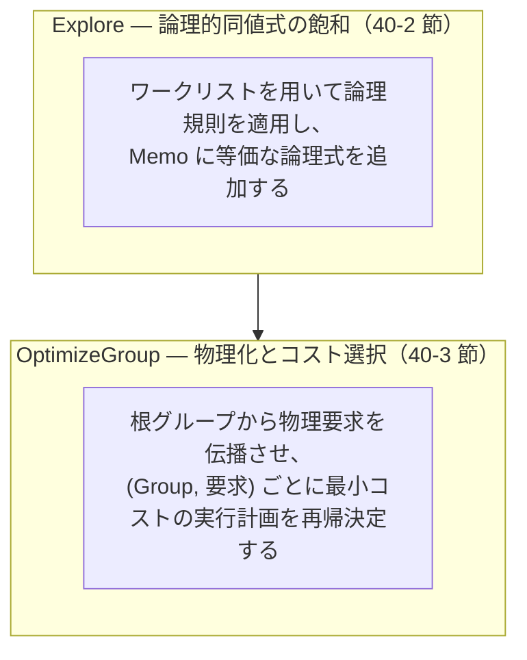

# 第40章 SearchEngine — 探索・コスト・枝刈り・縮退

- 状態: draft / 執筆基準リビジョン: `3880673` (2026-09-12)
- 状態: draft / 執筆基準リビジョン: `3880673` (2026-09-12)

本章では、第 1 章で概観した探索エンジン（`SearchEngine`）の実装詳細を解説する。論理規則を飽和適用する `Explore` と、物理要求に基づいて最小コストの計画を選択する `OptimizeGroup` のアルゴリズムを追う。対象は `plan/cascades.cpp` における `SearchEngine` の実装である。

## 40-1. 探索エンジンの 2 段階処理

`SearchEngine::Optimize` は、以下の 2 段階で構成される。



第 1 段階の `Explore` が探索空間（等価式の候補群）を生成し、第 2 段階の `OptimizeGroup` がその中から具体的な物理実行計画を導出する。

## 40-2. `Explore` — ワークリストによる規則の飽和適用

`SearchEngine::Explore` の処理本体は以下のとおりである（`plan/cascades.cpp`）。

```cpp
void SearchEngine::Explore(GroupId root) {
  best_.clear();
  next_expression_.clear();
  steps_ = 0;
  budget_exhausted_ = false;
  std::deque<GroupId> queue;
  std::unordered_set<GroupId> queued;
  const std::function<void(GroupId)> enqueue = [&](GroupId group) {
    if (group == kInvalidGroup) {
      return;
    }
    if (queued.insert(group).second) {
      queue.push_back(group);
    }
  };
  enqueue(root);
  size_t steps = 0;
  constexpr size_t kMaxExploreSteps = 20000;
  while (!queue.empty() && steps < kMaxExploreSteps) {
    ++steps;
    const GroupId group = queue.front();
    queue.pop_front();
    ExploreGroup(group, enqueue);
    for (GroupId touched : memo_.DrainTouchedGroups()) {
      enqueue(touched);
    }
  }
}
```

この処理は幅優先探索（BFS）型のワークリストとして動作する。

- **重複キューイングの抑止**: `queued` 集合を用いて、同一グループがキューへ重複して追加されるのを防ぐ。Memo への更新は追記のみ（append-only）であるため、無限循環に陥ることはない。
- **派生更新の追跡**: `Memo::AddExpression` は式が追加されたグループを `touched_groups_` に記録する。`ExploreGroup` の完了ごとに `DrainTouchedGroups()` でこれらを回収してキューへ再投入することで、新しく生成された式に対する規則適用を順次進める。
- **探索回数の安全上限**: 論理規則の適用予算（`search_step_budget`）とは別に、ループ自体の安全弁として `kMaxExploreSteps = 20000` の上限が設けられている。

各グループの探索処理は `ExploreGroup` が担う（`plan/cascades.cpp`）。

```cpp
void SearchEngine::ExploreGroup(GroupId group,
                                const std::function<void(GroupId)>& enqueue) {
  size_t& next = next_expression_[group];
  while (next < memo_.Get(group).expressions.size()) {
    const LogicalExpression expression = memo_.Get(group).expressions[next];
    ++next;
    for (const Rule& rule : rules_->Rules()) {
      if (!rule.MayApply(expression.operation)) {
        continue;
      }
      if (step_budget_ != 0 && steps_ >= step_budget_) {
        budget_exhausted_ = true;
        return;
      }
      ++steps_;
      try {
        if (rule.Apply(memo_, group, expression)) {
          applied_rules_.insert(rule.Name());
        }
      } catch (const std::invalid_argument&) {
        continue;
      }
    }
    for (GroupId child : expression.children) {
      enqueue(child);
    }
  }
}
```

グループごとに式の読み取り位置を示すカーソル `next`（`next_expression_[group]`）を管理している。新たに式が追加されてグループが再キューイングされた場合でも、未評価の式のみを対象に処理が再開され、既知の式に対する再走査が発生しない。

## 40-3. `OptimizeGroup` — メモ化再帰と分枝限定法

第 2 段階の `OptimizeGroup` は、指定された物理要求を満たす最良の物理プランを再帰的に決定する（`plan/cascades.cpp`）。

```cpp
std::optional<BestPlan>
SearchEngine::OptimizeGroup(
    GroupId group, const PhysicalProperties& properties,
    const Implement& implement, const RuleContext& context) {
  const std::string cache_key = std::to_string(group) + '/' + properties.Key();
  if (const auto found = best_.find(cache_key); found != best_.end()) {
    return found->second;
  }

  const bool needs_ordering = !properties.ordering.empty() &&
                              context.query != nullptr &&
                              !context.query->order_expressions_.empty();
  std::optional<BestPlan> best;
  const Group& memo_group = memo_.Get(group);
  for (size_t index = 0; index < memo_group.expressions.size(); ++index) {
    const LogicalExpression& expression = memo_group.expressions[index];
    const std::vector<PhysicalProperties> child_properties =
        RequiredChildProperties(expression, properties);
    if (child_properties.size() != expression.children.size()) {
      continue;
    }
    std::vector<BestPlan> children;
    double child_cost = 0;
    double child_rows = 0;
    bool valid = true;
    for (size_t child = 0; child < expression.children.size(); ++child) {
      std::optional<BestPlan> child_plan =
          OptimizeGroup(expression.children[child], child_properties[child],
                        implement, context);
      if (!child_plan) {
        valid = false;
        break;
      }
      child_cost += child_plan->cost;
      child_rows += child_plan->estimated_rows;
      children.push_back(std::move(*child_plan));
    }
    if (!valid) {
      continue;
    }

    if (best && child_cost >= best->cost) {
      continue;
    }

    for (PlanAlternative alternative :
         implement(group, memo_, expression, children, properties, context)) {
      if (!alternative.plan) {
        continue;
      }
      double cost = child_cost + alternative.local_cost;
      if (needs_ordering &&
          !alternative.plan->IsOrderedBy(context.query->order_expressions_,
                                         context.query->order_ascending_,
                                         context.query->order_nulls_first_)) {
        const double rows = std::max(alternative.estimated_rows, child_rows);
        cost += rows * std::log2(std::max(2.0, rows));
      }
      if (!best || cost < best->cost) {
        best = BestPlan{.plan = std::move(alternative.plan),
                        .cost = cost,
                        .estimated_rows = alternative.estimated_rows,
                        .group = group,
                        .expression_index = index};
      }
    }
  }
  best_.emplace(cache_key, best);
  return best;
}
```

この処理における設計上の重要事項は以下のとおりである。

1. **(Group, 物理要求) を単位とするメモ化**: キャッシュキーはグループ番号と物理要求キーの組（`group/properties.Key()`）で構成される。同じ関係集合であっても、ソート順を要求する場合と要求しない場合とで異なる最適解が導出・保持される。
2. **分枝限定法（Branch-and-Bound）による枝刈り**: 各物理代替案の総コストは「子ノードの累積コスト ＋ 自ノードの局所コスト（＋ 整列ペナルティ）」となる。自ノードの局所コストおよびペナルティは非負であるため、子ノードの合計コスト（`child_cost`）が暫定の最小コスト（`best->cost`）に達している場合、その論理式からより安価な計画が得られる可能性はない。この判定により、後続の物理化処理を早期にスキップする。
3. **物理要求のコスト評価（D6 規律）**: 要求された整列順序を自然に出力できない物理計画に対しては、後段で必要となるソート処理の推定コスト $N \log_2 N$ をペナルティとして加算する。これにより、インデックス走査によって整列順を無償で提供する計画と、全表走査にソート演算子を追加する計画とを、同一のコスト基準で比較できる。
4. **失敗結果のキャッシュ**: 要求を満たす実行計画が存在しない場合、`std::nullopt` がキャッシュされる。同一の (Group, 物理要求) に対する不要な再帰探索を防ぐ。

## 40-4. 物理演算子の局所コスト算出例

実装規則が算出する局所コスト（`local_cost`）の具体例として、結合演算の 2 方式を示す（`plan/implementation_rules.cpp` の `JoinAlternatives`）。

**クロス積のコストモデル**:
```cpp
const double local_cost = (l_rows * r_rows) + l_rows + r_rows;
```
左右の行数の積（出力行数）に、両入力の読み込み行数を加算した単純なモデルである。

**ハッシュ結合のコストモデル**:
```cpp
double local_cost = l_rows + r_rows;
const double build_bytes = r_rows * kHashJoinRowBytesEstimate;
if (mode == HashJoinMode::kInMemory &&
    PreferHybridHashJoin(static_cast<size_t>(build_bytes))) {
  local_cost += r_rows * 3;
}
```
両入力の走査行数を基本コストとし、build 側の推定メモリ使用量がメモリ予算を超える場合は、インメモリ結合に対してペナルティを加算してディスクスピルを前提とするハイブリッド結合を優先させる。

## 40-5. 探索の打ち切りと縮退動作

大規模クエリにおける探索コストの肥大化を抑止するため、tinylamb は以下の縮退（degradation）機構を備えている。

1. **グループ内の式数上限（`expression_cap_`）**: グループ内の論理式が 4096 件（既定値）に達した時点で新規式の追加を停止し、`degraded_` フラグを立てる（第 20 章 20-7 節）。
2. **規則適用ステップ予算（`search_step_budget`）**: 論理規則の適用回数が指定値に達した時点で探索を打ち切り、その時点までに発見された最良プランを返す。
3. **探索ループ上限（`kMaxExploreSteps`）**: ワークリストのループ回数を最大 20,000 回に制限する。

これらの縮退機構は、探索時間を制限するために計画の最適性を緩めるものであり、出力結果の意味論的な正しさを損なうことはない。

## 40-6. まとめ

- `Explore` は、グループごとの読み取りカーソルを用いたワークリストにより、論理規則の適用を効率的に飽和させる。
- `OptimizeGroup` は (Group, 物理要求) を単位として最良プランをメモ化し、子コストに基づく分枝限定法によって探索枝を刈り込む。
- 物理要求（ソート順）を満たさない代替案には明示的なソートコストが加算され、要求を満たす演算子との間で統一的なコスト比較が行われる。
- 3 系統の探索上限（式数上限、適用予算、ループ上限）により、異常終了を避けつつ安全に実行計画を決定する。

次章（第 50 章）では、本章で扱った `PhysicalProperties` の構造と、親から子ノードへの要求伝播規則を解説する。

