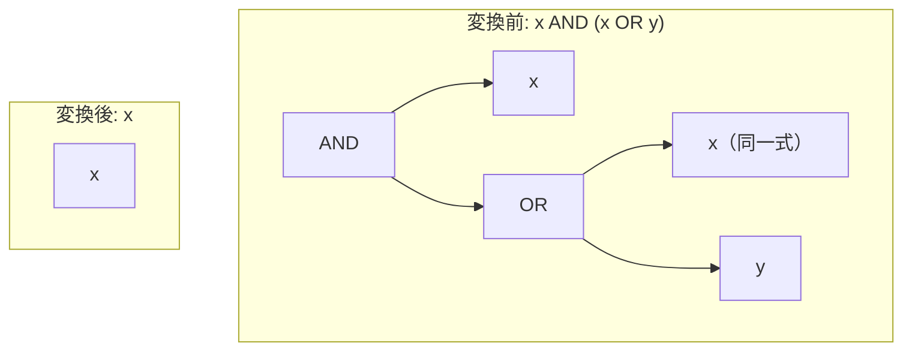

# absorption_and

- 状態: draft   /   執筆基準リビジョン: `3880673` (2026-09-12)
- 定義位置: `expression/rewrite.cpp` の `ExpressionRuleSet::Default()`（登録名 `"absorption_and"`）
- 同型の兄弟: `absorption_and_reversed` / `absorption_or` / `absorption_or_reversed`（同一の guard を持つ 4 本組）

## 概要

論理積と論理和の組み合わせ $x \land (x \lor y)$ を $x$ へ縮退させる式書き換え Rule です（ブール代数の吸収則）。

三値論理（Kleene 論理）において本式は常に $x$ と同一の評価値を返します。ただし、部分式 $y$ の評価が完全に破棄されるため、短絡評価の観点から $y$ がランタイムエラー（ゼロ除算や不正キャスト例外など）を発生させない安全性が保証される場合に限り発火が許可されます。

## 変換前後の関係



## 適用条件

パターン定義および登録処理は以下のとおりです（`expression/rewrite.cpp`）。

```cpp
    // Absorption laws (x AND (x OR y) -> x, etc.).  Value-identical under
    // Kleene 3-valued logic, but they DROP y: the AST short-circuits only
    // when x decides, so when x is UNKNOWN/FALSE-but-undecided it still
    // evaluates y, and a raising y (oracle-found: `(NULL AND CAST(-inf AS
    // INT64) <= c) OR NULL`) must not be erased.  Fire only if y is total.
    // Furthermore, x must be safe to reduce evaluations and cannot be
    // non-boolean.
    built.Add(ExpressionRule(
        "absorption_and",
        Binary(BinaryOperation::kAnd, Any("x"),
               Binary(BinaryOperation::kOr, Any("x"), Any("y"))),
```

パターン内に同一の束縛名 `Any("x")` が 2 箇所存在します。式パターン DSL では同名キャプチャに対して `Same()`（ノード種別および `ToString()` の完全一致）を課すため、外側の論理積オペランドと論理和左辺オペランドが同一の部分木である場合にのみマッチします。

適用可否はラムダ式内の以下の事前条件（guard）により判定されます。

```cpp
          const Expression& x = bindings.at("x");
          if (!ExpressionCannotThrow(bindings.at("y")) ||
              StaticallyNonBoolean(x) || !SafeToReduceEvaluationCount(x)) {
            return Expression{};
          }
          return x;
```

発火には以下の 3 条件がすべて満たされる必要があります。

1. **`ExpressionCannotThrow(y)`**: 破棄される部分式 $y$ が、入力タプルの値に依存せず絶対に例外を発生させない全域関数（total function）であること。
2. **`!StaticallyNonBoolean(x)`**: 生き残る部分式 $x$ が非ブール型（文字列型や数値型など）に静的に確定していないこと（論理積の結果型であるブール型と一致させるための型保護）。
3. **`SafeToReduceEvaluationCount(x)`**: $x$ の評価回数が 2 回から 1 回に減少するため、$x$ に副作用を伴う揮発性関数（volatile function）や相関サブクエリが含まれていないこと。

## 意味論的根拠と例外消失の抑止

### 1. Kleene 三値論理における恒等性
ブール代数における吸収則 $x \land (x \lor y) \equiv x$ は、三値論理系においても成立します。
- $x = \text{TRUE}$ の場合: $\text{TRUE} \land (\text{TRUE} \lor y) \equiv \text{TRUE} \land \text{TRUE} \equiv \text{TRUE} \equiv x$
- $x = \text{FALSE}$ の場合: $\text{FALSE} \land (\text{FALSE} \lor y) \equiv \text{FALSE} \land y \equiv \text{FALSE} \equiv x$（$y$ が $\text{TRUE}, \text{FALSE}, \text{UNKNOWN}$ のいずれであっても積は $\text{FALSE}$）
- $x = \text{UNKNOWN}$ の場合: $\text{UNKNOWN} \land (\text{UNKNOWN} \lor y)$ において、$(\text{UNKNOWN} \lor y)$ は $y = \text{TRUE}$ のとき $\text{TRUE}$、それ以外は $\text{UNKNOWN}$ となります。したがって、$\text{UNKNOWN} \land \text{TRUE} \equiv \text{UNKNOWN}$、$\text{UNKNOWN} \land \text{UNKNOWN} \equiv \text{UNKNOWN}$ となり、常に $x$ の値と一致します。

### 2. 短絡評価と例外消去の防止
評価値が論理的に一致するにもかかわらず条件 1（`ExpressionCannotThrow`）が必要とされる理由は、SQL 実行エンジンにおける短絡評価規則（short-circuit evaluation）に起因します。

AST 評価器（意味論の正準参照実装）は、左辺の評価値によって結果が確定しない限り右辺を評価します。$x = \text{UNKNOWN}$ の場合、左辺 $x$ だけでは論理積の結果が確定しないため、右辺 $(x \lor y)$ が評価され、さらにその中の $y$ まで実際に評価が到達します。

もし $y$ が例外を発生させる式（例: `CAST('-inf' AS INT64)` やゼロ除算）を含んでいた場合、変換前のクエリはランタイムエラーを発生させてトランザクションをアボートさせます。しかし、本 Rule を無条件に適用して $x$（$\text{UNKNOWN}$）に畳み込むと、クエリ実行は例外を出さずに正常終了し、NULL を返してしまいます。

オラクルフューザーによって発見された反例 `(NULL AND CAST(-inf AS INT64) <= c) OR NULL` は、この例外消去の危険性を実証しています。したがって、破棄対象の $y$ がいかなる入力に対しても安全に計算を完了できること（total であること）が必須要件となります。

### 3. 補元つき吸収則（Complementary Absorption）の非採用
なお、古典二値論理で知られる補元つき吸収則 $x \land (\neg x \lor y) \equiv x \land y$ は、**三値論理では一般に成立しません**。$x = \text{UNKNOWN}, y = \text{FALSE}$ の場合、左辺は $\text{UNKNOWN} \land (\text{UNKNOWN} \lor \text{FALSE}) \equiv \text{UNKNOWN}$ となりますが、右辺は $\text{UNKNOWN} \land \text{FALSE} \equiv \text{FALSE}$ となり、評価値の不一致（三値論理の健全性破壊）を招きます。このため、`tinylamb` では補元つき吸収則は意図的に採用されていません。

## 実装の詳細

ラムダ式は事前条件検査に合致した場合、バインディングから取得した式ノード $x$ をそのまま返します。事前条件判定は「破棄されるオペランドの安全性確認」から始まり、「残余オペランドの型整合性」「揮発性の排除」の順に短絡評価されます。

## 最適化効果

冗長な論理和ツリーおよびオペランド $y$ の評価処理が丸ごと削除され、$x$ の評価回数が 1 回に集約されます。また、述語の平坦化により、後続の連言分解（`SplitConjuncts`）やスキャン演算子への述語プッシュダウンにおけるパターン照合が単純化されます。

## 関連 Rule との相互作用

- `absorption_and_reversed`: 被演算子の順序が逆転した $(x \lor y) \land x$ を処理する対照 Rule です。
- `absorption_or` / `absorption_or_reversed`: 論理和を外側、論理積を内側に配置した双対形 $x \lor (x \land y)$ を処理します。
- `factor_or_common_and`: 選言から共通の連言項を括り出す Rule であり、一方の分岐が空になる場合の簡約と領域が接合します。

## 検証テスト

`expression/rewrite_test.cpp` にて以下の項目が検証されています。

- `ExpressionRewriteTest.IdempotenceAndAbsorption`:
  $x \land (x \lor y)$ が単一の列参照ノード $x$ へ正常に畳み込まれること、および非該当パターン（$x \land (y \lor z)$）が保持されることを確認します。
- `ExpressionRewriteTest.IdempotenceAndAbsorptionRefuseNonBooleanAndVolatile`:
  $x$ が非ブール型である場合、または volatile 指定された関数を含む場合に書き換えが抑止されることを確認します。
- `ExpressionRewriteTest.AbsorptionPreservesRaisingOperand`:
  例外を発生させる式を含む $y$ が与えられた際、吸収則が発火せず例外発生特性が維持されることを確認します。
