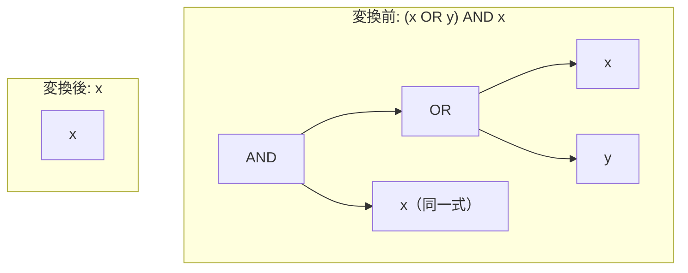

# absorption_and_reversed

- 状態: draft   /   執筆基準リビジョン: `3880673` (2026-09-12)
- 定義位置: `expression/rewrite.cpp` の `ExpressionRuleSet::Default()`（登録名 `"absorption_and_reversed"`）
- 同型の兄弟: `absorption_and` / `absorption_or` / `absorption_or_reversed`（同一の guard を持つ 4 本組）

## 概要

論理積と論理和の組み合わせ $(x \lor y) \land x$ を $x$ へ縮退させる式書き換え Rule です（ブール代数の吸収則・左右反転形）。

`absorption_and`（$x \land (x \lor y)$ を対象とする形）と同一の意味論的根拠および事前条件（guard）を持ち、二項演算子の被演算子の左右順序が逆転したパターンを網羅するために定義されています。

## 変換前後の関係



## 適用条件

パターン定義および登録処理は以下のとおりです（`expression/rewrite.cpp`）。

```cpp
    built.Add(ExpressionRule(
        "absorption_and_reversed",
        Binary(BinaryOperation::kAnd,
               Binary(BinaryOperation::kOr, Any("x"), Any("y")), Any("x")),
        [](const Expression&, const ExpressionBindings& bindings) {
          const Expression& x = bindings.at("x");
          if (!ExpressionCannotThrow(bindings.at("y")) ||
              StaticallyNonBoolean(x) || !SafeToReduceEvaluationCount(x)) {
            return Expression{};
          }
          return x;
        }));
```

マッチングパターンは論理積の左辺が論理和 $(x \lor y)$、右辺が $x$ となる構造を要求します。適用判定を担う事前条件は `absorption_and` と同一です。

1. **`ExpressionCannotThrow(y)`**: 破棄される $y$ がランタイム例外を発生させない全域関数であること。
2. **`!StaticallyNonBoolean(x)`**: 残余式 $x$ が非ブール型に確定していないこと。
3. **`SafeToReduceEvaluationCount(x)`**: $x$ の評価回数削減に伴う副作用（volatile 関数の呼び出し変化など）が生じないこと。

## 意味論的根拠と例外消失の抑止

Kleene 三値論理において、$(x \lor y) \land x$ は演算の可換性に基づき $x \land (x \lor y)$ と同値であり、すべての真理値（$\text{TRUE}, \text{FALSE}, \text{UNKNOWN}$）において評価値は $x$ と完全に一致します。

しかし、AST 評価器の短絡評価順序において、変換前の式はまず左辺 $(x \lor y)$ を評価します。$x = \text{UNKNOWN}$ のとき、論理和の結果を確定させるために $y$ が評価されます。ここで $y$ が例外を投げる式であった場合、元の式は評価エラーとなりますが、$x$ へ畳み込むとエラーが消去されます。

したがって、被演算子の配置順序にかかわらず、消去対象となるオペランド $y$ の例外非発生性（`ExpressionCannotThrow`）の検証が必須となります。

## 実装の詳細

実装ロジックは `absorption_and` と同一であり、抽出された束縛辞書から $x$ および $y$ を取得し、3 つの guard 条件を順次評価します。条件を満たした場合は式 $x$ を返却し、いずれかが不成立の場合は空式を返して書き換えを抑止します。

## 最適化効果

複雑な論理和ツリーおよび $y$ の評価計算が除去され、式ノードが葉ノード $x$ へ直接縮約されます。SQL 自動生成ツールや複雑なビュー定義の展開によって生じる冗長な連言・選言の混在式を正規化し、後続の述語プッシュダウンやインデックス選択の精度を高めます。

## 関連 Rule との相互作用

- `absorption_and`: 左辺が $x$、右辺が $(x \lor y)$ のパターンを処理する対照 Rule です。
- `absorption_or` / `absorption_or_reversed`: 論理和と論理積の演算子が逆転した双対形を処理します。
- `factor_or_common_and`: 共通連言項の括り出しを行う Rule であり、一方の項が空となるケースにおいて本 Rule と目的を共有します。

## 検証テスト

`expression/rewrite_test.cpp` における以下のテストケースで検証されています。

- `ExpressionRewriteTest.IdempotenceAndAbsorption`:
  $(x \lor y) \land x$ が $x$ へ正しく縮退することを確認します。
- `ExpressionRewriteTest.IdempotenceAndAbsorptionRefuseNonBooleanAndVolatile`:
  非ブール型や volatile 関数を含む式に対して書き換えが不発火となることを確認します。
- `ExpressionRewriteTest.AbsorptionPreservesRaisingOperand`:
  評価エラーを引き起こす式が消去されないことを確認します。
