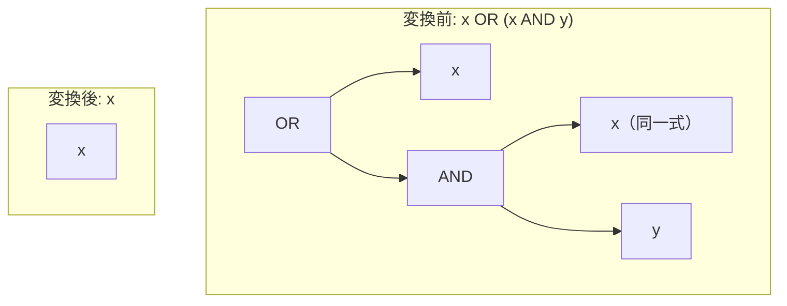

# absorption_or

- 状態: draft   /   執筆基準リビジョン: `3880673` (2026-09-12)
- 定義位置: `expression/rewrite.cpp` の `ExpressionRuleSet::Default()`（登録名 `"absorption_or"`）
- 同型の兄弟: `absorption_and` / `absorption_and_reversed` / `absorption_or_reversed`（同一の guard を持つ 4 本組）

## 概要

論理和と論理積の組み合わせ $x \lor (x \land y)$ を $x$ へ縮退させる式書き換え Rule です（ブール代数の双対吸収則）。

論理積を外側とする `absorption_and` の双対形であり、Kleene 三値論理において恒等性を保ちながら、$y$ の評価消去に伴う例外消失を防止する共通の事前条件（guard）を備えます。

## 変換前後の関係



## 適用条件

パターン定義および登録処理は以下のとおりです（`expression/rewrite.cpp`）。

```cpp
    built.Add(ExpressionRule(
        "absorption_or",
        Binary(BinaryOperation::kOr, Any("x"),
               Binary(BinaryOperation::kAnd, Any("x"), Any("y"))),
        [](const Expression&, const ExpressionBindings& bindings) {
          const Expression& x = bindings.at("x");
          if (!ExpressionCannotThrow(bindings.at("y")) ||
              StaticallyNonBoolean(x) || !SafeToReduceEvaluationCount(x)) {
            return Expression{};
          }
          return x;
        }));
```

マッチングパターンは論理和の左辺が $x$、右辺が論理積 $(x \land y)$ となる構造です。同名キャプチャ `Any("x")` により部分木の一致を保証します。事前条件は 4 本組共通の 3 条件です。

1. **`ExpressionCannotThrow(y)`**: 破棄される $y$ がランタイム例外を発生させない全域関数であること。
2. **`!StaticallyNonBoolean(x)`**: 残余式 $x$ が非ブール型に確定していないこと（論理和の結果型との整合）。
3. **`SafeToReduceEvaluationCount(x)`**: $x$ の評価回数減少によって volatile 関数などの副作用が損なわれないこと。

## 意味論的根拠と例外消失の抑止

### 1. Kleene 三値論理における恒等性
双対吸収則 $x \lor (x \land y) \equiv x$ は、三値論理系においても成立します。
- $x = \text{TRUE}$ の場合: $\text{TRUE} \lor (\text{TRUE} \land y) \equiv \text{TRUE} \lor y \equiv \text{TRUE} \equiv x$（$y$ の真理値に依存せず和は $\text{TRUE}$）
- $x = \text{FALSE}$ の場合: $\text{FALSE} \lor (\text{FALSE} \land y) \equiv \text{FALSE} \lor \text{FALSE} \equiv \text{FALSE} \equiv x$
- $x = \text{UNKNOWN}$ の場合: $\text{UNKNOWN} \lor (\text{UNKNOWN} \land y)$ において、$(\text{UNKNOWN} \land y)$ は $y = \text{FALSE}$ のとき $\text{FALSE}$、それ以外は $\text{UNKNOWN}$ となります。したがって、$\text{UNKNOWN} \lor \text{FALSE} \equiv \text{UNKNOWN}$、$\text{UNKNOWN} \lor \text{UNKNOWN} \equiv \text{UNKNOWN}$ となり、常に $x$ の値と一致します。

### 2. 短絡評価と例外消去の防止
AST 評価器において、論理和演算は左辺が結果を確定（$\text{TRUE}$）させない限り右辺を評価します。$x = \text{UNKNOWN}$ のとき、論理和の結果を確定させるために右辺 $(x \land y)$ 内の $y$ まで実際に評価されます。

もし $y$ がランタイム例外を発生させる式を含む場合、変換前の式は例外を投げて異常終了しますが、本 Rule を無条件に適用して $x$ に畳むと例外が消失します。このため、`ExpressionCannotThrow(y)` による全域性の確認が不可欠です。

## 実装の詳細

実装コードは `absorption_and` と同一構造を持ち、二項演算子の種別が `kOr` と `kAnd` に入れ替わっている点のみが異なります。条件不成立時には空式を返してマッチングを棄却します。

## 最適化効果

不要な論理積ノードおよびオペランド $y$ の計算が排除され、式評価コストが削減されます。選言ツリーが縮約されることで、後続の共通項括り出し（`factor_or_common_and`）や IN リスト変換（`or_of_ranges_to_in`）の最適化適用機会が増加します。

## 関連 Rule との相互作用

- `absorption_or_reversed`: 左右のオペランド順序が逆転した $(x \land y) \lor x$ を処理する対照 Rule です。
- `absorption_and` / `absorption_and_reversed`: 論理積を外側とする双対形です。
- `factor_or_common_and`: 共通連言項の括り出しを行う Rule であり、一方の項が空となるケースにおいて本 Rule と重なります。

## 検証テスト

`expression/rewrite_test.cpp` における以下のテストケースで検証されています。

- `ExpressionRewriteTest.IdempotenceAndAbsorption`:
  $x \lor (x \land y)$ が $x$ へ正しく縮退することを確認します。
- `ExpressionRewriteTest.IdempotenceAndAbsorptionRefuseNonBooleanAndVolatile`:
  非ブール型式や volatile 関数を含む式に対して書き換えが抑止されることを確認します。
- `ExpressionRewriteTest.AbsorptionPreservesRaisingOperand`:
  例外を投げるオペランド $y$ が安全に保持され、誤った吸収が行われないことを確認します。
