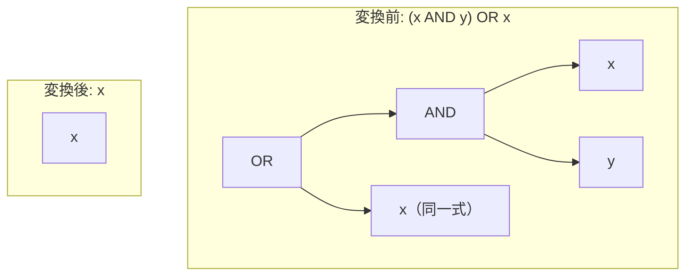

# absorption_or_reversed

- 状態: draft   /   執筆基準リビジョン: `3880673` (2026-09-12)
- 定義位置: `expression/rewrite.cpp` の `ExpressionRuleSet::Default()`（登録名 `"absorption_or_reversed"`）
- 同型の兄弟: `absorption_and` / `absorption_and_reversed` / `absorption_or`（同一の guard を持つ 4 本組）

## 概要

論理和と論理積の組み合わせ $(x \land y) \lor x$ を $x$ へ縮退させる式書き換え Rule です（ブール代数の双対吸収則・左右反転形）。

`absorption_or` の被演算子順序を反転させた形であり、オラクル検証（SQL Fuzzer）において短絡評価時の例外消失バグ `(NULL AND CAST(-inf AS INT64) <= c) OR NULL` が直接観測された対象構造そのものです。

## 変換前後の関係



## 適用条件

パターン定義および登録処理は以下のとおりです（`expression/rewrite.cpp`）。

```cpp
    built.Add(ExpressionRule(
        "absorption_or_reversed",
        Binary(BinaryOperation::kOr,
               Binary(BinaryOperation::kAnd, Any("x"), Any("y")), Any("x")),
        [](const Expression&, const ExpressionBindings& bindings) {
          const Expression& x = bindings.at("x");
          if (!ExpressionCannotThrow(bindings.at("y")) ||
              StaticallyNonBoolean(x) || !SafeToReduceEvaluationCount(x)) {
            return Expression{};
          }
          return x;
        }));
```

マッチングパターンは論理和の左辺が論理積 $(x \land y)$、右辺が $x$ となる構造です。事前条件は 4 本組共通の 3 項目です。

1. **`ExpressionCannotThrow(y)`**: 破棄される $y$ がランタイム例外を発生させない全域関数であること。
2. **`!StaticallyNonBoolean(x)`**: 残余式 $x$ が非ブール型に確定していないこと。
3. **`SafeToReduceEvaluationCount(x)`**: $x$ の評価回数減少に伴う副作用が生じないこと。

## 意味論的根拠と例外消失の実例

### 1. Kleene 三値論理における恒等性
可換性により $(x \land y) \lor x \equiv x \lor (x \land y)$ であり、三値論理体系において本式の真理値は常に $x$ と一致します。

### 2. オラクル反例に基づく例外消失の抑止
本構造は、四本組共通コメントに記録されたオラクル反例が直接当てはまる典型例です。

$$\text{式例: } (\text{NULL} \land (\text{CAST}(\text{'-inf'} \text{ AS INT64}) \le c)) \lor \text{NULL}$$

この式において、$x = \text{NULL}$（定数）、$y = (\text{CAST}(\text{'-inf'} \text{ AS INT64}) \le c)$ と置くと、厳密に $(x \land y) \lor x$ の形となります。

AST 評価器の短絡評価順序では、まず左辺の論理積が評価されます。左辺の第一項が $\text{NULL}$（$\text{UNKNOWN}$）であるため、論理積の結果を確定できず、第二項 $y$ が評価されます。ここで不正なキャスト例外が発生し、評価プロセス全体がランタイムエラーとして停止します。

もし本 Rule を無条件に適用して式全体を右辺の $x$（$\text{NULL}$）へ畳み込んだ場合、本来発生すべき例外が完全に消去され、クエリは NULL を返して正常終了してしまいます。したがって、条件 1（`ExpressionCannotThrow(y)`）による事前防御が不可欠です。

## 実装の詳細

実装は `absorption_or` と同一の判定ロジックであり、パターン定義における左右の位置のみが異なります。登録順序としては吸収則 4 本組の最後に配置され、AND/OR の主演算子と左右の配置順序の直積（$2 \times 2 = 4$ 通り）の正規化を完結させます。

## 最適化効果

左辺の論理積ノードおよびオペランド $y$ の評価処理が丸ごと消去され、式評価が $x$ 単体の評価へと平坦化されます。クエリ実行時の CPU 命令数および中間オブジェクト割り当てを削減します。

## 関連 Rule との相互作用

- `absorption_or`: 左右逆順の $x \lor (x \land y)$ を処理します。
- `absorption_and` / `absorption_and_reversed`: 論理積を外側とする双対形です。
- `factor_or_common_and`: 共通連言項の括り出しを行う Rule であり、右側の残余項が空となるケースにおいて本 Rule と重なります。

## 検証テスト

`expression/rewrite_test.cpp` における以下のテストケースで検証されています。

- `ExpressionRewriteTest.IdempotenceAndAbsorption`:
  吸収則の基本変形が正常に動作することを確認します。
- `ExpressionRewriteTest.AbsorptionPreservesRaisingOperand`:
  オラクル反例に基づく例外保持特性（`CAST` 例外が消去されずに維持されること）を直接検証します。
- `ExpressionRewriteTest.IdempotenceAndAbsorptionRefuseNonBooleanAndVolatile`:
  非ブール型や volatile 関数を含む式が適切に保護されることを確認します。
