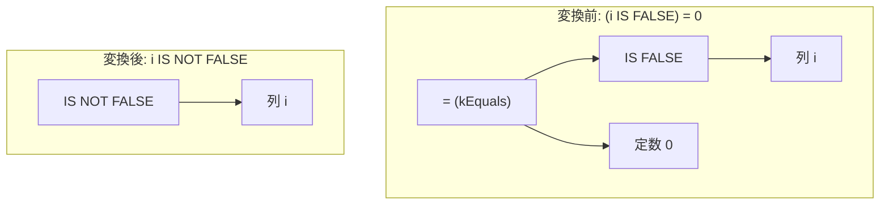

# boolean_eq_true_false_three_valued

- 状態: draft   /   執筆基準リビジョン: `3880673` (2026-09-12)
- 定義位置: `expression/rewrite.cpp` の `ExpressionRuleSet::Default()` 内
  `built.Add(ExpressionRule("boolean_eq_true_false_three_valued", ...))`

## 概要

ブール述語の等値比較 `(pred) = 0` および `(pred) = 1` を、述語そのものまたはその正確な補数（complement）へ簡約する式書き換え Rule です。

SQL の三値論理（SQL 3VL）において、一般の述語 $x = 0$ は $x$ が NULL のとき `UNKNOWN` を返します。そのため、一般式に対して $\text{NOT}(x)$ や特定の述語へ無条件に置き換える操作は真理値を保存しません。tinylamb では、NULL を返さず必ず 0（FALSE）または 1（TRUE）を返す IS 述語ファミリー（`IS TRUE`, `IS FALSE`, `IS NOT TRUE`, `IS NOT FALSE`）に適用対象を限定することで、意味論を完全に保存した置換を実現しています。

## 変換前後の関係



## 適用条件

パターンは `AnyBinary(Any("left"), Any("right"))` であり、述語の絞り込みはラムダ式の guard 条件によって段階的に行われます（引用は `expression/rewrite.cpp`）。

```cpp
          if (!IsConstant(bindings.at("right"))) {
            return Expression{};
          }
          const Value val = bindings.at("right")->AsConstantValue().GetValue();
          if (val.IsNull() || val.type != ValueType::kInt64) {
            return Expression{};
          }
```

1. **定数制約**: 右辺が非 NULL の `kInt64` 定数であること（tinylamb では真偽値を 64 ビット整数の 0 または 1 として内部表現します）。
2. **演算子制約**: 二項演算子が厳密に等号（`kEquals`）であること（不等号 `!=` は本 Rule の対象外です）。
3. **左辺の形式**: 左辺が単項式であり、その演算子が `kIsTrue`, `kIsNotTrue`, `kIsFalse`, `kIsNotFalse` のいずれかであること。

さらに、右辺の定数値に応じて以下の分岐を適用します。

```cpp
          if (val.value.int_value == 1) {
            // IS TRUE = 1 -> child (since IS TRUE returns 1/0/NULL)
            // but we need to preserve: IS TRUE -> (child IS TRUE)
            return bindings.at("left");
          }
          if (val.value.int_value != 0) {
            // Only 0/1 can invert a boolean predicate; comparing an
            // IS-predicate (1/0/NULL) against e.g. 5 must not invert the
            // predicate.
            return Expression{};
          }
```

- 定数値が `1` の場合: `pred = 1` は `pred` と等価であるため、左辺の IS 述語ノードをそのまま返します。
- 定数値が `0` の場合: 各演算子に対応する厳密な補数（`kIsTrue` $\leftrightarrow$ `kIsNotTrue`、`kIsFalse` $\leftrightarrow$ `kIsNotFalse`）へ置き換えます。
- 定数値が 0 でも 1 でもない場合（例: 5）: 述語の真理値反転は成立しないため、書き換えを不発火（`Expression{}`）とします。

## 意味論的根拠と正確な補数の選択

### 1. 三値論理における閉包性と完全な二値性
三値論理において、任意の式 $x$ に対する等式 $x = 0$ は、$x$ が NULL の場合に `UNKNOWN` と評価されます。これに対し、tinylamb の AST 評価器（`expression/unary_expression.cpp` の `TryEvaluateUnary`）における IS 述語群の実装は以下のとおり定義されています。

```cpp
    case UnaryOperation::kIsTrue:
      return Value(!child.IsNull() && child.Truthy());
    case UnaryOperation::kIsNotTrue:
      return Value(child.IsNull() || !child.Truthy());
```

`kIsTrue` およびその関連述語は、子ノードの評価結果が NULL であるか否かを内部で吸収し、常に真偽値（`Value(true)` または `Value(false)`）を出力します。出力集合が $\{0, 1\}$ に限定され `UNKNOWN` を返さないため、$(\text{pred}) = 0$ という等値比較の結果は $\text{NOT}(\text{pred})$ と完全に一致します。この性質が担保されない一般のブール列 $b$ に対して $b = 0$ を単純置換することは許されず、対象を IS 述語族へ限定する必然性がここにあります。

### 2. 補数マッピングの正確性と意味論の保存
$(\text{pred}) = 0$ を反転する際、左辺の述語に応じた正確な補数を割り当てる必要があります。

| 左辺の述語 $P$ | 意味 | $P = 0$ の正確な補数 | 誤った変換の例 |
| :--- | :--- | :--- | :--- |
| `x IS TRUE` | $x \text{ is not null } \land x \ne 0$ | `x IS NOT TRUE` | — |
| `x IS NOT TRUE` | $x \text{ is null } \lor x = 0$ | `x IS TRUE` | — |
| `x IS FALSE` | $x \text{ is not null } \land x = 0$ | `x IS NOT FALSE` | `x IS NOT TRUE`（誤り） |
| `x IS NOT FALSE` | $x \text{ is null } \lor x \ne 0$ | `x IS FALSE` | — |

`(i IS FALSE) = 0` の補数として一律に `i IS NOT TRUE` を返すと、`i = 0` の行において元の式は $(0 \text{ IS FALSE}) = 0 \implies 1 = 0 \implies \text{FALSE}$ であるのに対し、誤変換後は $0 \text{ IS NOT TRUE} \implies \text{FALSE}$ となる一方、`i = 1` の行では元の式 $(1 \text{ IS FALSE}) = 0 \implies 0 = 0 \implies \text{TRUE}$ に対し、誤変換後は $1 \text{ IS NOT TRUE} \implies \text{FALSE}$ となり真理値の不整合が発生します。したがって、`kIsFalse` の正確な補数は $x \text{ IS NOT FALSE}$（NULL または真）でなければなりません。

## 実装の詳細

`val.value.int_value == 0` の分岐では、対象ノードの単項演算子を取り出し、`switch` 文により補数演算子を選択します。

```cpp
          UnaryOperation complement;
          switch (unary.Op()) {
            case UnaryOperation::kIsTrue:
              complement = UnaryOperation::kIsNotTrue;
              break;
            case UnaryOperation::kIsNotTrue:
              complement = UnaryOperation::kIsTrue;
              break;
            case UnaryOperation::kIsFalse:
              complement = UnaryOperation::kIsNotFalse;
              break;
            case UnaryOperation::kIsNotFalse:
              complement = UnaryOperation::kIsFalse;
              break;
            default:
              return Expression{};
          }
          return UnaryExpressionExp(unary.Child(), complement);
```

マッチした補数演算子と元の子ノードを用いて新たな `UnaryExpression` を構築して返します。guard 条件を型検査・演算子種別・定数値の各段階へ明確に切り分けることで、過度なオブジェクト走査を伴わずに $O(1)$ で変換を完結させています。

## 最適化効果

1. **ノード削減と評価段数の短縮**: 「二項比較演算ノード」と「定数ノード」の 2 ノードが単一の「単項 IS 述語ノード」に集約され、実行時の評価コストおよび式木の深さが削減されます。
2. **正規形への統合**: 式木を IS 述語の正規形に寄せることで、後続の `canonicalize_boolean` や NOT プッシュダウン系ルール（`not_is_null`, `not_is_not_null` 等）が合致しやすくなります。
3. **スキャンフィルタのコンパイル適合**: スキャン述語の早期評価器（`executor/detail/scan_filter.cpp` の `TryCompileSimpleCompare`）において、二重比較を伴わない直接の述語判定コードとして解釈可能になります。

## 関連 Rule との相互作用

- `canonicalize_boolean`: 真偽値を返す二項比較・論理式と 0/1 定数の比較を処理します。一般式を `NOT 式` へ補完する同ルールに対し、本 Rule は IS 述語に特化して正確な補数を生成する役割を担います。
- `not_is_null` / `not_is_not_null`: 否定演算子 `NOT` を伴う NULL 判定述語を相互に変換するルール群です。
- `fold_binary`: 左右両辺がともに定数の式木（例: `(1 IS TRUE) = 0`）は、本 Rule に到達する前に定数畳み込みによって直接スカラー値へ縮退します。

## 検証テスト

`expression/rewrite_test.cpp` の `ExpressionRewriteTest.BooleanPredicateEqualityInvertsExactComplement` において以下の性質が検証されています。

- 4 種類の IS 述語それぞれに対し、`(i pred) = 0` が正確な補数演算子へ変換されること。
- 変換後の式木が、元の AST と $i = 0$ および $i = 1$ の双方のタプルにおいて完全に一致する評価結果を返すこと。
- 0 および 1 以外の定数（例: 定数 5）との比較において、不適切な反転が行われず不発火となること。
- 過去の不具合（`(i IS FALSE) = 0` が `i IS NOT TRUE` に誤変換されていた問題）に対する恒久的な回帰抑止。
