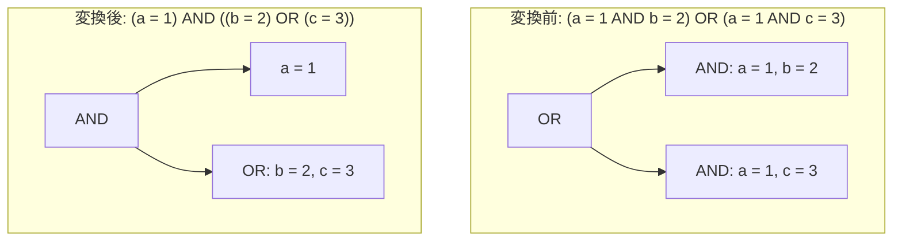

# boolean_filter_pullup

- 状態: draft   /   執筆基準リビジョン: `3880673` (2026-09-12)
- 定義位置: `expression/rewrite.cpp` の `ExpressionRuleSet::Default()` 内
  `built.Add(ExpressionRule("boolean_filter_pullup", ...))`
  (本体は同ファイルの `FactorCommonAndImpl`)

## 概要

選言（OR）の各項に共通して現れる連言（AND）因子を抽出し、選言の外側へ括り出す（factor out）式書き換え Rule です。

命題論理における分配法則 $(A \land B) \lor (A \land C) \iff A \land (B \lor C)$ は三値論理においても成立しますが、因子の括り出しは式の評価順序を変化させ、場合によっては部分式の評価を省略（短絡）します。そのため、揮発性関数による副作用や、本来発生すべき例外の消去（short-circuit error erasure）を防止するための厳格な安全性制約を備えています。本 Rule の主目的は、共通述語 $A$ を独立した連言項として遊離させ、下流の述語プッシュダウンを可能にすることにあります。

## 変換前後の関係



## 適用条件

パターンは `AnyBinary(Any("left"), Any("right"))` であり、実際の処理は `FactorCommonAndImpl`（`expression/rewrite.cpp`）へ委譲されます。

処理系は左右の部分式を `SplitConjuncts` により連言列へ平坦化し、左側の各連言 $l$ について右側の未照合連言 $r$ との構造的一致（`Same()`）を走査します。共通因子として認定するための guard 条件は以下のとおりです。

```cpp
  // Identify common conjuncts that can safely be factored out.
  // Safety requirements:
  // 1. SafeToReduceEvaluationCount: volatile functions (e.g. RAND()) must not
  //    have their evaluation count collapsed.
  // 2. Short-circuit order preservation: any conjunct in `left` (or `right`)
  //    that appeared before a factored conjunct must be guaranteed not to
  //    throw (ExpressionCannotThrow). Otherwise, moving the common conjunct
  //    ahead of it could evaluate to FALSE and skip evaluating the throwing
  //    preceding conjunct, silently erasing an error.
```

1. **評価回数削減の安全性（要件 1）**: 括り出し対象の連言が `SafeToReduceEvaluationCount` を満たすこと（`RAND()` などの揮発性関数やサブクエリを含まないこと）。
2. **短絡評価順序の保存（要件 2）**: 連言列において、当該因子より前方に出現するすべての述語が `ExpressionCannotThrow` を満たすこと。前方に例外を送出し得る式が存在する場合、それ以降の照合を打ち切ります（フラグ `left_saw_throwing` および `right_saw_throwing` による制御）。

共通因子が存在しない場合、書き換えは不発火となります。さらに、因子の括り出しによって左右いずれかの残余連言列が空集合となる場合（吸収則への縮退）は、追加の guard が適用されます。

## 意味論的根拠と評価順序の保護

### 1. 揮発性関数の多重評価と非決定性
共通因子に非決定的関数（例: `RAND() > 0.5`）が含まれる場合、元の式では左右のブランチで独立に最大 2 回評価されていたものが、括り出しによって 1 回の評価に統合されます。これはタプルごとの真理値割り当ての確率分布を変化させるため、`SafeToReduceEvaluationCount` によって括り出しが明示的に拒絶されます。

### 2. 短絡評価による例外消去の防止
SQL における選言 $L \lor R$ の AST 評価器は左から右へ短絡評価を行います。$(E_{\text{throw}} \land x = 1) \lor (y = 2 \land x = 1)$ という式において、$x = 0, y = 2$ のタプルを評価する場合を想定します。
元の式では、左被演算子 $(E_{\text{throw}} \land x = 1)$ の評価時に先頭の $E_{\text{throw}}$ が直ちに実行時例外を送出します。
もし共通項 $x = 1$ を無条件に外側へ括り出して $(x = 1) \land (E_{\text{throw}} \lor y = 2)$ へ変換した場合、先頭の $x = 1$ が `FALSE` と評価され、連言全体の短絡規則によって右辺 $(E_{\text{throw}} \lor y = 2)$ の評価がスキップされます。その結果、本来発生すべき例外が隠蔽され、クエリが正常終了して偽の結果を返す重大な意味論破壊に至ります。
これを防ぐため、先行する連言項に例外を送出し得るものが 1 つでも検知された場合、以降の項に対する因子化は禁止されます。

### 3. 吸収則縮退時の全域性担保
$(a = 1 \land b = 2) \lor (a = 1)$ のように、片側の残余項が空となるケースでは、式全体が共通因子 $a = 1$ 単独へ還元されます。この操作は脱落する側の部分式（例: $b = 2$）の評価を恒久的に破棄するため、脱落対象のすべての項が全域（`ExpressionCannotThrow`）であることを要求します。

```cpp
  if (left_rest.empty() || right_rest.empty()) {
    const std::vector<Expression>& dropped =
        left_rest.empty() ? right_rest : left_rest;
    if (!std::ranges::all_of(dropped, [](const Expression& e) {
          return ExpressionCannotThrow(e);
        })) {
      return Expression{};
    }
    if (common.size() == 1 && StaticallyNonBoolean(common[0])) {
      return Expression{};
    }
    return CombineConjuncts(common);
  }
```

加えて、単一の共通因子が静的に非ブール型（文字列や数値など）である場合は、ブール論理式としての縮退を抑絶します。

## 実装の詳細

共通因子の集合 `common`、左側の残余項 `left_rest`、右側の残余項 `right_rest` を分離した後、双方が非空である一般形については以下のツリー再構築を行います。

```cpp
  return BinaryExpressionExp(
      CombineConjuncts(common), BinaryOperation::kAnd,
      BinaryExpressionExp(CombineConjuncts(left_rest), BinaryOperation::kOr,
                          CombineConjuncts(right_rest)));
```

平坦化された連言列を平衡な二分木へと復元する `CombineConjuncts` を介することで、左側に共通連言木、右側に残余の選言木が配置された規準形が生成されます。

## 最適化効果

1. **述語プッシュダウンの成立**: OR 構造の内部に埋もれていた単一関係述語（例: $a = 1$）が最上位の連言項として分離されるため、`push_selection_into_scan` や `push_selection_through_join` によってベーステーブルのスキャン段まで直接押し込むことが可能になります。
2. **評価重複の排除**: 共通因子の評価回数が削減され、複雑なスカラー式や正規表現判定における CPU サイクルが節約されます。

## 関連 Rule との相互作用

- `factor_or_common_and`: 本 Rule と同一の内部実装 `FactorCommonAndImpl` を共有する双子 Rule です。
- `absorption_and` / `absorption_or`: 吸収則の特殊形を処理する Rule 群であり、片側の残余が空となる境界条件において整合した簡約結果を与えます。
- `distribute_or_over_and_budgeted`: 本 Rule と逆向きの変換（選言の連言に対する分配）を行いますが、式のサイズ増加を抑止する探索バジェット機構の下で制御されます。

## 検証テスト

`expression/rewrite_test.cpp` において以下の項目が検証されています。

- `ExpressionRewriteTest.FactorCommonAndFromOr`: $(x \land y) \lor (x \land z)$ が $x \land (y \lor z)$ へ再構築されること。
- `ExpressionRewriteTest.FactorCommonAndShortCircuitThrow`: 先行する投げる式によって括り出しが抑止され、元の例外送出挙動が厳密に維持されること、ならびに `RAND()` を含む共通因子が正しく拒絶されること。
- `ExpressionRewriteTest.BooleanFilterPullup`: 等号比較を含む典型例および吸収形への縮退が正確に機能すること。
- `ExpressionRewriteTest.IdempotenceAndAbsorptionRefuseNonBooleanAndVolatile`: 非ブール型の式や揮発性式に対して不適切な縮退が発生しないこと。
