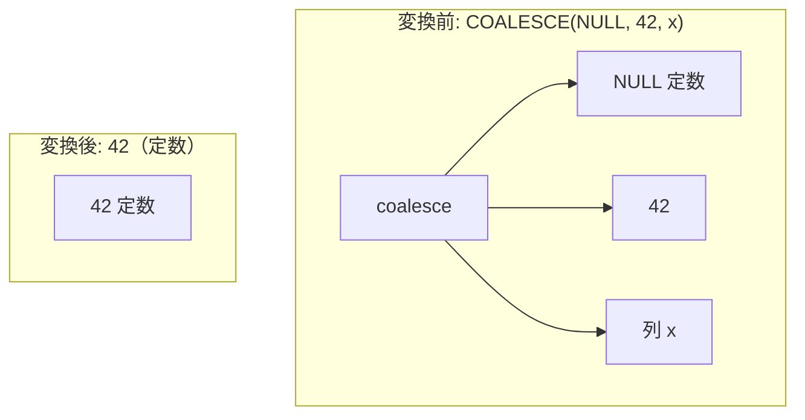

# coalesce_and_nullif_simplification

- 状態: draft   /   執筆基準リビジョン: `3880673` (2026-09-12)
- 定義位置: `expression/rewrite.cpp` の `ExpressionRuleSet::Default()` 内
  `built.Add(ExpressionRule("coalesce_and_nullif_simplification", ...))`

## 概要

`COALESCE` および `NULLIF` 関数呼び出しの冗長な引数、ネスト構造、定数同士の比較を三値論理に基づいて簡約化・定数畳み込みする式書き換え Rule です。

`COALESCE` においては、先頭・中間に現れる NULL 定数の除去、非 NULL 定数以降の到達不能引数の枝刈り、およびネストした `COALESCE` の平坦化を一括して行います。`NULLIF` においては、定数同士の評価、同一式同士の NULL 縮退（`NULLIF(a, a) \to \text{NULL}`）、および NULL 定数引数の単純化を行います。部分式の消去を伴う畳み込みに対しては、IEEE 754 NaN 比較の不成立性や例外消去抑止を保証する多重のガードを備えています。

## 変換前後の関係



## 適用条件

パターンは `Is(TypeTag::kFunctionCallExp, "expr")` であり、関数名（小文字正規化済み）が `coalesce` または `nullif` である場合に分岐します（引用は `expression/rewrite.cpp`）。

### 1. COALESCE の簡約条件
引数リストを左から右へ走査し、以下の正規化を適用します。

```cpp
              // Skip leading/middle NULL constants
              if (IsConstant(arg) &&
                  arg->AsConstantValue().GetValue().IsNull()) {
                changed = true;
                continue;
              }
              new_args.push_back(arg);
              // If we encounter a non-null constant, arguments after it will
              // never be reached.
              if (IsConstant(arg) &&
                  !arg->AsConstantValue().GetValue().IsNull()) {
                if (new_args.size() < fn.Args().size()) {
                  changed = true;
                }
                break;
              }
```

- NULL 定数は結果に寄与しないためリストからスキップ（除去）。
- 非 NULL 定数に到達した場合、短絡評価によりそれ以降の引数は決して評価されないため、以降の引数を完全に刈り込み（打ち切り）。
- ネストした `coalesce` 引数は平坦化して展開。
- 残余引数が空なら NULL 定数、1 個ならその式そのものへ縮退。

### 2. NULLIF の簡約条件
引数数が 2 個の場合に限定され、以下の優先順位で判定します。

1. **両辺定数**: `TryEvaluateBinary(kEquals, ...)` による即時評価。
2. **同一引数 `Same(a, b)`**: 以下の guard をすべて満たす場合に限り NULL 定数へ畳み込み。
   - `!StaticallyDouble(a)`（NaN 比較の例外性を回避）
   - `ExpressionCannotThrow(a)`（例外消去を抑止）
   - `SafeToReduceEvaluationCount(a)`（揮発性関数の多重評価変動を抑止）
3. **第 1 引数が NULL 定数**: 第 2 引数が定数ノードである場合に限り NULL 定数へ畳み込み（未評価式の例外消去抑止）。
4. **第 2 引数が NULL 定数**: 無条件に第 1 引数 `a` を返却。

## 意味論的根拠と例外・IEEE 754 保護

### 1. 同一引数 NULLIF と IEEE 754 NaN
命題論理では $a = a$ は常に真ですが、SQL および浮動小数点数規格（IEEE 754）において $\text{NaN} = \text{NaN}$ は `FALSE` と評価されます。したがって、$x$ が NaN の場合、$\text{NULLIF}(x, x)$ は NULL ではなく NaN 自身を返却しなければなりません。`StaticallyDouble(a)` が真となる場合、値が NaN となり得るため、同一引数であっても NULL 定数への縮退は拒絶されます。

### 2. 未評価式の脱落に伴う例外消去の防止
$\text{NULLIF}(\text{NULL}, b)$ において、結果は常に NULL ですが、第 2 引数 $b$ の評価を消去することは危険を伴います。ファジング検証において、$\text{NULLIF}(\text{NULL}, x \pmod 0)$ が 0 除算エラーを送出せずに NULL を返してしまう不具合が確認されたため、$b$ が非定数である場合の畳み込みは明示的に禁止されています。

```cpp
            if (IsConstant(a) && a->AsConstantValue().GetValue().IsNull()) {
              // Dropping b must not remove a throwing evaluation
              // (oracle-found: nullif(NULL, x % 0) folded to NULL instead
              // of raising "modulo by zero").
              if (!IsConstant(b)) {
                return Expression{};
              }
              return ConstantValueExp(Value());
            }
```

対照的に、$\text{NULLIF}(x, \text{NULL})$ においては消去される側の第 2 引数が既に安全な NULL 定数であり、$x$ の評価回数も 1 回のまま維持されるため、追加 guard なしで $x$ そのものへと簡約されます。

## 実装の詳細

COALESCE 処理系は引数列を 1 パスで走査し、`changed` フラグにより実際にノード数や構造に変化が生じた場合のみ新規ノードを構築します。NULLIF 処理系は $O(1)$ の guard 判定を順次行い、成立時は即座にスカラー定数または部分式ノードを返却します。

## 最適化効果

1. **不要な評価とメモリの節約**: 到達不能な引数や NULL 引数の評価オーバーヘッドが根絶されます。
2. **式の線形化と CSE の促進**: 単一引数への縮退やネスト解消により、共通部分式抽出（CSE）や述語プッシュダウンの照合成功率が向上します。

## 関連 Rule との相互作用

- `nullif_to_case`: 定数畳み込みが成立しなかった一般形の NULLIF を CASE 式へと展開します。
- `deterministic_function_cse`: 同一引数を持つ決定的関数呼び出しの共有を推進します。
- `fold_function`: スカラー関数全般の定数畳み込みを担当します。

## 検証テスト

`expression/rewrite_test.cpp` の `ExpressionRewriteTest.CoalesceAndNullifSimplification` において以下の項目が検証されています。

- `COALESCE(NULL, 42, x)` $\to$ `42`、`COALESCE(x, 42, y)` $\to$ `COALESCE(x, 42)`、`COALESCE(x, y, NULL)` $\to$ `COALESCE(x, y)`。
- `NULLIF(x, x)` $\to$ NULL、`NULLIF(42, 42)` $\to$ NULL、`NULLIF(42, 99)` $\to$ `42`、`NULLIF(x, NULL)` $\to$ `x`。
- `NULLIF(NaN, NaN)` が NaN として維持されること。
- `NULLIF(CAST(x AS FLOAT64), CAST(x AS FLOAT64))` が浮動小数点保護により畳まれないこと。
- 揮発性関数を含む第 1 引数が安全に保存されること。
