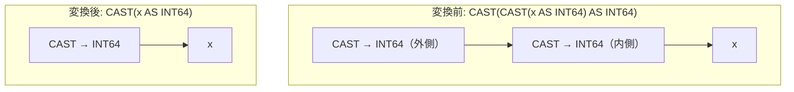

# collapse_nested_identical_cast

- 状態: draft   /   執筆基準リビジョン: `3880673` (2026-09-12)
- 定義位置: `expression/rewrite.cpp` の `ExpressionRuleSet::Default()`(登録名 `"collapse_nested_identical_cast"`)

## 概要

同一のターゲット型および同一のエラーハンドリング方針を持つ二重の型変換 `CAST(CAST(x AS T) AS T)` を、内側の単一型変換 `CAST(x AS T)` へ畳み込む式書き換え Rule です。

既に型 $T$ へのキャストおよびエラー処理が確定している値に対し、全く同一のパラメータで重ねてキャストを適用する操作は恒等写像となります。外側の余剰なキャストノードを除去することで、評価器における不要な型変換オーバーヘッドを削減し、式の構造を簡約化します。

## 変換前後の関係



## 適用条件

パターン定義および登録コードは以下のとおりです（引用は `expression/rewrite.cpp`）。

```cpp
    built.Add(ExpressionRule(
        "collapse_nested_identical_cast", Is(TypeTag::kCastExp),
        [](const Expression& expression, const ExpressionBindings&) {
          const auto& outer = expression->AsCastExpression();
          if (!outer.Child() || outer.Child()->Type() != TypeTag::kCastExp) {
            return Expression{};
          }
          const auto& inner = outer.Child()->AsCastExpression();
          if (inner.TargetTypeName() != outer.TargetTypeName() ||
              inner.ReturnNullOnError() != outer.ReturnNullOnError()) {
            return Expression{};
          }
          return outer.Child();
        }));
```

1. **二重キャスト構造**: 対象ノードが `kCastExp` であり、その子ノードも `kCastExp` であること。
2. **ターゲット型の一致**: 内側キャストの `TargetTypeName()` と外側キャストの `TargetTypeName()` が一致すること。
3. **エラー方針の一致**: 内側キャストの `ReturnNullOnError()` と外側キャストの `ReturnNullOnError()` が一致すること。

すべての条件を満たす場合に限り、外側のキャストを剥離し、内側の子ノード（`outer.Child()`）をそのまま返します。

## 意味論的根拠とエラー方針の保存

### 1. 同一型変換の冪等性
同一の型名 $T$ に対するキャスト演算 $\text{cast}_T$ は、正常値に対して冪等律 $\text{cast}_T(\text{cast}_T(v)) = \text{cast}_T(v)$ を満たします。内側のキャストを通過した時点で値は既に型 $T$ のドメインに適合しているため、再度同一の変換を施しても値の変更は発生しません。

### 2. エラー処理モードの厳格な一致
`CastExpression` は、キャスト変換失敗時に実行時例外を送出するか、あるいは NULL を返却するかを制御するフラグ `return_null_on_error_` を保持します（`SAFE_CAST` 等に対応）。

```cpp
  [[nodiscard]] bool ReturnNullOnError() const { return return_null_on_error_; }
```

もし外側と内側でこの方針が異なる場合、変換の振る舞いは恒等ではなくなります。例えば、内側が「エラー時に NULL 返却」で外側が「エラー時に例外送出」である場合、あるいはその逆の組み合わせにおいては、中間値の評価状態に応じたエラー検出の意味論が変質する恐れがあります。したがって、型名だけでなくエラーハンドリング方針が完全に一致していることを確認する guard が必須となります。

なお、本変換において消去されるのは外側のキャスト適用 1 回のみであり、内側のキャストおよび被演算子 $x$ の評価回数は保存されます。したがって、例外の隠蔽（error erasure）は構造上発生せず、`ExpressionCannotThrow` によるガードは不要です。

## 実装の詳細

DSL パターンとしては `Is(TypeTag::kCastExp)` のみで広く捕捉し、型名文字列やエラーフラグといったペイロード属性の比較はラムダ式内部で明示的に実施します。条件成立時は内側の式ポインタをそのまま返却するため、新規のヒープ割り当てを伴わず $O(1)$ で処理が完了します。

## 最適化効果

1. **型変換コストの削減**: 二重に発生していた型変換関数呼び出しやメモリコピーが 1 回に集約されます。
2. **型推論およびインデックス整合性の向上**: 式木が簡潔な単一キャスト形式に正規化されることで、後続の比較演算子押し込み（`cast_pushdown_on_comparison`）や、インデックスキーとの型適合性判定が阻害されなくなります。

## 関連 Rule との相互作用

- `numeric_widening_cast`: 数値型の暗黙の拡大キャストを整理するルール群と連携し、CAST 式の規準化を推進します。
- `cast_pushdown_on_comparison`: 単一化された CAST 式を比較演算子の対向側へ押し込む論理 Rule です。
- `fold_unary`: 被演算子が定数の場合、CAST 全体が事前にスカラー値へ畳み込まれるため、本 Rule は主に列参照や動的式を含む木に対して機能します。

## 検証テスト

`expression/rewrite_test.cpp` において以下のテストケースにより動作が検証されています。

- `ExpressionRewriteTest.CollapseNestedIdenticalCast`:
  `CAST(CAST(x AS INT64) AS INT64)` が外側の CAST を剥ぎ取られ、単一の `CAST(x AS INT64)` へと縮退することを確認します。
