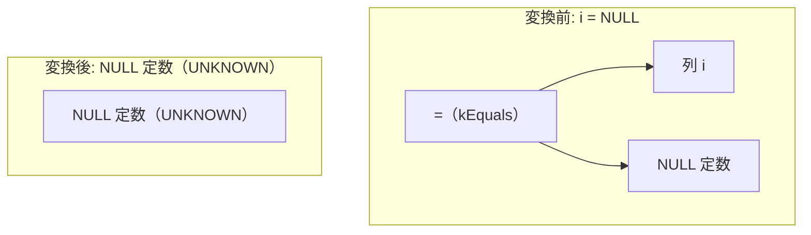

# contradiction_from_null_eq

- 状態: draft   /   執筆基準リビジョン: `3880673` (2026-09-12)
- 定義位置: `expression/rewrite.cpp` の `ExpressionRuleSet::Default()` 内
  `built.Add(ExpressionRule("contradiction_from_null_eq", ...))`

## 概要

NULL 定数との等値・不等値比較（`x = NULL` および `x != NULL`）を、三値論理における `UNKNOWN` を表すスカラー NULL 定数へ直接畳み込む式書き換え Rule です。

SQL の三値論理において、任意の式 $x$ と NULL の比較結果は常に `UNKNOWN`（真理値としての NULL）となります。この比較式を `FALSE` や `x IS NULL` へ置き換えることは意味論を破壊します。本 Rule は、確定真理値 `UNKNOWN` への忠実な縮退を行うとともに、左辺式 $x$ の評価脱落に伴う実行時例外の消去（error erasure）を `ExpressionCannotThrow` により厳格に抑止します。

## 変換前後の関係



## 適用条件

パターン定義は `AnyBinary(Any("left"), Any("right"))` であり、二項演算全般にマッチを試みます。絞り込みはラムダ式内の guard 条件によって直列に実施されます（引用は `expression/rewrite.cpp`）。

```cpp
          const auto& binary = expression->AsBinaryExpression();
          if (binary.Op() != BinaryOperation::kEquals &&
              binary.Op() != BinaryOperation::kNotEquals) {
            return Expression{};
          }
          if (!IsConstant(bindings.at("right"))) {
            return Expression{};
          }
          const Value right_val =
              bindings.at("right")->AsConstantValue().GetValue();
          if (!right_val.IsNull()) {
            return Expression{};
          }
```

1. **演算子制約**: 二項演算子が等号（`kEquals`）または不等号（`kNotEquals`）であること。
2. **右辺の NULL 定数制約**: 右辺が定数ノードであり、かつその値が NULL であること。
3. **例外消去抑止制約**: 左辺ノードが `ExpressionCannotThrow` を満たすこと（いかなる行に対しても例外を投げないことが証明されていること）。

すべての条件を満たす場合に限り、NULL 定数ノード（`ConstantValueExp(Value())`）を返します。

## 意味論的根拠と三値論理の規律

### 1. UNKNOWN と FALSE / IS NULL の厳格な区別
SQL の三値論理において、$x = \text{NULL}$ はすべての行において `UNKNOWN` と評価されます。WHERE 節などのフィルタ条件において `UNKNOWN` は通過阻止（`FALSE` 相当）として扱われますが、SELECT 句などの値文脈において `UNKNOWN`（NULL）と `FALSE` は異なるスカラー値です。
過去の実装に存在した `x = NULL` を `x IS NULL` へ書き換える安易な変形は、`WHERE x = NULL` が「$x$ が NULL である行」を返却する結果の変質を招き、重大なバグとなっていました。

```cpp
    // x = NULL -> NULL (removed: rewriting this to `x IS NULL` destroyed
    // three-valued logic.  `x = NULL` is UNKNOWN for every row, so the
    // honest constant result is the NULL (unknown) value; the old rewrite
    // made `WHERE x = NULL` return exactly the rows with x IS NULL.)
```

真理値としての厳密な同値性を保つ唯一の変換は、式全体を `UNKNOWN` 定数（NULL 値）へと畳み込むことです。

### 2. 式の消去に伴う例外消去の防止
左辺 $x$ の値にかかわらず比較結果が `UNKNOWN` に確定するとしても、AST 参照評価器は常に左被演算子を先行して評価します。したがって、$x$ が例外（例: `CAST(Inf AS INT64)`）を送出し得る式である場合、元のクエリは実行時例外を送出する必要があります。
ここで無条件に式を NULL 定数へ置換すると、本来発生すべき例外が隠蔽されてしまうため、左辺が例外フリーであることを `ExpressionCannotThrow` により静的に保証することが必須となります。

```cpp
          // The result is UNKNOWN regardless of left, but the AST still
          // evaluates left first, so a raising left (oracle-found:
          // `CAST(Inf AS INT64) = NULL`) must not be dropped.
          if (!ExpressionCannotThrow(bindings.at("left"))) {
            return Expression{};
          }
          return ConstantValueExp(Value());
```

## 実装の詳細

本体処理は、演算子タグ検査、右辺の定数・NULL 検査、左辺の `ExpressionCannotThrow` 検査を段階的に通過した後、デフォルトコンストラクタ `Value()`（NULL 値）を保持する `ConstantValueExp` を生成して返します。不発火時は空オブジェクトを返し、アロケーションを伴わず $O(1)$ で処理を終えます。

## 最適化効果

1. **比較演算の排除**: 実行時における毎行の二項比較評価および型検査オーバーヘッドが消去されます。
2. **上位フィルタの空関係化**: WHERE 節に現れる $x = \text{NULL}$ が NULL 定数に還元されることで、上位の論理最適化器（`eliminate_false_selection`）が起動し、プラン全体を空関係（Empty Relation）へ早期枝刈り可能になります。

## 関連 Rule との相互作用

- `in_single_null`: $x \text{ IN } (\text{NULL})$ に対する同一の縮退と例外保護を担う兄弟 Rule です。
- `canonicalize_comparison`: `NULL = x` のように定数が左辺に存在する式を `x = NULL` へ正規化し、本 Rule の適用対象へと誘導します。
- `fold_binary`: 左右双方が定数の場合は、本 Rule に先行して定数畳み込みが適用されます。

## 検証テスト

本 Rule は以下のテストケースにより動作が保証されています。

- `expression/rewrite_test.cpp` の `ExpressionRewriteTest.NullComparisonFoldsToUnknownNotIsNull`:
  `i = NULL` および `i != NULL` が `x IS NULL` ではなく正確な NULL 定数（`UNKNOWN`）へと畳まれること、ならびに $x=5$ および $x=\text{NULL}$ のタプルで元の AST と一致することを検証します。
- `query/expr_oracle_fuzzer_test.cpp` の `ExprOracleFuzzer.ReplayPinnedNullEqCastThrowRegression`:
  ファザーが検出した反例 `CAST(Inf AS INT64) = NULL`（シード `0x83e4e3d5`）において、例外が消失せず安全に維持されることをピン留め検証します。
