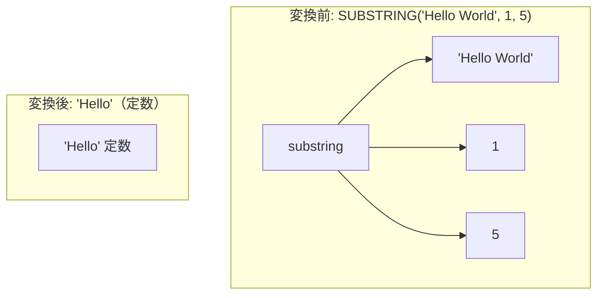

# datetime_and_string_fold_extent

- 状態: draft   /   執筆基準リビジョン: `3880673` (2026-09-12)
- 定義位置: `expression/rewrite.cpp` の `ExpressionRuleSet::Default()` 内
  `built.Add(ExpressionRule("datetime_and_string_fold_extent", ...))`

## 概要

日時および文字列操作に関する組み込み関数群（`SUBSTRING`, `INSTR`, `LPAD`, `RPAD`, `CONCAT`, `LENGTH` など 12 関数）に対し、引数がすべてリテラルである場合に AST 評価器を用いて事前評価し、スカラー定数ノードへ畳み込む式書き換え Rule です。

例えば `SUBSTRING('Hello World', 1, 5)` をコンパイル時に `'Hello'` という定数ノードへと直接置換します。実行時における行ごとの文字列走査やメモリ割り当てを完全に排除し、生成された定数を後続の比較正規化やインデックス走査範囲の確定へと引き渡します。

## 変換前後の関係



## 適用条件

パターン定義は `Is(TypeTag::kFunctionCallExp, "expr")` であり、対象となる関数名および引数型をラムダ式内部で厳格に検証します（引用は `expression/rewrite.cpp`）。

```cpp
          static const std::unordered_set<std::string> target_funcs = {
              "substring",        "substr",       "instr",
              "strpos",           "lpad",         "rpad",
              "concat",           "length",       "char_length",
              "character_length", "octet_length", "byte_length"};
          if (!target_funcs.contains(name)) {
            return Expression{};
          }
          const auto is_literal = [](const Expression& arg) {
            return arg && (arg->Type() == TypeTag::kConstantValue ||
                           arg->Type() == TypeTag::kIntervalExp);
          };
          if (!std::ranges::all_of(fn.Args(), is_literal)) {
            return Expression{};
          }
```

1. **対象関数のホワイトリスト制約**: 関数名が定義済みの 12 種類（文字列長、部分文字列、パディング、結合等）のいずれかに一致すること。
2. **全引数リテラル制約**: すべての引数ノードが定数（`kConstantValue`）または期間リテラル（`kIntervalExp`）であること。
3. **評価成功制約**: 空の行およびスキーマ環境（`Row()`, `Schema()`）における `TryEvaluate` がエラーなく完了し、正常な `Value` を返却すること。

## 意味論的根拠と事前評価の規律

### 1. 決定的セマンティクスと評価環境の独立性
対象関数群はすべて決定的な純粋関数（immutable function）であり、現在のシステム時刻や外部テーブルの状態に依存しません。したがって、コンパイル時に空のコンテキストで評価した結果は、実行時に各タプルに対して評価した結果と数学的に同一となります。`is_literal` が `kIntervalExp` を許容するのは、`DATE_ADD(date, INTERVAL 3 DAY)` のように日時演算に不可欠なリテラル構文を漏れなく捕捉するためです。

### 2. 実行時エラーの保存
引数がリテラルであっても、不正なパラメータ（例: 不正な UTF-8 シーケンスや範囲外のインデックス）によって実行時エラーが返される場合があります。`TryEvaluate` が失敗した際、本 Rule は不発火（`Expression{}`）として元の関数呼び出しを温存します。これにより、エラーの発生タイミングを実行時まで忠実に保存し、静的解析フェーズでの不当なクエリ中断を防ぎます。

## 実装の詳細

本体処理は、事前評価ルーチンを実行し、取得された `Value` を `ConstantValueExp` へラップして返します。

```cpp
          if (StatusOr<Value> folded = expression->TryEvaluate(Row(), Schema());
              folded.HasValue()) {
            return ConstantValueExp(folded.MoveValue());
          }
          return Expression{};
```

評価処理自体を AST 参照実装の `TryEvaluate` に委譲しているため、エンジン内の型変換ルールやエラーチェックロジックがそのまま適用されます。なお、本 Rule はルールセット内で一般的な `fold_function` よりも後方に登録されており、実質的には文字列・日時ドメインに対する明示的な畳み込み保証として位置づけられています。

## 最適化効果

1. **実行時 CPU オーバーヘッドの根絶**: 毎行行われていた文字列のアロケーション、境界チェック、および文字数カウントがゼロになります。
2. **下流述語の単純化**: WHERE 節内の `WHERE length(col) > length('constant')` のような式において、右辺が即座に数値定数となり、SARGable な単純比較コンパイルへと導かれます。

## 関連 Rule との相互作用

- `fold_function`: スカラー関数全般に対する広範な定数畳み込み Rule であり、本 Rule と協調して機能します。
- `concat_flatten`: 多段の CONCAT を平坦化し、リテラル同士を隣接させて本 Rule の畳み込み入力を整えます。
- `json_path_constant_fold`: JSON 抽出における定数パスマッチングを事前評価する同族 Rule です。

## 検証テスト

`expression/rewrite_test.cpp` の `ExpressionRewriteTest.DatetimeAndStringFoldExtent` において以下の動作が検証されています。

- `DATE_ADD` / `DATE_SUB`（`2026-08-27` に対する INTERVAL 加減算）が正しい日時定数へと畳み込まれること。
- `SUBSTRING`, `INSTR`, `LPAD`, `RPAD`, `CONCAT`, `LENGTH` の各文字列関数がリテラル引数に対して事前評価され、正しいスカラー定数となること。
