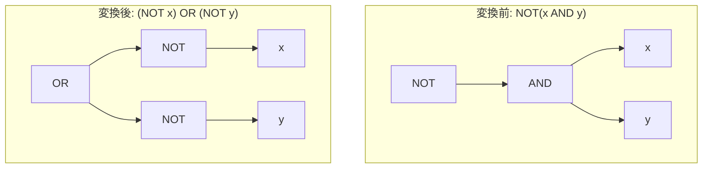

# de_morgan

- 状態: draft   /   執筆基準リビジョン: `3880673` (2026-09-12)
- 定義位置: `expression/rewrite.cpp` の `ExpressionRuleSet::Default()`（登録名 `"de_morgan"`）

## 概要

論理積または論理和に対する否定演算 $\neg (x \land y)$ を $(\neg x) \lor (\neg y)$ へ、$\neg (x \lor y)$ を $(\neg x) \land (\neg y)$ へ変形する式書き換え Rule です（ブール代数のド・モルガンの法則）。

否定ノード（`NOT`）を外層から内層のオペランド直下へ押し込み、論理積および論理和を外側に配置する形へ正規化することで、後続の連言分解や専用の比較否定 Rule の適用を可能にします。

## 変換前後の関係



対象演算子が論理和の場合も対称的に $\neg(x \lor y) \to (\neg x) \land (\neg y)$ と変換されます。

## 適用条件

パターンは「単項否定演算子（`kNot`）の子ノードが任意の二項演算子」である構造を照合します（`expression/rewrite.cpp`）。

```cpp
    built.Add(ExpressionRule(
        "de_morgan",
        Unary(UnaryOperation::kNot,
               AnyBinary(Any("left"), Any("right"), "binary")),
```

適用判定（guard）はラムダ式内で実施され、子ノードの二項演算が論理積（`kAnd`）または論理和（`kOr`）である場合のみ処理を継続します。

```cpp
          const auto operation =
              bindings.at("binary")->AsBinaryExpression().Op();
          if (operation != BinaryOperation::kAnd &&
              operation != BinaryOperation::kOr) {
            return Expression{};
          }
```

比較演算（$\neg(x < y)$）やパターンマッチ演算（$\neg(x \text{ LIKE } p)$）など、AND/OR 以外の二項演算に対しては空式（`Expression{}`）を返してマッチングを棄却します。式リライタ（`ExpressionRewriter`）は各ノードに対して登録順に Rule を走査するため、棄却された式は後続の個別否定 Rule（`not_comparison` や `not_like` など）に委ねられます。

## 意味論的根拠と三値論理での保存性

### 1. Kleene 三値論理における恒等性
SQL が準拠する Kleene 三値論理系において、ド・モルガンの法則はすべての真理値組み合わせ（$\text{TRUE}, \text{FALSE}, \text{UNKNOWN}$ の $3 \times 3 = 9$ 通り）において厳密に成立します。

例えば、$x = \text{UNKNOWN}, y = \text{FALSE}$ の場合:
- 変換前: $\neg(\text{UNKNOWN} \land \text{FALSE}) \equiv \neg(\text{FALSE}) \equiv \text{TRUE}$
- 変換後: $(\neg \text{UNKNOWN}) \lor (\neg \text{FALSE}) \equiv \text{UNKNOWN} \lor \text{TRUE} \equiv \text{TRUE}$

評価値は一致します。論理和に対しても同様に対称性が維持されます。

### 2. 事前条件（guard）不要の特性
本 Rule は部分木の評価回数や短絡評価の順序特性を変更しません。変換前後のいずれにおいても、左辺 $x$ は常に 1 回評価され、右辺 $y$ は左辺の評価結果によって式全体の真偽値が確定しない場合にのみ評価されます。

したがって、他の式書き換えで要求されるような例外消去判定（`ExpressionCannotThrow`）や評価回数削減の制約（`SafeToReduceEvaluationCount`）を課す必要がなく、純粋な代数変形として無条件に安全性が保証されます。

## 実装の詳細

変換処理はキャプチャされた左右のオペランドをそれぞれ `kNot` ノードでラップし、中央の演算子種別を反転させて新たな二項式を構築します。

```cpp
        [](const Expression&, const ExpressionBindings& bindings) {
          const auto operation =
              bindings.at("binary")->AsBinaryExpression().Op();
          if (operation != BinaryOperation::kAnd &&
              operation != BinaryOperation::kOr) {
            return Expression{};
          }
          return BinaryExpressionExp(
              UnaryExpressionExp(bindings.at("left"), UnaryOperation::kNot),
              operation == BinaryOperation::kAnd ? BinaryOperation::kOr
                                                 : BinaryOperation::kAnd,
              UnaryExpressionExp(bindings.at("right"), UnaryOperation::kNot));
        }));
```

## 最適化効果

式評価自体の演算コストは同等ですが、式の正規化により以下の最適化が促進されます。

1. **連言・選言の平坦化**: 否定が外層から取り除かれることで、$\neg(A \lor B)$ が $(\neg A) \land (\neg B)$ へ展開され、WHERE 節全体の連言集合（`SplitConjuncts`）へ組み込み可能になります。
2. **比較演算子否定への接続**: $\neg (x = y \land a > 10)$ が $\neg(x = y) \lor \neg(a > 10)$ に分解された後、各項が後続パスにおいて `x != y` や `a <= 10` へ局所的に変形されます。

## 関連 Rule との相互作用

- `double_negation`: `de_morgan` の直前に登録されており、二重否定 $\neg(\neg x)$ は事前に解消されます。
- `not_comparison` / `not_like`: `de_morgan` の直後に登録されており、論理積・論理和以外の二項演算子に対する否定を処理します。
- `canonicalize_comparison`: 否定が各葉ノードに到達した後の比較演算子正規化と協調します。

## 検証テスト

`expression/rewrite_test.cpp` における以下のテストケースで検証されています。

- `ExpressionRewriteTest.DoubleNegationAndDeMorgan`:
  $\neg(x \land y)$ が論理和ノードおよび 2 つの否定ノードへ正しく変形されることを確認します。
- `ExpressionRewriteTest.NotPushdownRewritesComparisons`:
  $\neg$ 直下の AND 構造が比較否定ではなくド・モルガンの法則により適切に分解される優先順序を確認します。
