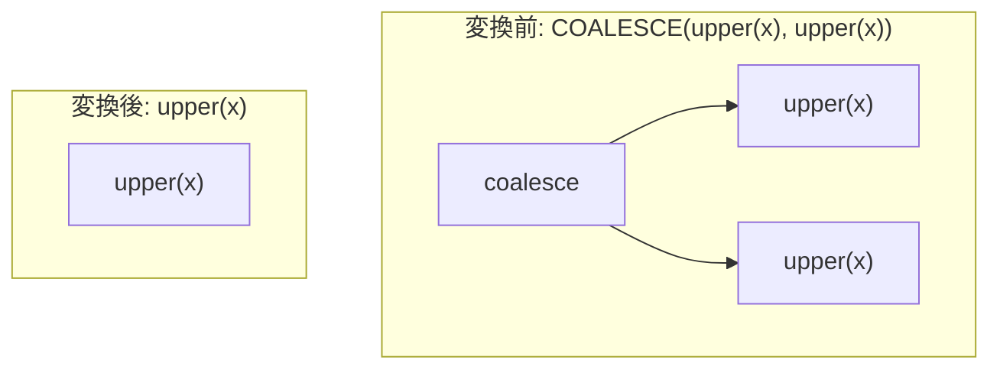

# deterministic_function_cse

- 状態: draft   /   執筆基準リビジョン: `3880673` (2026-09-12)
- 定義位置: `expression/rewrite.cpp` の `ExpressionRuleSet::Default()` 内
  `built.Add(ExpressionRule("deterministic_function_cse", ...))`

## 概要

式木内に現れる決定的関数（immutable function）の同一呼び出しを 1 回の評価に統合する共通部分式除去（Common Subexpression Elimination, CSE）の Rule です。

ただし現在の実装では、二項演算レベルの自己同一形（`f - f` → `0` や `f / f` → `1` など）は無効化されています。実際に変換を行う経路は、`COALESCE` / `GREATEST` / `LEAST` / `IFNULL` / `NULLIF` の同一引数重複の解消と、全分岐が同一の関数呼び出しを返す `CASE` 式の短縮という 3 つの経路に限定されています。

## 変換前後の関係



## 適用条件

パターンは `Any()` であり、ラムダ式内部で以下の 3 経路を順に判定します。

1. **二項演算経路（自己同一形の抑止）**: 左右両辺が `Same` な関数呼び出しである二項演算に対しては、意図的に何も行わず変換をスキップします。

   ```cpp
   // PRODUCTION FIX: self-identities (f-f -> 0, f/f -> 1,
   // f = f -> IS NOT NULL, f < f -> FALSE) were only valid for
   // non-NULL operands.  An immutable function may return NULL,
   // so folding changed UNKNOWN into concrete values (and f/f
   // hid the division by zero when f(x) == 0).  The unsafe fold
   // was removed; expressions stay as written.
   ```

2. **同一引数を持つ多引数関数経路**: `GetFunctionVolatility` が `kImmutable` であり、引数を 2 個以上持つ関数呼び出しを対象とします。
   - `coalesce` / `greatest` / `least`: 全引数が第 1 引数と `Same` かつ `SafeToReduceEvaluationCount`（揮発性関数やサブクエリを含まない）を満たす場合、第 1 引数そのものへ置き換えます。
   - `ifnull(a, a)`: 2 つの引数が `Same` であれば `a` へ置き換えます。
   - `nullif(a, a)`: 以下の guard をすべて満たす場合にのみ、NULL 定数へ畳み込みます。

   ```cpp
   } else if (Same(fn.Args()[0], fn.Args()[1]) &&
              !StaticallyDouble(fn.Args()[0]) &&
              ExpressionCannotThrow(fn.Args()[0]) &&
              SafeToReduceEvaluationCount(fn.Args()[0])) {
     return ConstantValueExp(Value());
   }
   ```

3. **全分岐が同一結果の CASE 式経路**: `ELSE` 節が存在し、すべての `WHEN` 節の戻り値式が `ELSE` 節の式と `Same` な `kImmutable` 関数呼び出しである場合、`ELSE` 節の式へ畳み込みます。ただし、各 `WHEN` 条件式がエラーを投げず揮発性も持たないことを保証する guard が必須です。

   ```cpp
   // Returning the else drops all WHEN-condition evaluations;
   // only sound when none of them can raise or are volatile (cf.
   // uniform_case_result).
   const bool conditions_total =
       std::ranges::all_of(c.when_clauses_, [](const auto& w) {
         return ExpressionCannotThrow(w.first) &&
                SafeToReduceEvaluationCount(w.first);
       });
   if (!conditions_total) {
     return Expression{};
   }
   return c.else_clause_;
   ```

## 意味論的根拠と三値論理・例外保護

自己同一形（`f - f` や `f / f`）を二分演算で安易に畳むことは、三値論理および例外意味論の観点から不正です。たとえ決定的関数であっても、NULL を返す可能性があります。SQL の三値論理において `NULL - NULL` は `UNKNOWN`（NULL）であり、`0` ではありません。同様に、`f(x) / f(x)` は `f(x) = 0` のときにゼロ除算エラーを送出すべきであり、これを `1` に畳み込むと実行時エラーが不当に隠蔽されます。

`nullif(a, a)` において `!StaticallyDouble`、`ExpressionCannotThrow`、`SafeToReduceEvaluationCount` の 3 条件を課す理由も同義です。IEEE 754 の浮動小数点演算では `NaN = NaN` は false と判定されるため、`NULLIF(NaN, NaN)` は NULL ではなく NaN を返さなければなりません。また、引数 `a` が例外を送出し得る式や副作用を伴う揮発性式である場合、評価を省略して NULL に置換すると例外や副作用が消去されてしまいます。

全分岐が同一の `CASE` 式を `ELSE` 式へ短縮する際も、すべての `WHEN` 条件式の評価が完全に消失します。条件式に型キャスト例外を引き起こす式や `rand()` 等の揮発性関数が含まれている場合、それらの評価がスキップされると観測可能な動作が変化します。したがって、条件式すべてに対して `ExpressionCannotThrow` かつ `SafeToReduceEvaluationCount` であることの確認が不可欠です。

## 実装の詳細

式の同一性判定には `Same`（ノードの型タグおよび `ToString()` の完全一致）を用います。

経路 2 の `coalesce` / `greatest` / `least` では、引数リストを順次走査し、全要素が第 1 引数と `Same` であるかを判定します。`nullif` の第 1 引数が定数リテラルの場合は本 Rule では処理せず、定数畳み込み系 Rule（`fold_function` など）の管轄に委ねます。

計算量はノードの走査と文字列表現の比較に依存しますが、対象となる式木の局所的なサイズに対して線形時間 $O(N)$ で完結します。

## 最適化効果

同一の決定的関数呼び出しが重複している箇所を 1 回の評価に削減し、重複した関数呼び出しのオーバーヘッドを排除します。

また、全分岐が同一の `CASE` 式を短縮することで、分岐条件判定の評価コストおよび分岐命令自体のオーバーヘッドを完全に消去します。本 Rule は 1 つの式木内部に閉じた局所的な CSE を担い、複数の式にまたがる重複計算は下流の射影 CSE（`projection_cse_and_pruning`）が担当します。

## 関連 Rule との相互作用

- `coalesce_and_nullif_simplification`: `nullif(a, a)` の同一引数畳み込みを定数引数の簡約とともに扱います。どちらが先に適用されても同一の NULL 定数へ正規化されます。
- `uniform_case_result`: 全分岐が同一の定数リテラルを返す `CASE` 式を畳み込む Rule であり、条件式に対する例外保護・揮発性検証のガード条件を共有しています。
- `fold_function`: 引数がすべてリテラルである関数呼び出しを定数へ畳み込みます。

## 検証テスト

`expression/rewrite_test.cpp` の `ExpressionRewriteTest.DeterministicFunctionCse` において以下を検証しています。

- `abs(x) - abs(x)`、`upper(x) = upper(x)`、`sqrt(x) / sqrt(x)` が書き換えられずに元の形のまま保持されること（自己同一形無効化の回帰テスト）。
- `COALESCE(upper(x), upper(x))` が `upper(x)` に畳み込まれること。
- `NULLIF(upper(x), upper(x))` は保持される一方、引数が単純な列参照で例外・NaN の恐れがない場合は NULL 定数へ畳み込まれること。
- `CASE WHEN c THEN upper(x) ELSE upper(x) END` が `upper(x)` へ簡約されること。
- `rand() - rand()` 等の揮発性関数呼び出しが保持されること。
