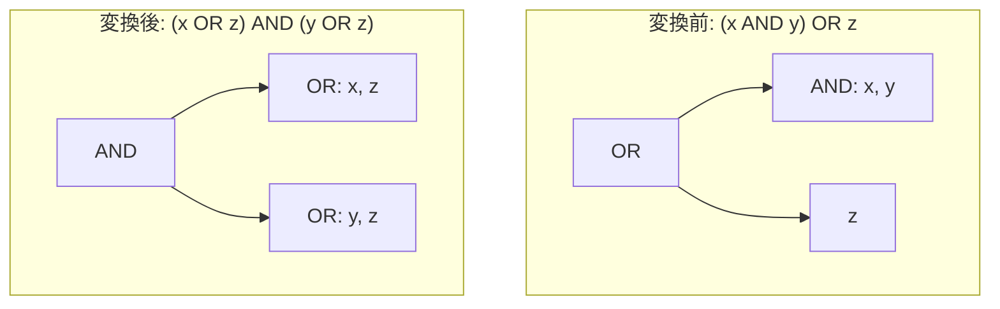

# distribute_or_over_and_budgeted

- 状態: draft   /   執筆基準リビジョン: `3880673` (2026-09-12)
- 定義位置: `expression/rewrite.cpp` の `ExpressionRuleSet::Default()` 内
  `built.Add(ExpressionRule("distribute_or_over_and_budgeted", ...))`

## 概要

選言（`OR`）の片側のオペランドのみが連言（`AND`）である場合に、論理積に対する論理和の分配則を適用して `AND` を `OR` の上位へと押し上げる Rule です。

具体的には、`(x AND y) OR z` を `(x OR z) AND (y OR z)` の形に展開します。分配の無制限な適用は連言の項数に応じて式木のサイズを爆発的に増大させるため、連言の要素数が 4 以下のケースに限定する適用予算（budget）が設定されています。これは `boolean_filter_pullup`（共通因子のくくり出し）の逆方向の変換に相当します。

## 変換前後の関係



## 適用条件

パターンは `Binary(BinaryOperation::kOr, Any("left"), Any("right"))` です。ラムダ式内部で左右のオペランドを `SplitConjuncts` により連言リストに分解し、以下の条件をすべて満たす場合にのみ発火します。

```cpp
const std::vector<Expression> left = SplitConjuncts(binary.Left());
const std::vector<Expression> right = SplitConjuncts(binary.Right());
const std::vector<Expression>* and_side = nullptr;
const Expression* other = nullptr;
if (left.size() > 1 && right.size() == 1) {
  and_side = &left;
  other = &binary.Right();
} else if (right.size() > 1 && left.size() == 1) {
  and_side = &right;
  other = &binary.Left();
} else {
  return Expression{};
}
if (and_side->size() > 4) {
  return Expression{};
}
// Distribution duplicates `other` into one disjunct per conjunct:
// a volatile (RAND()) or potentially-raising (1/0) operand would
// then evaluate (or raise) several times where the original
// short-circuits after the first TRUE disjunct. Sibling rules
// gate on the same two predicates.
if (!ExpressionCannotThrow(*other) ||
    !SafeToReduceEvaluationCount(*other)) {
  return Expression{};
}
```

- **片側のみが連言**: 左右どちらか一方のみが 2 要素以上の連言であり、他方は単一の式であること（両側が連言、または両側が単一式の場合は対象外）。
- **連言要素数の上限（予算制約）**: 連言側の要素数が 4 以下であること。5 以上の場合は式の肥大化を防ぐため変換を拒否します。
- **反対側式の安全性**: 複製される側の式 `other` が `ExpressionCannotThrow`（例外を送出しない）かつ `SafeToReduceEvaluationCount`（揮発性関数やサブクエリを含まない）を満たすこと。

## 意味論的根拠と三値論理・例外保護

tinylamb のブール代数は強 Kleene 三値論理に基づいて実装されています。強 Kleene 論理体系においては、真理値に NULL（`UNKNOWN`）が含まれる場合であっても論理積と論理和の分配則 `(x ∧ y) ∨ z ≡ (x ∨ z) ∧ (y ∨ z)` が恒等的に成立します。したがって、値の評価結果に関する意味論は完全に保存されます。

本変換では、反対側のオペランド `other` が連言の各要素に対して複製されます。もし `other` に `rand()` 等の揮発性関数が含まれている場合、式の複製によって評価回数が増加し、実行結果の整合性が崩れます。また、`other` がゼロ除算などの例外を送出し得る式である場合、短絡評価の順序変化により元来発生しないはずの例外が発生したり、複数回送出されたりする危険が生じます。このため、複製対象となる式に対する `ExpressionCannotThrow` と `SafeToReduceEvaluationCount` の検証が安全性の前提条件となります。

さらに、連言要素数を 4 以下に制限する予算 guard は、最適化エンジンのメモリ消費と探索空間の爆発を未然に防止するために設計されています。

## 実装の詳細

分配処理では、連言リストの各要素 `c_i` に対して `BinaryExpressionExp(c_i, BinaryOperation::kOr, *other)` を構築し、得られた選言式リストを `CombineConjuncts` で結合して AND 木へと再編成します。

```cpp
std::vector<Expression> distributed;
distributed.reserve(and_side->size());
for (const Expression& conjunct : *and_side) {
  distributed.push_back(
      BinaryExpressionExp(conjunct, BinaryOperation::kOr, *other));
}
return CombineConjuncts(distributed);
```

元の連言の出現順序は完全に保持され、左から順に `(c_1 OR z)`, `(c_2 OR z)`, … と連なる平衡な AND 木が生成されます。

## 最適化効果

`(x AND y) OR z` を積和標準形から和積標準形（CNF: Conjunctive Normal Form）へと移行させます。

最上位に AND ノードを露出させることで、結合述語のプッシュダウン（`push_selection_through_join`）や各連言項ごとのインデックス走査範囲の導出など、AND を前提とした下流のオプティマイザルール群が各項に対して個別に対処可能になります。

## 関連 Rule との相互作用

- `boolean_filter_pullup`: 共通因数をくくり出して式を圧縮する逆変換を担います。本 Rule で分配された式 `(x OR z) AND (y OR z)` には新たな共通因数が生じないため、ルール間での無限ループ（振動）は発生せず、決定的に不動点へと収束します。
- `and_idempotent` / `absorption_and`: 分配の適用後に生じ得る冗長な連言項の簡約を担います。
- 登録順序: `ExpressionRuleSet::Default()` の終盤に配置されており、基本的なブール式の正規化が一段落した段階で適用されます。

## 検証テスト

`expression/rewrite_test.cpp` の `ExpressionRewriteTest.DistributeOrOverAndBudgeted` において以下を検証しています。

- `(x AND y) OR z` が最上位 AND ノードと 2 つの OR 子ノードを持つ木構造に正しく展開されること。
- 複製される式に例外発生リスクがある場合に変換が抑止されること。
