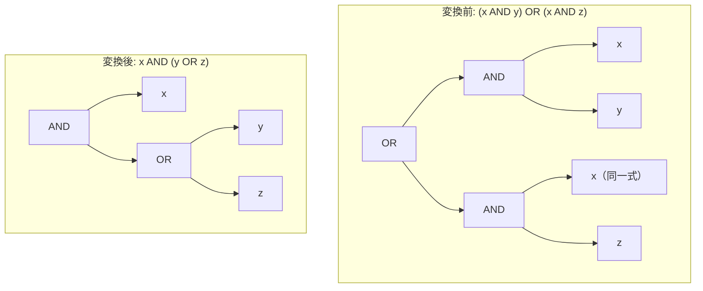

# factor_or_common_and

- 状態: draft   /   執筆基準リビジョン: `3880673` (2026-09-12)
- 定義位置: `expression/rewrite.cpp` の `ExpressionRuleSet::Default()`(登録名 `"factor_or_common_and"`)と、同ファイルの `FactorCommonAndImpl`

## 概要

選言（OR）の両被演算子に共通する連言（AND）因子を外側へ括り出し、$(x \land y) \lor (x \land z)$ を $x \land (y \lor z)$ へ再構築する式書き換え Rule です。

Kleene の三値論理において命題論理の分配法則は真理値を保存しますが、式の括り出しは被演算子の評価順序を移動させ、連言全体の短絡規則によって一部の部分式の評価を抑止する性質を持ちます。そのため、先行する部分式が送出し得る例外の隠蔽（error erasure）や、揮発性関数（volatile functions）の多重評価の不整合を回避するための保守的な guard 機構が組み込まれています。

## 変換前後の関係



左右いずれかの残余連言列が空集合となる場合（例: $(x \land y) \lor x$）は、吸収則に基づき共通項 $x$ 単独へと縮退します。

## 適用条件

パターン定義は `AnyBinary(Any("left"), Any("right"))` であり、本体処理は `FactorCommonAndImpl`（`expression/rewrite.cpp`）へ委譲されます。

```cpp
    built.Add(ExpressionRule(
        "factor_or_common_and", AnyBinary(Any("left"), Any("right")),
        [](const Expression& expression, const ExpressionBindings&) {
          return FactorCommonAndImpl(expression);
        }));
```

`FactorCommonAndImpl` は対象ノードが OR 演算子（`BinaryOperation::kOr`）であることを確認し、`SplitConjuncts` により左右の連言列を抽出します。

```cpp
Expression FactorCommonAndImpl(const Expression& expression) {
  if (!expression || expression->Type() != TypeTag::kBinaryExp) {
    return Expression{};
  }
  const auto& binary = expression->AsBinaryExpression();
  if (binary.Op() != BinaryOperation::kOr) {
    return Expression{};
  }
  const std::vector<Expression> left = SplitConjuncts(binary.Left());
  const std::vector<Expression> right = SplitConjuncts(binary.Right());
```

共通因子の判定における安全基準は以下の 2 要件です。

```cpp
  // Identify common conjuncts that can safely be factored out.
  // Safety requirements:
  // 1. SafeToReduceEvaluationCount: volatile functions (e.g. RAND()) must not
  //    have their evaluation count collapsed.
  // 2. Short-circuit order preservation: any conjunct in `left` (or `right`)
  //    that appeared before a factored conjunct must be guaranteed not to
  //    throw (ExpressionCannotThrow). Otherwise, moving the common conjunct
  //    ahead of it could evaluate to FALSE and skip evaluating the throwing
  //    preceding conjunct, silently erasing an error.
```

1. **評価回数削減の安全性（要件 1）**: 抽出対象の連言が `SafeToReduceEvaluationCount` を満たすこと（揮発性関数や相関サブクエリを含まないこと）。
2. **短絡評価順序の保存（要件 2）**: 連言列において、当該因子の出現位置より手前に存在するすべての式が `ExpressionCannotThrow` を満たすこと。投げ得る式が先行している場合、以降の因子抽出は中断されます（`left_saw_throwing` および `right_saw_throwing` フラグによるガード）。

残余項が空となる吸収形に遷移する場合、脱落する側の部分式がすべて `ExpressionCannotThrow` であること、かつ共通因子が静的に非ブール型でないことが追加条件となります。

## 意味論的根拠と評価順序の保護

### 1. 短絡順序の変更に伴う例外消去の防止
AST 参照評価器は二項演算を左から右へ短絡評価します。$(E_{\text{throw}} \land x = 1) \lor (y = 2 \land x = 1)$ という式において、$x = 0, y = 2$ の行を評価する場合を考えます。
元の式では、左被演算子の先頭に位置する $E_{\text{throw}}$ が評価され、直ちに実行時例外を送出します。
もし共通項 $x = 1$ を無条件に外側へ括り出し、$(x = 1) \land (E_{\text{throw}} \lor y = 2)$ へ書き換えたとすると、先頭の $x = 1$ が `FALSE` を返し、連言全体の短絡により右側の被演算子 $(E_{\text{throw}} \lor y = 2)$ の評価がスキップされます。その結果、本来発生すべき例外が消滅し、クエリが正常終了して不正な結果集合を返す重大な意味論破壊が発生します。
したがって、共通因子の前方に 1 つでも例外を送出し得る式が存在する場合、括り出しは禁止されなければなりません。

### 2. 揮発性関数の評価回数保存
共通因子が `RAND()` などの揮発性関数を含む場合、括り出しによって評価回数が複数回から 1 回へと減少します。これは関数呼び出しごとの乱数生成や副作用の回数を変質させるため、`SafeToReduceEvaluationCount` により変換を拒絶します。

### 3. 吸収形における全域性の要求
$(x \land y) \lor x$ を $x$ へ縮退させる場合、部分式 $y$ の評価は完全に破棄されます。もし $y$ が 0 除算などの例外を含んでいた場合、その例外が不可視化されるため、脱落する部分式の全域性（`all_of(dropped, ExpressionCannotThrow)`）が厳格に検証されます。

```cpp
  if (left_rest.empty() || right_rest.empty()) {
    const std::vector<Expression>& dropped =
        left_rest.empty() ? right_rest : left_rest;
    if (!std::ranges::all_of(dropped, [](const Expression& e) {
          return ExpressionCannotThrow(e);
        })) {
      return Expression{};
    }
    if (common.size() == 1 && StaticallyNonBoolean(common[0])) {
      return Expression{};
    }
    return CombineConjuncts(common);
  }
```

## 実装の詳細

本体ループでは、左側の各連言 $l$ について、手前に投げる式が現れていないこと（`!left_saw_throwing`）および `SafeToReduceEvaluationCount(l)` を確認した上で、右側の未照合リストから構造的一致（`Same()`）する項を探索します。

```cpp
  for (const Expression& l : left) {
    if (!left_saw_throwing && SafeToReduceEvaluationCount(l)) {
      // 右側の未マッチ項から Same な共通項を探し、
      // right_saw_throwing が立つ前の範囲で common へ移す
    } else {
      left_rest.push_back(l);
    }
    if (!ExpressionCannotThrow(l)) {
      left_saw_throwing = true;
    }
  }
```

共通因子が見つかった一般形は、以下のとおり平衡二分木として再構成されます。

```cpp
  return BinaryExpressionExp(
      CombineConjuncts(common), BinaryOperation::kAnd,
      BinaryExpressionExp(CombineConjuncts(left_rest), BinaryOperation::kOr,
                          CombineConjuncts(right_rest)));
```

照合された右側の要素インデックスは `matched_right_indices` で追跡され、同一の連言項が多重に消費されることを防止します。

## 最適化効果

1. **共通式の評価回数削減**: 左右のブランチで重複して評価されていた共通述語が 1 回の評価に統合され、CPU サイクルとメモリ帯域の消費が抑制されます。
2. **述語プッシュダウンの誘発**: 最上位に抽出された共通連言木（`common`）は、OR 全体から独立してテーブルスキャンや結合演算子へ個別にプッシュダウン可能になります。

## 関連 Rule との相互作用

- `boolean_filter_pullup`: 本 Rule と同一の内部実装 `FactorCommonAndImpl` を共有する別名 Rule です。
- `absorption_and` / `absorption_or`: 吸収則を直接処理するルール群であり、本 Rule における残余空の境界条件と同一の縮退を行います。
- `and_idempotent` / `or_idempotent`: 括り出し後に隣接した同一連言項の統合を担います。

## 検証テスト

`expression/rewrite_test.cpp` において以下のテストケースにより動作が検証されています。

- `ExpressionRewriteTest.FactorCommonAndFromOr`: $(x \land y) \lor (x \land z)$ が AND を頂点とする木へ正しく変換されること。
- `ExpressionRewriteTest.FactorCommonAndShortCircuitThrow`: 先行する投げる式によって括り出しが抑絶され、元の AST と同一の例外が維持されること、ならびに `RAND()` を含む共通因子が不発火となること。
- `ExpressionRewriteTest.IdempotenceAndAbsorptionRefuseNonBooleanAndVolatile`: 非ブール型式に対する不適切な縮退の拒絶。
