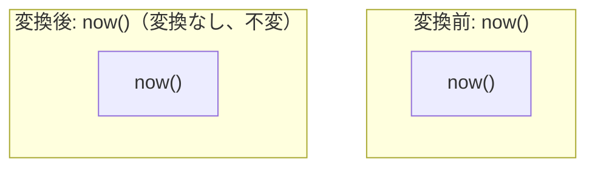

# function_volatility_classification

- 状態: draft   /   執筆基準リビジョン: `3880673` (2026-09-12)
- 定義位置: `expression/rewrite.cpp` の `ExpressionRuleSet::Default()` 内
  `built.Add(ExpressionRule("function_volatility_classification", ...))`

## 概要

関数の揮発性（volatility: `kImmutable`, `kStable`, `kVolatile`）の分類体系を式書き換え層に明示し、揮発性・安定性の関数がコンパイル時に定数畳み込みされない契約を宣言する Rule です。

現在の実装における本 Rule 自体の変換ラムダは常に空の式（変更なし）を返す no-op であり、実際の分類検査および畳み込み抑止の責務は `GetFunctionVolatility` 判定ルーチンと `fold_function` をはじめとする各 Rule の guard 条件が担当しています。

## 変換前後の関係

構文木の変換は行われません。



## 適用条件

パターンは `Is(TypeTag::kFunctionCallExp)` であり、すべての関数呼び出しにマッチします。ラムダ式の実装は以下のとおりです。

```cpp
const auto& fn = expression->AsFunctionCallExpression();
if (GetFunctionVolatility(fn.FuncName()) != Volatility::kImmutable) {
  // Barrier for volatile or stable functions
  return Expression{};
}
return Expression{};
```

条件分岐の成否にかかわらず常に `Expression{}` を返却するため、構文木に対する直接の書き換えは一切行われません。

## 意味論的根拠と三値論理・例外保護

`rand()` や `now()` のような非決定的な関数をクエリコンパイル時に単一の定数リテラルへ畳み込むことは、SQL の意味論を破壊します。`rand()` を畳み込むと全タプルに対して同一の擬似乱数が割り当てられてしまい、`now()` や `current_timestamp()` を畳み込むとクエリ実行スナップショットの時刻整合性やステートメント安定性が崩壊します。

この安全規律は、tinylamb 全体で以下の 2 箇所の中心機構により厳格に強制されています。

1. **`fold_function` の先端 guard**: 対象関数の `GetFunctionVolatility` が `kImmutable` でない限り、定数引数であっても畳み込みを即座に拒否します。
2. **`SafeToReduceEvaluationCount`**: 揮発性関数を含む式の評価回数削減や短絡除去を一括して抑止します。

`GetFunctionVolatility` は、`rand`, `random`, `uuid`, `generate_uuid`, `newid` を `kVolatile`、`now`, `current_timestamp`, `current_date`, `current_time` 等を `kStable`、それ以外を `kImmutable` と判定します。未知の関数はデフォルトで immutable に分類されるため、新しい揮発性関数をエンジンに導入する際は本分類表への登録が必須となります。本 Rule は、この揮発性判定体系がリライタのパスに組み込まれていることを示すアーキテクチャ上の標識となっています。

## 実装の詳細

関数名テーブルとの照合は `GetFunctionVolatility` ヘルパーにより高速に実施されます。本 Rule のハンドラ自体は副作用を持たず、定数時間の判定を経て終了します。

## 最適化効果

本 Rule 単体による構文木変換効果はありません。ただし、揮発性分類機構と協調することで、非決定的な関数呼び出しの誤った畳み込みや評価順序の狂いを完全に遮断します。

## 関連 Rule との相互作用

- `fold_function`: 揮発性判定を参照し、不変関数のみを対象に定数畳み込みを実行します。
- `nondeterministic_barrier`: 非決定的関数の畳み込み抑止を宣言する同系のプレースホルダルールです。
- `deterministic_function_cse`: 共通部分式の安全な統合において `kImmutable` であることを検証します。

## 検証テスト

`expression/rewrite_test.cpp` の `ExpressionRewriteTest.FunctionVolatilityClassification` において以下を検証しています。

- `GetFunctionVolatility` が `rand` / `random` を `kVolatile`、`now` / `current_date` を `kStable`、`upper` / `abs` を `kImmutable` に正確に分類すること。
- `rand()` や `now()` を含む式がコンパイル時に誤って定数化されないこと。
