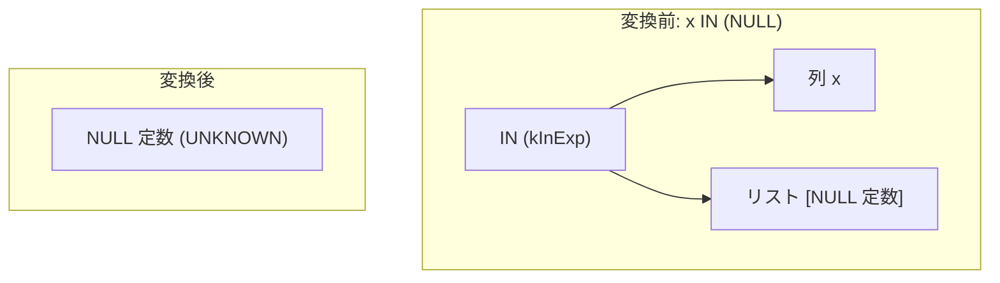

# in_single_null

- 状態: draft   /   執筆基準リビジョン: `3880673` (2026-09-12)
- 定義位置: `expression/rewrite.cpp` の `ExpressionRuleSet::Default()` 内
  `built.Add(ExpressionRule("in_single_null", ...))`

## 概要

要素が単一の NULL 定数のみで構成される IN 式 `x IN (NULL)` を、NULL 定数（`UNKNOWN`）スカラー値へ畳み込む式書き換え Rule です。

SQL の三値論理において、集合内に比較可能な有効値が存在しない `x IN (NULL)` は、$x$ の値が何であれ常に `UNKNOWN` と評価されます。しかし、部分式 $x$ の評価を安全に省略するためには、$x$ が実行時に例外（0 除算や数値オーバーフロー等）を誘発しないことが数学的に保証されなければなりません。本 Rule は、確定真理値への定数畳み込みと例外消去抑止（`ExpressionCannotThrow`）を両立させています。

## 変換前後の関係



## 適用条件

パターンは `Is(TypeTag::kInExp)` であり、すべての IN 式に対してマッチを試行します。ラムダ式内部の guard 条件によって以下の要件を厳格に検証します（引用は `expression/rewrite.cpp`）。

```cpp
          const auto& in = expression->AsInExpression();
          if (in.list_.size() != 1) {
            return Expression{};
          }
          if (!IsConstant(in.list_.front())) {
            return Expression{};
          }
          const Value val = in.list_.front()->AsConstantValue().GetValue();
          if (!val.IsNull()) {
            return Expression{};
          }
          if (!ExpressionCannotThrow(in.child_)) {
            return Expression{};
          }
          return ConstantValueExp(Value());
```

1. **単一要素制約**: IN リストの要素数（`in.list_.size()`）が厳密に 1 であること。
2. **定数かつ NULL 制約**: リストの先頭要素が定数ノードであり、かつその値が NULL であること。
3. **例外安全性制約**: 左辺の子ノード `in.child_` が `ExpressionCannotThrow` を満たすこと（いかなる入力行に対しても例外を投げないことが静的に証明されていること）。

これらすべての guard を通過した場合に限り、NULL 定数ノード（`ConstantValueExp(Value())`）を返します。

## 意味論的根拠と例外安全性の保護

### 1. 三値論理における確定値 UNKNOWN
SQL 標準における述語 $x \in \{y_1, y_2, \dots, y_n\}$ の意味論は、連言と等号比較の選言 $\bigvee_{i=1}^n (x = y_i)$ と等価です。リスト要素が NULL のみ（$n=1, y_1 = \text{NULL}$）の場合、比較式は $x = \text{NULL}$ となります。三値論理の定義により、被演算子 $x$ が任意の値（非 NULL、または NULL 自身）のいずれであっても、$x = \text{NULL}$ は常に `UNKNOWN` を返します。したがって、論理値としてこの式は NULL 定数と同値です。

### 2. 式の脱落に伴う例外消去の防止
式書き換えによって被演算子 $x$ を消去しスカラー定数へ置き換える操作は、$x$ の評価を完全に破棄することを意味します。tinylamb の AST 参照評価器（`expression/in_expression.cpp`）では、演算子の左辺ノードを右辺リストの照合に先立って先行評価します。

もし $x$ に例外を発生させる式（例: `(INT64_MIN / 0)` や無効な文字列からのキャスト）が含まれていた場合、元のクエリは行の評価時に実行時エラーを送出しなければなりません。ここで無条件に式を NULL 定数へ畳み込むと、本来発生すべきエラーが握りつぶされ、クエリ結果が空行（WHERE 節による除外）としてサイレントに処理される意味論破壊が生じます。

```cpp
    // x IN (NULL) -> NULL, but only when x cannot raise: evaluating the
    // left operand precedes the NULL comparison in the AST reference
    // (oracle-found: `(INT64_MIN / 0) IN (NULL)` folded to NULL).
```

オプティマイザのファジング検証（`expr_oracle_fuzzer`）によって検出されたこの不整合を抑止するため、左辺式が全域関数（total function）のみで構成されていることを `ExpressionCannotThrow` により静的に確認する guard が必須となります。

## 実装の詳細

本体処理は、型安全なダウンキャスト `AsInExpression()` から始まり、リスト長・定属性・NULL 判定・例外耐性を直列に評価します。すべての条件を満たした時点で `Value()`（NULL を表現する Value オブジェクト）をラップした `ConstantValueExp` を構築して返します。

単一走査 $O(1)$ で判定が完結し、不発火時は空オブジェクト `Expression{}` を返すことで、式木の再構築オーバーヘッドをゼロに抑えています。

## 最適化効果

1. **探索空間および評価コストの圧縮**: 走査のたびに発生するリスト反復処理および等号判定のオーバーヘッドを排除し、評価器レベルで即座に `UNKNOWN` を参照可能にします。
2. **後続の連言簡約の誘発**: WHERE 節に現れる $x \text{ IN } (\text{NULL})$ が NULL 定数に還元されることで、上位の論理簡約 Rule（`eliminate_false_selection` など）が起動し、プラン全体を空関係（Empty Relation / `kValues`）へ早期縮退させることが可能になります。

## 関連 Rule との相互作用

- `singleton_in`: 単一要素の IN 式 $x \in \{c\}$ を $x = c$ へ変換しますが、要素が NULL 定数の場合はあえて不発火となるよう設計されています。NULL 定数の処理を本 Rule へ委譲することで、責務の直交性を保っています。
- `not_in_null_semantics`: $x \text{ NOT IN } (\dots \text{NULL} \dots)$ を扱う対の Rule です。リストに NULL が含まれる場合の三値論理上の特殊性および同一の `ExpressionCannotThrow` guard を共有します。
- `empty_in_list` / `fold_in`: 空リストに対する IN 式の FALSE 化や、全要素が定数のリストに対する早期畳み込みを担う Rule 群です。

## 検証テスト

本 Rule は以下のテストスイートによって検証されています。

- `query/expr_oracle_fuzzer_test.cpp` の `ExprOracleFuzzer.ReplayPinnedInNullDivisionThrowRegression`:
  ファザーが発見した反例 `((-9223372036854775807 - 1) / 0.0) IN (CAST(NULL AS FLOAT64))`（シード `0x16b1e8b4`）において、0 除算例外が畳み込みによって消去されず正しく送出されることをピン留め検証します。
- `expression/rewrite_test.cpp` の `ExpressionRewriteTest.NotInNullSemantics`:
  兄弟 Rule となる NOT IN 系の書き換えを通じ、単一 NULL リストに対する畳み込みの意味論的一貫性を間接的に担保します。
