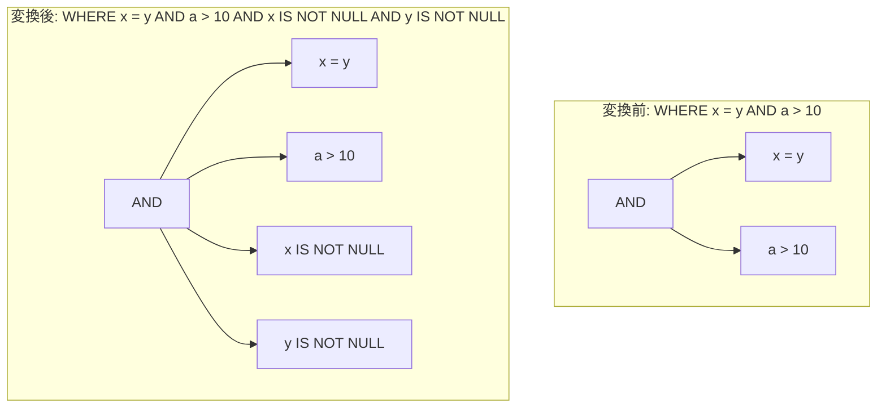

# inner_join_not_null_inference

- 状態: draft   /   執筆基準リビジョン: `3880673` (2026-09-12)
- 定義位置: `expression/rewrite.cpp` の `ExpressionRuleSet::Default()` 内
  `built.Add(ExpressionRule("inner_join_not_null_inference", ...))`

## 概要

連言（WHERE 節の AND 木）に含まれる等号述語 $x = y$ から、$x \text{ IS NOT NULL} \land y \text{ IS NOT NULL}$ を推論して連言集合に追加する式書き換え Rule です。

式書き換え Rule の中で唯一 `root_only` オプション（コンストラクタ第 4 引数）を指定する Rule であり、「述語を**追加**する Rule は根の連言集合でのみ発火しなければならない」という D6 規律（不動点収束の保証）を具現化した実装です。また、WHERE 節などのフィルタ文脈では意味論が保存されますが、SELECT 句や ORDER BY 句などの値文脈では三値論理上の `UNKNOWN`（NULL）が `FALSE` に縮退して結果が変質するため、オプティマイザは値文脈において本 Rule を除外して式書き換えを適用します。

## 変換前後の関係



## 適用条件

パターンは `Binary(BinaryOperation::kAnd, Any("left"), Any("right"))` であり、登録時に `/*root_only=*/true` を指定します。ラムダ式は `SplitConjuncts` により根の AND 木を連言の列へ平坦化し、各連言を次の条件で判定します（引用は `expression/rewrite.cpp`）。

```cpp
            if (c->Type() == TypeTag::kBinaryExp &&
                c->AsBinaryExpression().Op() == BinaryOperation::kEquals) {
              const Expression& l = c->AsBinaryExpression().Left();
              const Expression& r = c->AsBinaryExpression().Right();
              if (l && r && !IsConstant(l) && !IsConstant(r)) {
```

- 連言が等号二項演算（`kEquals`）であり、左右の被演算子が**ともに非定数**であること（定数との比較 $x = 1$ からは新たな有益述語を推論できないため）。

この条件を満たす等号述語 1 本につき、$x \text{ IS NOT NULL}$ および $y \text{ IS NOT NULL}$ のうち**まだ連言列に存在しないもののみ**を $x = y \land \dots$ の連言列末尾に追加します。重複判定は `already_present` ラムダが、入力連言列と当該パスで追加済みの連言列の双方に対してノード内容（`Same()`）に基づき行います。

```cpp
          // D6 (docs/design.md): a shared operand (x = y AND y = z) must
          // infer y IS NOT NULL exactly once.  Deduplicate by content
          // against the input conjuncts AND everything already appended
          // this pass, so an equal predicate is never re-added because of
          // its position in the AND tree.
```

## 意味論的根拠と適用文脈の分離

### 1. フィルタ文脈における意味論保存
三値論理（SQL 3VL）において、等号述語 $x = y$ は $x$ または $y$ のいずれかが NULL のとき `UNKNOWN` と評価されます。WHERE 節などのフィルタ演算（$\sigma_p$）は評価結果が厳密に `TRUE` となるタプルのみを通過させるため、$x = y$ を満たすタプルでは $x$ および $y$ の双方が非 NULL であることが保証されます。

したがって、連言に $x \text{ IS NOT NULL} \land y \text{ IS NOT NULL}$ を追加しても、フィルタを通過するタプル集合は変化しません。追加された単項述語は、基底関係のスキャン演算子へ単独でプッシュダウン可能となり、B+Tree インデックスの探索範囲決定や Zone Map / 統計情報によるブロック刈り込みに寄与します。

### 2. ルート限定発火（D6 規律）による不動点収束の保証
`expression/rewrite.hpp` の `ExpressionRule` に定義された設計原則 D6 は次のとおりです。

```cpp
  // D6 (docs/design.md): a predicate-ADDING rule applies to the ROOT
  // conjunct set only.  Firing on inner AND subtrees made such a rule
  // re-append the same predicate at every level, and the copies re-fed each
  // other until the pass cap (the "expression rewrite did not converge"
  // failure on legitimate 3-table joins).
```

述語を追加・拡大する Rule が木の内層ノード（AND の部分木）で発火すると、追加された述語が新たな AND 結合を形成し、ボトムアップの走査パスごとに新しい連言が生成されて不動点に収束しなくなります（上限反復数到達によるエラーの発生）。`root_only = true` を付与された Rule は深さ 0（式の根ノード）でのみ発火が許可されます。平坦化関数 `SplitConjuncts` により連言集合全体を一括して取得するため、ネストした AND 構造内の等式も漏れなく処理されます。

### 3. 値文脈における不整合と Rule の除外
`plan/optimizer.cpp` の最適化フェーズ開始時、SELECT リストや ORDER BY キーの式書き換えにおいて本 Rule は明示的に除外されます。

```cpp
  // Value contexts (select items, ORDER BY keys) must not gain inferred
  // predicates: `x IS NOT NULL AND ...` changes a NULL projection/sort key
  // into FALSE.  The inference rule is only sound in a filter context, so
  // it is stripped for these rewrites (WHERE keeps the full rule set).
  ExpressionRuleSet value_context_rules = options.expression_rules;
  value_context_rules.Remove("inner_join_not_null_inference");
  const ExpressionRewriter value_rewriter(value_context_rules);
```

値文脈において、式 $x = y$ はタプルが NULL を含む場合に値 `NULL`（真偽値 UNKNOWN）を返します。ここに $x \text{ IS NOT NULL}$ を連言として結合すると、評価結果は `FALSE` に変化し、プロジェクションの出力値やソート順序の意味論が破壊されます。フィルタ文脈と値文脈で適用可能性が分岐する本仕様に対し、ルールセットの動的構成（`Remove`）が機能しています。

## 実装の詳細

推論処理は、抽出された等式ごとに $l \text{ IS NOT NULL}$ と $r \text{ IS NOT NULL}$ を生成し、`already_present` の判定結果に応じて未登録の述語のみを連言列へ追加します（両方未登録、左のみ、右のみの分岐制御）。

走査終了後、変更フラグ `changed` が立っている場合のみ `CombineConjuncts` により連言列を平衡な AND 二分木へ再構成して返します。変更がない場合は空式（`Expression{}`）を返し、無用なオブジェクト生成を抑制します。

## 最適化効果

連言集合に $x \text{ IS NOT NULL}$ が明示されることで、以下の論理最適化および物理計画生成が誘発されます。

1. **述語プッシュダウンの促進**: 結合述語 $x = y$ 自体は結合前には評価できませんが、推論された $x \text{ IS NOT NULL}$ は各テーブルのスキャン演算子（$\sigma$）へ単独で押し込み可能です。
2. **外部結合の内部結合化**: `outer_to_inner_join_on_null_rejecting_filter` が NULL 排除述語の存在を検知し、外部結合をコストの低い内部結合へ単純化します。
3. **インデックススキャンの成立**: B+Tree における NULL 除外範囲スキャンへの誘導、または Zone Map によるデータブロックの早期スキップが有効化されます。

## 関連 Rule との相互作用

- `push_selection_into_scan` / `push_selection_through_join`: 本 Rule が導出した単項 NULL 排除述語をテーブルスキャンや結合入力へ押し込む消費者です。
- `outer_to_inner_join_on_null_rejecting_filter`: 推論された `IS NOT NULL` 述語を根拠として外部結合を内部結合へ変換します。
- `canonicalize_comparison`: 定数比較の正規化を担当し、非定数同士の等式を対象とする本 Rule と競合しません。
- `merge_selections`: 複数の選択演算子が統合された後、巨大化した連言集合に対して一括して本推論が適用されます。

## 検証テスト

`expression/rewrite_test.cpp` にて以下のテストケースにより検証されています。

- `ExpressionRewriteTest.InnerJoinNotNullInference`:
  $(x = y \land a > 10)$ から $x \text{ IS NOT NULL}$ および $y \text{ IS NOT NULL}$ が正しく連言に追加されることを確認します。
- `ExpressionRewriteTest.NotNullInferenceIdempotentAndRootScoped`:
  ネストした連言 $((x = y \land y = z) \land k > 5)$ に対し、書き換えを複数回適用しても式の指紋（`Fingerprint()`）が変化せず冪等性が維持されること、ならびに共有オペランド $y$ に対する $y \text{ IS NOT NULL}$ が重複なく 1 度だけ推論されることを確認します。
