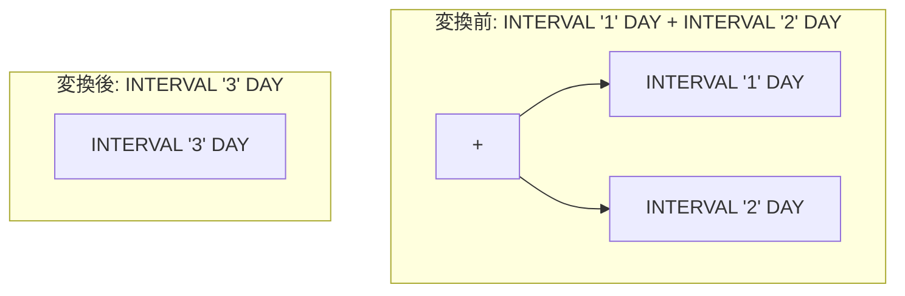

# interval_normalize

- 状態: draft   /   執筆基準リビジョン: `3880673` (2026-09-12)
- 定義位置: `expression/rewrite.cpp` の `ExpressionRuleSet::Default()` 内
  `built.Add(ExpressionRule("interval_normalize", ...))`

## 概要

`INTERVAL` 型リテラル同士の加減算（例: `INTERVAL '1' DAY + INTERVAL '2' DAY` → `INTERVAL '3' DAY`）、整数定数との乗算（例: `INTERVAL '2' DAY * 3` → `INTERVAL '6' DAY`）、単項マイナスによる符号反転、および `JUSTIFY_HOURS` / `JUSTIFY_DAYS` / `JUSTIFY_INTERVAL` 関数の定数適用を、コンパイル時に計算して正規化された単一の `INTERVAL` リテラルへ畳み込む Rule です。

算術オーバーフローが生じる場合には、実行時エンジンが送出すべき例外を消去しないよう、畳み込みを即座に中止して元の構文木のまま保持します。

## 変換前後の関係



## 適用条件

パターンは `Any()` であり、ノード種別に応じて以下の 4 経路で判定します。

1. **二項加減算経路**: 左右両オペランドがともに `INTERVAL` リテラルの場合。
   同一単位かつ複合量テキストを持たない場合は、コンパイラ組み込み関数で 64 ビット整数のオーバーフローを検出します。

   ```cpp
   // Fast paths must respect the same overflow contract as the
   // runtime IntervalValue arithmetic (throw); a silent int64
   // wrap would make the rewrite change the observable result.
   int64_t folded = 0;
   if (l_iv.RawAmount().empty() && r_iv.RawAmount().empty() &&
       l_iv.Unit() == r_iv.Unit()) {
     bool overflowed = false;
     if (binary.Op() == BinaryOperation::kAdd) {
       overflowed = __builtin_add_overflow(l_iv.Amount(),
                                           r_iv.Amount(), &folded);
     } else if (binary.Op() == BinaryOperation::kSubtract) {
       overflowed = __builtin_sub_overflow(l_iv.Amount(),
                                           r_iv.Amount(), &folded);
     }
   ```

   オーバーフローが検出された場合は変換を行わず `Expression{}` を返します。単位が異なる複合計算の場合は `IntervalValue` の一般加減算ルーチンへ委譲します。

2. **整数倍乗算経路**: `INTERVAL * 整数定数` および `整数定数 * INTERVAL` の場合。
   `__builtin_mul_overflow` により乗算オーバーフローを検査し、オーバーフロー時は畳み込みを拒絶します。

3. **単項符号反転経路**: 単項マイナスが `INTERVAL` リテラルに適用されている場合。
   ただし、`INT64_MIN` の符号反転は C++ の未定義動作（UB）であり、実行時エラーと厳密に一致させるため畳み込みを抑止します。

   ```cpp
   // INT64_MIN negation is UB on int64; leave it to the runtime
   // path which throws like the AST ground truth.
   if (child.Amount() == std::numeric_limits<int64_t>::min()) {
     return Expression{};
   }
   return IntervalExpressionExp(-child.Amount(), child.Unit());
   ```

4. **正規化関数経路**: 1 引数の `justify_hours` / `justify_days` / `justify_interval` が `INTERVAL` リテラルを受け取った場合。正規化後の `INTERVAL` リテラルを返します。

## 意味論的根拠と三値論理・例外保護

本 Rule における最大の規律は、**実行時エンジンとの例外契約の一致**です。

tinylamb の実行時評価器における `IntervalValue` の算術演算は、int64 の桁あふれが発生した際に例外を送出します。もしオプティマイザの定数畳み込み側で符号付き整数の wrap-around を静かに許容してしまうと、「実行時例外でクエリがアボートするはずの処理」が「予期せぬ値で完走する不正なクエリ」へと変貌してしまいます。したがって、組み込み演算オーバーフロー検出機能（`__builtin_*_overflow`）を用いて、例外を送出すべきケースでは一切の畳み込みを行わず、実行時の例外ハンドラに処理を委ねます。

また、`INT64_MIN` の反転を避けるガードも同様に、未定義動作を回避しつつ実行時エラー契約を正確に保つためのものです。

## 実装の詳細

生成される式は、単位付きの単一量を表す `IntervalExpressionExp(amount, unit)`、または複合量の文字列表現を保持する `IntervalExpressionExp(0, "", str)` の形式で構築されます。

パターンが `Any()` であるため、対象外のノードに対してはラムダ式の先頭で即座に `Expression{}` を返却し、評価オーバーヘッドを極小に抑えています。

## 最適化効果

`INTERVAL` リテラル同士の算術計算がコンパイル時に解消されます。

たとえば `DATE_ADD(col, INTERVAL '1' DAY + INTERVAL '2' DAY)` のようなクエリにおいて、内部の INTERVAL 式が事前に `INTERVAL '3' DAY` へ正規化されることで、後続の日時関数定数畳み込みやスキャン範囲の絞り込み処理が円滑に適用可能になります。

## 関連 Rule との相互作用

- `datetime_and_string_fold_extent`: 日時関数と `INTERVAL` の計算を畳み込みます。本 Rule による事前の INTERVAL 単一化が下流の前提条件となります。
- `fold_binary`: 通常の数値二項演算を畳み込みますが、`INTERVAL` 型をオペランドに含む演算は本 Rule が特化して処理を担当します。

## 検証テスト

`expression/rewrite_test.cpp` の `ExpressionRewriteTest.IntervalNormalize` において以下を検証しています。

- 日時加減算、整数乗算（左右両オペランド）、単項マイナス反転、および `JUSTIFY_*` 関数が単一の `INTERVAL` リテラルに正規化されること。
- オーバーフローする加算および乗算において、静かな桁あふれを起こさず書き換えが安全に拒絶されること。
- `INT64_MIN` の符号反転が正しく拒絶されること。
