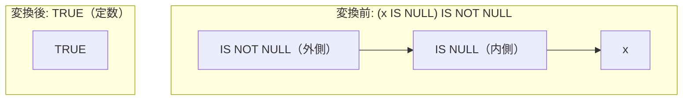

# is_not_null_of_null_check

- 状態: draft   /   執筆基準リビジョン: `3880673` (2026-09-12)
- 定義位置: `expression/rewrite.cpp` の `ExpressionRuleSet::Default()`(登録名 `"is_not_null_of_null_check"`)

## 概要

NULL 判定述語の多重適用 `(x IS NULL) IS NOT NULL` および `(x IS NOT NULL) IS NOT NULL` を、スカラー定数 `TRUE` へ畳み込む式書き換え Rule です。

`is_null_of_null_check` と対称関係にあり、二値閉包性を持つ NULL 判定述語の出力に対して外側から非 NULL 判定を行う構造を解消します。内側の述語出力は常に 0（FALSE）または 1（TRUE）であり NULL を返さないため、式全体は恒真に `TRUE` と確定します。ただし、部分式 $x$ の評価を省略することによる例外消去（error erasure）を抑止するため、`ExpressionCannotThrow` ガードによる安全性を厳密に担保します。

## 変換前後の関係



## 適用条件

パターン定義および登録コードは以下のとおりです（引用は `expression/rewrite.cpp`）。

```cpp
    built.Add(ExpressionRule(
        "is_not_null_of_null_check",
        Unary(UnaryOperation::kIsNotNull, Is(TypeTag::kUnaryExp, "inner")),
        [](const Expression&, const ExpressionBindings& bindings) {
          const auto inner_op = bindings.at("inner")->AsUnaryExpression().Op();
          if (inner_op != UnaryOperation::kIsNull &&
              inner_op != UnaryOperation::kIsNotNull) {
            return Expression{};
          }
          // `(x IS NULL) IS NOT NULL -> TRUE` drops x: only sound when x
          // cannot raise (oracle-found: CAST(-inf AS INT64) erased).
          if (!ExpressionCannotThrow(bindings.at("inner"))) {
            return Expression{};
          }
          return ConstantValueExp(Value(true));
        }));
```

1. **外層のパターン制約**: 根ノードが単項 `IS NOT NULL` 演算（`kIsNotNull`）であり、その子が単項式ノードであること。
2. **内層の演算子制約**: 内側の単項演算子が `kIsNull` または `kIsNotNull` であること。
3. **例外消去抑止制約**: 内側の部分木全体について `ExpressionCannotThrow` が真であること。

これらを満たす場合に限り、定数ノード `ConstantValueExp(Value(true))` を返します。

## 意味論的根拠と例外安全性の保護

### 1. 二値閉包性と恒真性
内側の述語 $P_{\text{null}}(x) \in \{x \text{ IS NULL}, x \text{ IS NOT NULL}\}$ の評価結果は、SQL 三値論理において常に真偽値 $\{0, 1\}$ のいずれかを取り、`UNKNOWN` を返しません。したがって、非 NULL 判定 $P_{\text{null}}(x) \text{ IS NOT NULL}$ は、いかなるタプルに対しても恒等的に `TRUE` となります。

### 2. 例外消去リスクの遮断
式全体を定数 `TRUE` へ縮退させる操作は、子式 $x$ の評価を完全に破棄します。ファジング検証により発見された `CAST(-inf AS INT64)` の反例が示すとおり、$x$ が実行時に例外を送出する場合、畳み込みによってその例外が消失することは許されません。

```cpp
          // `(x IS NULL) IS NOT NULL -> TRUE` drops x: only sound when x
          // cannot raise (oracle-found: CAST(-inf AS INT64) erased).
```

`ExpressionCannotThrow` は、式木を構成するすべての演算子が全域（total）であり、いかなる入力値に対しても例外を投げないことをボトムアップに証明します。この guard が成立しない限り、式木は変形されず元の例外送出特性が保持されます。

## 実装の詳細

本体処理は、単項演算子の種別検査と `ExpressionCannotThrow` 述語関数の評価によって構成されます。マッチング成功時は即座にブール定数ノードを構築し、$O(1)$ の計算量で処理を完了します。

## 最適化効果

1. **実行時オーバーヘッドの削減**: 子式 $x$ の評価および多段の NULL チェック判定が排除され、スカラー定数参照へと短縮されます。
2. **連言・選言の早期簡約**: 定数 `TRUE` が生成されることで、包含する AND 木から恒真項が除去（`boolean_identity`）され、あるいは OR 木全体が `TRUE` へと連鎖的に縮退します。

## 関連 Rule との相互作用

- `is_null_of_null_check`: 外側が `IS NULL` の対面 Rule であり、定数 `FALSE` を生成します。
- `not_is_null` / `not_is_not_null`: 否定演算子が関与する NULL 判定を事前に専用単項演算子へと正規化します。
- `boolean_identity`: 本 Rule が生成した定数 `TRUE` を上位の論理積・論理和において吸収・消去します。

## 検証テスト

`expression/rewrite_test.cpp` において以下のテストケースにより動作が検証されています。

- `ExpressionRewriteTest.NullCheckCompositionCollapsesToConstant`:
  `(x IS NULL) IS NOT NULL` および `(x IS NOT NULL) IS NOT NULL` が定数 `TRUE` へと正常に畳み込まれることを確認します。
- `ExpressionRewriteTest.NullCheckOfNullCheckPreservesRaise`:
  例外を送出する部分式（`CAST(-inf AS INT64)`）を含む場合、畳み込みが安全に抑止されることを確認します。
