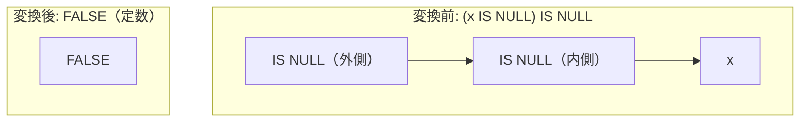

# is_null_of_null_check

- 状態: draft   /   執筆基準リビジョン: `3880673` (2026-09-12)
- 定義位置: `expression/rewrite.cpp` の `ExpressionRuleSet::Default()`(登録名 `"is_null_of_null_check"`)

## 概要

NULL 判定述語の多重適用 `(x IS NULL) IS NULL` および `(x IS NOT NULL) IS NULL` を、スカラー定数 `FALSE` へ畳み込む式書き換え Rule です。

`IS NULL` および `IS NOT NULL` は、被演算子 $x$ が NULL であるか否かにかかわらず、常に `TRUE` または `FALSE` の二値を出力する全域述語（total predicate）です。したがって、その出力値が NULL となることは論理的にあり得ず、外側の `IS NULL` 判定は恒真に偽（`FALSE`）へと縮退します。ただし、部分式 $x$ の評価を完全に脱落させる書き換えであるため、$x$ に起因する実行時例外が隠蔽されないよう `ExpressionCannotThrow` による厳格な例外安全ガードを備えています。

## 変換前後の関係



## 適用条件

パターン定義および登録処理は以下のとおりです（引用は `expression/rewrite.cpp`）。

```cpp
    built.Add(ExpressionRule(
        "is_null_of_null_check",
        Unary(UnaryOperation::kIsNull, Is(TypeTag::kUnaryExp, "inner")),
        [](const Expression&, const ExpressionBindings& bindings) {
          const auto inner_op = bindings.at("inner")->AsUnaryExpression().Op();
          if (inner_op != UnaryOperation::kIsNull &&
               inner_op != UnaryOperation::kIsNotNull) {
            return Expression{};
          }
          // `(x IS NULL) IS NULL -> FALSE` drops x; only sound when x cannot
          // raise (mirror of is_not_null_of_null_check).
          if (!ExpressionCannotThrow(bindings.at("inner"))) {
            return Expression{};
          }
          return ConstantValueExp(Value(false));
        }));
```

1. **外層のパターン制約**: 根ノードが単項 `IS NULL` 演算（`kIsNull`）であり、その子が単項式ノードであること。
2. **内層の演算子制約**: 内側の単項演算子が `kIsNull` または `kIsNotNull`（NULL 判定述語族）であること。
3. **例外消去抑止制約**: 内側の部分木全体について `ExpressionCannotThrow` が真であること（いかなる入力に対しても例外を投げないことが静的に証明されていること）。

すべての条件が満たされた場合に限り、定数ノード `ConstantValueExp(Value(false))` を返します。

## 意味論的根拠と例外安全性の保護

### 1. 二値閉包性と恒偽性
SQL の三値論理において、任意の式 $x$ に対する述語 $P_{\text{null}}(x) \in \{x \text{ IS NULL}, x \text{ IS NOT NULL}\}$ の値域は厳密に $\{0, 1\}$ です。$P_{\text{null}}(x)$ が NULL（`UNKNOWN`）を出力する入力は存在しないため、それに対する外側の判定 $P_{\text{null}}(x) \text{ IS NULL}$ は、真理値表の全行において `FALSE` と確定します。

### 2. 式の消去に伴う例外消去の防止
本変換は、内側に存在する任意の部分式 $x$ の評価を完全に破棄します。AST 参照評価器は式木をボトムアップに評価するため、もし $x$ に実行時例外を引き起こす演算（例: 数値オーバーフローを伴うキャスト `CAST(-inf AS INT64)` や 0 除算）が含まれていた場合、元のクエリは実行時エラーを送出します。
もし無条件に式全体を定数 `FALSE` へ畳み込むと、本来発生すべき例外が握りつぶされ、クエリが正常終了してしまうという重大な意味論破壊（error erasure）を引き起こします。

```cpp
// Conservative error-freedom test: true only when evaluating `expression`
// can never raise, whatever the row contains.  Rewrites that drop subtrees
// must not erase an error the AST interpreter (the semantic reference) would
// have raised, so they consult this before discarding an operand.
```

tinylamb では、ファジング検証によって発見されたこの安全性の裂け目を塞ぐため、部分式を破棄するすべての畳み込みにおいて `ExpressionCannotThrow` の充足を義務付けています。

## 実装の詳細

本体処理は、内側ノードの演算子判定（`kIsNull` / `kIsNotNull` の双方を網羅）と例外耐性チェックの 2 段階の guard で構成されます。単一の Rule 内で内側の肯定・否定の双方を受け止めることで、組み合わせの網羅性を高めています。条件合致時は即座にスカラー定数オブジェクトを返し、不要な式木再構築を排除します。

## 最適化効果

1. **計算オーバーヘッドの完全消去**: 実行時における子式 $x$ の評価、メモリ走査、および 2 段階の NULL 判定処理がすべて不要となり、コストが定数参照へと短縮されます。
2. **プランレベルの早期縮退の誘発**: 述語が恒偽（`FALSE`）となることで、包含する連言全体が `FALSE` となり、上位の論理最適化器（`eliminate_false_selection`）によってリレーション全体が空関係（`kValues`）へと早期枝刈りされます。

## 関連 Rule との相互作用

- `is_not_null_of_null_check`: 外側が `IS NOT NULL` の場合の対となる Rule であり、定数 `TRUE` への畳み込みを担います。
- `not_is_null` / `not_is_not_null`: 否定演算子 `NOT` を伴う NULL 判定を事前に正規化し、本 Rule の適用対象へと導きます。
- `eliminate_false_selection`: 本 Rule が生成した定数 `FALSE` を検知し、実行プランから無駄なスキャンノードを切り離します。

## 検証テスト

`expression/rewrite_test.cpp` において以下のテストケースにより検証されています。

- `ExpressionRewriteTest.NullCheckCompositionCollapsesToConstant`:
  `(x IS NULL) IS NULL` および `(x IS NOT NULL) IS NULL` が定数 `FALSE` へと正常に畳み込まれることを確認します。
- `ExpressionRewriteTest.NullCheckOfNullCheckPreservesRaise`:
  例外を送出し得る式（`CAST(-inf AS INT64)`）が内側に含まれる場合、畳み込みが安全に抑止され、元の式木とエラー挙動が維持されることを確認します。
