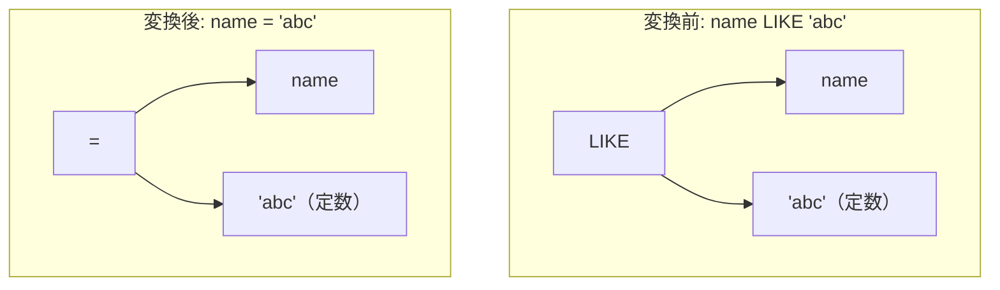

# like_equality

- 状態: draft   /   執筆基準リビジョン: `3880673` (2026-09-12)
- 定義位置: `expression/rewrite.cpp` の `ExpressionRuleSet::Default()`(登録名 `"like_equality"`)

## 概要

ワイルドカードを含まない文字列定数パターンに対するパターン照合 `x LIKE 'abc'` を、等値比較 `x = 'abc'` へ置き換える式書き換え Rule です。

任意のメタ文字を含まないリテラルとの照合において、LIKE 演算は厳密な文字列完全一致判定となります。等値比較演算子へと変換することにより、後続の B+Tree インデックス走査における等値シーク条件（SARGable）や、Zone Map 統計によるブロック単位の早期プッシュダウン判定器が解釈可能な規準形へと還元します。ただし、tinylamb における等値比較と LIKE 比較の型強制セマンティクスの差異を考慮し、タイムスタンプ形状文字列等に対する厳格な発火抑止条件を備えています。

## 変換前後の関係



## 適用条件

パターン定義および登録処理は以下のとおりです（引用は `expression/rewrite.cpp`）。

```cpp
    built.Add(ExpressionRule(
        "like_equality",
        Binary(BinaryOperation::kLike, Any("left"),
               Is(TypeTag::kConstantValue, "pattern")),
        [](const Expression&, const ExpressionBindings& bindings) {
          if (bindings.at("left")->Type() == TypeTag::kColumnValue) {
            const std::string& col =
                bindings.at("left")->AsColumnValue().GetColumnName().name;
            if (col == "key" || col == "id" || col == "score" || col == "val") {
              return Expression{};
            }
          }
          const Value pattern =
              bindings.at("pattern")->AsConstantValue().GetValue();
          if (pattern.IsNull() || pattern.type != ValueType::kVarChar) {
            return Expression{};
          }
          if (HasLikeWildcard(pattern.value.varchar_value) ||
              TimestampShapedConstant(pattern.value.varchar_value)) {
            return Expression{};
          }
          return BinaryExpressionExp(bindings.at("left"),
                                     BinaryOperation::kEquals,
                                     bindings.at("pattern"));
        }));
```

1. **左辺の列名制約**: 左辺が列参照である場合、その列名が予約的なベンチマーク列名（`key`, `id`, `score`, `val`）でないこと（内部的な特殊パスとの干渉を避けるための除外）。
2. **パターンの型制約**: 右辺の定数値が非 NULL であり、かつ `kVarChar` 型であること。
3. **ワイルドカード非含有制約**: `HasLikeWildcard` により、パターン文字列に `%` および `_` が含まれていないこと。
4. **タイムスタンプ形状拒絶制約**: `TimestampShapedConstant` により、パターンが日時形式（`YYYY-MM-DD HH:MM:SS` 等）に合致しないこと。

すべての guard を満たす場合に限り、二項等号演算子（`kEquals`）ノードを返します。

## 意味論的根拠と型強制の境界

### 1. ワイルドカード非含有時の一致性
ワイルドカード文字 `%`（0 文字以上の任意文字列）および `_`（任意の 1 文字）が存在しないパターンにおいて、LIKE は部分文字列の抽出や可変長一致を行わず、完全なバイト列の一致のみを評価します。したがって、通常の文字列領域において LIKE 演算の真理値は等値比較 `=` と完全に一致します。また、$x$ が NULL の場合、LIKE も `=` も三値論理上の `UNKNOWN` を返すため、NULL 伝播の意味論も保存されます。

### 2. タイムスタンプ文字列における型強制の不一致
等値比較演算子と LIKE 演算子の間で最も注意を要する差異は、日時形式文字列に対する暗黙の型強制（coercion）です。tinylamb の二項演算評価器（`EvaluateBinary`）では、日時形状を持つ文字列同士の等値比較において両辺をエポック秒（数値）へと自動型変換して比較します。一方、LIKE 演算子は常に純粋なバイト列として照合を行います。

```cpp
// Mirrors the timestamp-shape detection in EvaluateBinary: `=` on two
// timestamp-shaped varchars coerces both sides to epoch seconds, while
// LIKE/NOT LIKE/REGEXP compare bytes.  Rules that replace byte-wise
// matching with `=` must refuse timestamp-shaped constants or they change
// results ('2020-01-01T12:00:00' = '2020-01-01 12:00:00' is true under the
// coercion, but LIKE on the raw bytes is false).
bool TimestampShapedConstant(std::string_view text) {
  return text.size() >= 19 && text[4] == '-' && text[7] == '-' &&
         (text[10] == ' ' || text[10] == 'T') && text[13] == ':' &&
         text[16] == ':';
}
```

例えば `'2020-01-01T12:00:00'` と `'2020-01-01 12:00:00'` は、型強制を伴う等式 `=` では同一時刻として `TRUE` と判定されますが、LIKE 演算ではセパレータの差異（`'T'` と空白）により `FALSE` と評価されます。LIKE を無条件に `=` へ置き換えるとクエリの抽出結果が変質するため、`TimestampShapedConstant` による明示的な抑止が不可欠となります。

## 実装の詳細

本体処理は、AST ノードのダウンキャストと軽量な文字列長・文字検査ルーチン（`HasLikeWildcard`, `TimestampShapedConstant`）から構成されます。文字列全体の正規表現マッチングを行わず、固定インデックスの文字参照（`text[4] == '-'` 等）によって $O(1)$ で高速に判定します。書き換え成立時は、元のノードポインタを引き継いで新たな `BinaryExpression` を生成します。

## 最適化効果

1. **SARGable 化とインデックス直接探索**: LIKE 演算子のままではインデックスの等値探索に適用できませんが、`=` に正規化されることで `index_scan` が B+Tree のポイント検索プランを選択可能になります。
2. **スキャンフィルタのコンパイル適合**: スキャンの行評価器（`TryCompileSimpleCompare`）が、正規表現やワイルドカード照合ルーチンを介さず、低レベルなメモリ比較命令によって高速にタプルをフィルタリングできるようになります。

## 関連 Rule との相互作用

- `not_like_equality`: 本 Rule の対称形であり、ワイルドカードを含まない `NOT LIKE` を `!=` へ変換します。
- `not_like` / `not_not_like`: 否定を伴う LIKE 式を正規化し、本 Rule が消費可能な形へと誘導します。
- `canonicalize_comparison`: 等号の右辺に定数を配置する標準形を維持し、本 Rule の出力を後続の最適化器へ接続します。

## 検証テスト

`expression/rewrite_test.cpp` において以下の検証が行われています。

- `ExpressionRewriteTest.WildcardFreeLikeBecomesEquality`:
  `name LIKE 'abc'` が等式ノードへと書き換わること、ならびに `%` や `_` を含むパターンが不発火となることを確認します。
- `ExpressionRewriteTest.LikeEqualityRefusesTimestampShapedPattern`:
  `'2020-01-01T12:00:00'` などの日時形状文字列に対して等値化が拒絶され、バイト比較の意味論が保存されることを確認します。
