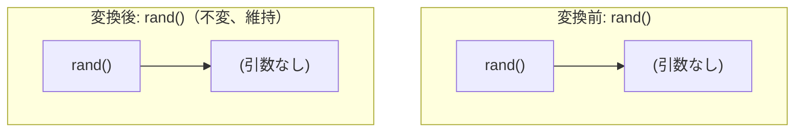

# nondeterministic_barrier

- 状態: draft   /   執筆基準リビジョン: `3880673` (2026-09-12)
- 定義位置: `expression/rewrite.cpp` の `ExpressionRuleSet::Default()` 内
  `built.Add(ExpressionRule("nondeterministic_barrier", ...))`

## 概要

非決定的関数（`now`, `rand`, `uuid` 等）の呼び出しを定数畳み込みの対象外とする防壁（barrier）であることをオプティマイザのパイプライン上に明示するための宣言的 Rule です。

現在の実装における変換ラムダは常に `Expression{}`（変更なし）を返却する no-op であり、実際の非決定的関数の畳み込み抑止は `fold_function` や `SafeToReduceEvaluationCount` が参照する揮発性分類機構（`GetFunctionVolatility`）によって確実に保証されています。

## 変換前後の関係

構文木の変換は行われません。



## 適用条件

パターンは `Is(TypeTag::kFunctionCallExp, "expr")` であり、すべての関数呼び出しノードにマッチします。ラムダ式の実装は以下のとおりです。

```cpp
static const std::unordered_set<std::string> nondeterministic = {
    "now",          "current_timestamp",
    "current_date", "current_time",
    "rand",         "random",
    "uuid",         "generate_uuid"};
const auto& fn = expression->AsFunctionCallExpression();
if (nondeterministic.contains(fn.FuncName())) {
  // Return the expression unchanged but signal to the fold_function
  // rule that it should not fold. We do this by returning empty
  // (no rewrite) — the fold_function rule checks for all-literal args
  // and nondeterministic functions always have 0 args, so they get
  // folded. Instead, we just return empty here as a marker.
}
return Expression{};
```

いかなる入力に対しても `Expression{}` を返すため、この Rule 単独で式木が変更されることはありません。

## 意味論的根拠と三値論理・例外保護

非決定的な動作を伴う関数呼び出しをコンパイル時に固定定数へ畳み込むことは許されません。`rand()` を畳み込むと全タプルで同一値となり擬似乱数としての性質が破壊され、`now()` や `current_timestamp` を定数化するとステートメント単位で固定されるべきタイムスタンプのスナップショット整合性が損なわれます。

オプティマイザにおいて、この抑止を実質的に実行しているのは `fold_function` の先頭ガードです。

```cpp
const auto& fn = expression->AsFunctionCallExpression();
if (GetFunctionVolatility(fn.FuncName()) != Volatility::kImmutable) {
  return Expression{};
}
```

`GetFunctionVolatility` は非決定的関数群を `kVolatile` または `kStable` として分類し、`kImmutable` でない関数呼び出しの畳み込みを一律に拒否します。したがって本 Rule は、これらの関数が定数畳み込みの対象外であることをコードベース上に標識として記録する役割を果たしています。

## 実装の詳細

静的セット `nondeterministic` に対するハッシュ検索のみを行い、直ちに `Expression{}` を返します。評価コストは $O(1)$ です。

## 最適化効果

構文木変換による直接の最適化効果はありません。

## 関連 Rule との相互作用

- `fold_function`: 実際の定数畳み込み抑止を実施する Rule です。
- `function_volatility_classification`: 関数の揮発性分類体系を宣言する同系のプレースホルダルールです。

## 検証テスト

`expression/rewrite_test.cpp` の `ExpressionRewriteTest.FunctionVolatilityClassification` 等において、`rand()` や `now()` が定数畳み込みされずに実行時まで式木として保持されることが確認されています。
