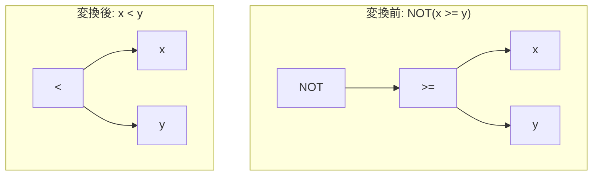

# not_comparison

- 状態: draft   /   執筆基準リビジョン: `3880673` (2026-09-12)
- 定義位置: `expression/rewrite.cpp` の `ExpressionRuleSet::Default()`（登録名 `"not_comparison"`）
- 関連コンポーネント: `NotComparisonFreeRules()` / `ContainsNotOfOrderedDoubleComparison`（`expression/rewrite.hpp`）

## 概要

比較演算に対する否定 $\neg(x < y)$ を逆向きの比較演算 $x \ge y$ へ、$\neg(x = y)$ を $x \ne y$ へと直接縮退させる式書き換え Rule です。

否定ノード（`NOT`）を 1 つ削除して比較演算子自体へ吸収し、述語の SARGable 化（インデックス Range スキャン適用可能性の向上）や Zone Map フィルタへの統合を促進します。ただし、浮動小数点数（DOUBLE 型）に対する順序比較では IEEE 754 の NaN（非数）意味論によって否定の同値性が破綻するため、型判定に基づく静的ガードおよびスキーマ付きコンテキストでの動的ルールセット切り替えが組み込まれています。

## 変換前後の関係



## 適用条件

パターンは「単項否定演算子（`kNot`）の子ノードが任意の二項演算子」である構造を照合します。適用判定（guard）は以下の 2 段階で構成されます（`expression/rewrite.cpp`）。

```cpp
          if (!IsComparison(operation)) {
            return Expression{};
          }

          switch (operation) {
            case BinaryOperation::kEquals:
            case BinaryOperation::kNotEquals:
              break;
            default:
              if (StaticallyDouble(bindings.at("left")) ||
                  StaticallyDouble(bindings.at("right"))) {
                return Expression{};
              }
              break;
          }
```

1. **比較演算子判定**: 子ノードの演算子が `=`、`!=`、`<`、`<=`、`>`、`>=` の 6 種類の比較演算子（`IsComparison`）のいずれかであること。
2. **IEEE 754 NaN 保護**: 等号・不等号（`=` / `!=`）を除く順序比較（`<`、`<=`、`>`、`>=`）の場合、左右の被演算子のいずれもが静的に確定した DOUBLE 型（`StaticallyDouble`）でないこと。

これらをすべて満たす場合のみ、演算子を反転させた比較式が返されます。

## 意味論的根拠と IEEE 754 NaN の制約

### 1. 二値論理および三値論理（非 NaN）における同値性
SQL の三値論理系において、オペランドに NULL が含まれる場合、比較演算（例: $x < y$）は `UNKNOWN` を返し、その否定 $\neg \text{UNKNOWN}$ も `UNKNOWN` となります。反転した比較演算（$x \ge y$）も同様に `UNKNOWN` を返すため、NULL 伝播の意味論は完全に保存されます。

### 2. IEEE 754 NaN と順序比較の破綻
浮動小数点数に NaN が混入した場合、この対称性が破綻します。
IEEE 754 規格および AST 参照実装において、NaN を含む順序比較（`<`、`<=`、`>`、`>=`）は常に `FALSE` と評価されます。

- 変換前: $\neg(\text{NaN} < y) \to \neg(\text{FALSE}) \to \text{TRUE}$
- 変換後: $\text{NaN} \ge y \to \text{FALSE}$

このように、元の式ではタプルを通過（$\text{TRUE}$）させるべき行が、反転後の式では排除（$\text{FALSE}$）され、クエリ結果が破壊されます。

一方、等号および不等号（`=` / `!=`）においては、$\text{NaN} = y$ は `FALSE`、$\text{NaN} \ne y$ は `TRUE` となるため、$\neg(\text{NaN} = y) \equiv (\text{NaN} \ne y)$ の同値関係が維持されます。したがって、ガード条件は順序比較にのみ課されます。

### 3. スキーマ非依存リライタの残存課題と外部安全弁
式書き換えエンジンはスキーマ情報を持たない純粋構文木上で動作するため、スキーマを参照しなければ型を決定できない列参照（例: `CAST` やリテラルを伴わない裸の列参照 `col_double`）は `StaticallyDouble` を通過してしまいます。

この残存ギャップ（documented residual gap）を塞ぐため、スキーマ情報を保持する上位レイヤ（バイトコードコンパイラやスキャン述語最適化）向けに、式木内の順序比較ノードを検査する `ContainsNotOfOrderedDoubleComparison` および本 Rule を安全に除外したルールセット `NotComparisonFreeRules()` が提供されています。

```cpp
bool ContainsNotOfOrderedDoubleComparison(const Expression& expression,
                                          const Schema& schema);
const ExpressionRuleSet& NotComparisonFreeRules();
```

呼び出し側は対象式に NaN リスクが存在することを検知した場合、動的に `not_comparison` を取り外したルールセットを選択して式書き換えを実行します。

## 実装の詳細

演算子の反転処理はヘルパー関数 `NegateComparison` に委譲されます。

```cpp
BinaryOperation NegateComparison(BinaryOperation operation) {
  switch (operation) {
    case BinaryOperation::kEquals:
      return BinaryOperation::kNotEquals;
    case BinaryOperation::kNotEquals:
      return BinaryOperation::kEquals;
    case BinaryOperation::kLessThan:
      return BinaryOperation::kGreaterThanEquals;
    case BinaryOperation::kLessThanEquals:
      return BinaryOperation::kGreaterThan;
    case BinaryOperation::kGreaterThan:
      return BinaryOperation::kLessThanEquals;
    case BinaryOperation::kGreaterThanEquals:
      return BinaryOperation::kLessThan;
    default:
      return operation;
  }
}
```

オペランドの左右位置は入れ替えず、演算子の境界包括性（等号の有無）を反転させた演算子へ差し替えます。オペランドの正規化（定数の右辺配置など）は `canonicalize_comparison` が独立して担当します。

## 最適化効果

1. **ノード数削減**: 単項否定ノードが除去され、式評価ツリーの深さと評価コストが減少します。
2. **SARGable 化**: 述語が直接の二項比較形式となることで、B+Tree インデックスのキー探索条件（下限・上限境界）への変換が可能になります。

## 関連 Rule との相互作用

- `de_morgan`: 論理積・論理和に対する否定を処理し、比較ノードに対する否定を本 Rule に委ねます。
- `canonicalize_comparison`: オペランドの位置（定数を右辺へ寄せる）を正規化し、本 Rule と協調して $\neg(5 > x) \to x \ge 5$ への収束を達成します。
- `NotComparisonFreeRules()`: DOUBLE 型カラムを含むスキーマ文脈において、本 Rule の発火を安全に停止させる切り替え機構です。

## 検証テスト

- `expression/rewrite_test.cpp`:
  - `ExpressionRewriteTest.NotPushdownRewritesComparisons`:
    $\neg(x < y) \to x \ge y$ および $\neg(x = y) \to x \ne y$ の基本的な反転を検証します。
- `expression/differential_test.cpp`:
  - `DifferentialTest.Evaluate_ComparisonMatrix_MatchesAcrossPaths`:
    AST 評価器、バイトコードエンジン、JIT 間で、IEEE NaN を含む比較式に対する否定の評価結果が完全一致することを全型マトリクスで検証します。
