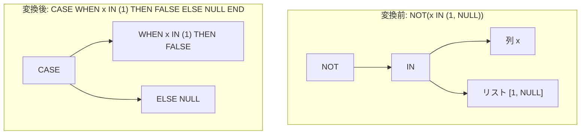

# not_in_null_semantics

- 状態: draft   /   執筆基準リビジョン: `3880673` (2026-09-12)
- 定義位置: `expression/rewrite.cpp` の `ExpressionRuleSet::Default()` 内
  `built.Add(ExpressionRule("not_in_null_semantics", ...))`

## 概要

リスト内に NULL 定数を含む否定包含判定 `x NOT IN (c1, ..., NULL)` を、明示的な三値論理制御フローを持つ CASE 式 `CASE WHEN x IN (c1, ...) THEN FALSE ELSE NULL END` へ展開する式書き換え Rule です。

SQL の三値論理において、NULL を含むリストに対する `NOT IN` 述語は、いずれかの要素と一致した場合は `FALSE`、それ以外の場合はすべて `UNKNOWN`（NULL）を返します。この挙動を素朴に二項不等号の連言 $\bigwedge (x \ne c_i)$ に分解すると、非一致時の `UNKNOWN` が偽として扱われ真理値の破壊が生じます。本 Rule は、明示的な CASE 式の分岐へと還元することで意味論を完全に保ち、後続の IN 簡約パスを有効化します。

## 変換前後の関係



## 適用条件

パターン定義は `Unary(UnaryOperation::kNot, Is(TypeTag::kInExp, "in"))` であり、IN 式の否定のみを抽出します。ラムダ式内部ではリストを走査し、NULL 定数の存在判定（`has_null`）および非 NULL 要素の分離（`non_null_items`）を行います（引用は `expression/rewrite.cpp`）。

```cpp
          if (!has_null) {
            return Expression{};
          }
          if (non_null_items.empty()) {
            // Same drop-as-if-unevaluated hazard as in_single_null.
            if (!ExpressionCannotThrow(in.child_)) {
              return Expression{};
            }
            return ConstantValueExp(Value());
          }
```

1. **NULL 定数存在制約**: リスト内に NULL 定数が少なくとも 1 つ以上含まれていること（NULL を含まない通常の `NOT IN` は不発火）。
2. **全要素 NULL 時の例外安全性**: 非 NULL 要素が存在しない場合（全要素が NULL）、左辺の子ノード `in.child_` が `ExpressionCannotThrow` を満たす場合に限り NULL 定数へと畳み込みます。
3. **要素混在時の展開**: 非 NULL 要素が存在する場合、後述の CASE 式再構成ルーチンを実行します。

## 意味論的根拠と三値論理の厳密展開

### 1. 三値論理における NOT IN の真理値表
リスト $L = \{1, \text{NULL}\}$ に対する述語 $x \text{ NOT IN } L$ の挙動は以下のとおりです。
- $x = 1$ の場合: $x \in L$ は `TRUE` となり、その否定は `FALSE`。
- $x = 2$ の場合: $x \in L$ は $2 = 1 \lor 2 = \text{NULL} \implies \text{FALSE} \lor \text{UNKNOWN} \implies \text{UNKNOWN}$。その否定は $\neg \text{UNKNOWN} = \text{UNKNOWN}$（NULL）。
- $x = \text{NULL}$ の場合: $\text{NULL} = 1 \lor \text{NULL} = \text{NULL} \implies \text{UNKNOWN} \lor \text{UNKNOWN} \implies \text{UNKNOWN}$。その否定は `UNKNOWN`。

したがって、評価結果は「有効な要素に一致したときのみ `FALSE`、それ以外は常に `UNKNOWN`」となります。展開後の式 `CASE WHEN x IN (1) THEN FALSE ELSE NULL END` は、全領域においてこの真理値と完全に一致します。

### 2. 要素消去時の例外保護
リストが NULL 定数のみで構成される場合（例: `x NOT IN (NULL)`）、式全体が NULL 定数へと畳み込まれます。この経路では子式 $x$ の評価が脱落するため、`in_single_null` と同様に 0 除算やキャスト例外を消去しないよう、`ExpressionCannotThrow` ガードが必須となります。

## 実装の詳細

再構成ステップでは、非 NULL 要素数が 1 個の場合は等式 `x = c`、2 個以上の場合は縮小されたリストを持つ `InExpression` を構築し、それを searched CASE の条件節へと組み込みます。

```cpp
          Expression in_check =
              non_null_items.size() == 1
                  ? BinaryExpressionExp(in.child_, BinaryOperation::kEquals,
                                        non_null_items[0])
                  : InExpressionExp(in.child_, std::move(non_null_items));
          return CaseExpressionExp(
              {{std::move(in_check), ConstantValueExp(Value(false))}},
              ConstantValueExp(Value()));
```

この変換により、NULL 要素の評価が取り除かれ、非 NULL 要素のみで構成された正規の包含判定へと再編されます。

## 最適化効果

1. **述語の正規化と最適化器への適合**: NULL 混在の特殊な `NOT IN` が排除され、内部の IN 式が `singleton_in` や等式系最適化ルールの対象となります。
2. **無駄な照合処理の回避**: 実行時に NULL 要素に対して毎回行われていた無意味な等号評価ループが排除され、CASE 式の高速な条件分岐へと集約されます。

## 関連 Rule との相互作用

- `in_single_null`: 全要素が NULL の境界ケースにおいて同一の例外安全ガードと定数畳み込みを共有します。
- `singleton_in`: 生成された CASE 条件内の単一要素 IN を等式へと即座に変換します。
- `double_negation`: `NOT (NOT (x IN ...))` のような二重否定を事前に消去して本 Rule に引き渡します。

## 検証テスト

`expression/rewrite_test.cpp` の `ExpressionRewriteTest.NotInNullSemantics` において以下の性質が検証されています。

- `x NOT IN (1, NULL)` が CASE 式へと展開され、$x=1$ で FALSE、$x=2$ および $x=\text{NULL}$ で NULL となること。
- `x NOT IN (1, 2, NULL)` が $x=3$ において NULL と評価されること。
- `x NOT IN (NULL)` が例外安全性を維持した上で NULL 定数へと畳み込まれること。
