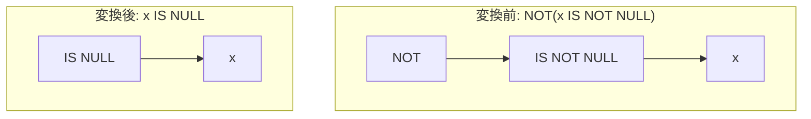

# not_is_not_null

- 状態: draft   /   執筆基準リビジョン: `3880673` (2026-09-12)
- 定義位置: `expression/rewrite.cpp` の `ExpressionRuleSet::Default()`(登録名 `"not_is_not_null"`)

## 概要

否定演算子を伴う非 NULL 判定 `NOT(x IS NOT NULL)` を、単一の NULL 判定演算子 `x IS NULL` へ置き換える式書き換え Rule です。

`not_is_null` と対称をなす関係にあり、二値の完全性を備えた非 NULL 述語の論理否定を、正規化された単項 `IS NULL` 述語へと還元します。式木の深さを削減するとともに、後続の NULL 判定処理系やインデックス走査生成器に対する入力形式を統一します。

## 変換前後の関係



## 適用条件

パターン定義および登録コードは以下のとおりです（引用は `expression/rewrite.cpp`）。

```cpp
    built.Add(ExpressionRule(
        "not_is_not_null",
        Unary(UnaryOperation::kNot,
              Unary(UnaryOperation::kIsNotNull, Any("child"))),
        [](const Expression&, const ExpressionBindings& bindings) {
          return UnaryExpressionExp(bindings.at("child"),
                                    UnaryOperation::kIsNull);
        }));
```

マッチング条件は「`NOT` 単項演算ノードの直下が `IS NOT NULL` 単項演算ノードであること」のみです。ラムダ式内部に追加の guard 分岐は存在せず、キャプチャされた子ノード `child` を保持したまま、演算子タグを `kIsNotNull` から `kIsNull` へと置換した新たな単項式を生成します。

## 意味論的根拠とガード不要性

### 1. 三値論理における完全な二値性
三値論理において、述語 $x \text{ IS NOT NULL}$ の出力値は $x$ が NULL のとき `FALSE`、非 NULL のとき `TRUE` となり、`UNKNOWN` を返しません。このため、二値論理における排中律および二重否定の反転則がそのまま成立し、$\neg (x \text{ IS NOT NULL})$ の真理値表は $x \text{ IS NULL}$ と厳密に一致します。

### 2. 評価回数および例外特性の保存
本 Rule は部分式の脱落を伴いません。子式 $x$ は変換後も過不足なく 1 回のみ評価されるため、実行時例外の消去リスク（`ExpressionCannotThrow` を要する状況）や、副作用・乱数生成の回数変動（`SafeToReduceEvaluationCount` を要する状況）は生じません。したがって、追加の検査を行わずに無条件適用することが数学的に正当化されます。

## 実装の詳細

`expression/rewrite.cpp` の登録テーブルにおいて `not_is_null` の直後に定義されています。パターンマッチングエンジンがノードの型タグを照合した直後にインラインで呼び出され、$O(1)$ の時間計算量で処理を完了します。

## 最適化効果

1. **ノード数および呼び出し段数の短縮**: 論理否定ノードが解消され、式の評価パスにおけるオーバーヘッドが軽減されます。
2. **パターンマッチングの正規化**: 素の `x IS NULL` 形式へ復元されることで、外層の NULL 判定縮退 Rule（`is_null_of_null_check` 等）や、アンチ結合の形成判定ルーチンが余計な否定ノードの解析を挟むことなく述語を認識できるようになります。

## 関連 Rule との相互作用

- `not_is_null`: 本 Rule と逆向きの対称 Rule であり、`NOT(x IS NULL)` を `x IS NOT NULL` へ変換します。
- `is_null_of_null_check` / `is_not_null_of_null_check`: NULL 判定が多重に重なる式木を定数へ畳み込むルール群です。
- `de_morgan`: 論理積および論理和に対する否定の押し込みを担当します。

## 検証テスト

`expression/rewrite_test.cpp` において以下のテストにより動作が検証されています。

- `ExpressionRewriteTest.NotPushdownRewritesLikeAndNullChecks`:
  `NOT(x IS NOT NULL)` が単一の `kIsNull` 単項式ノードへと正規化されることを確認します。
