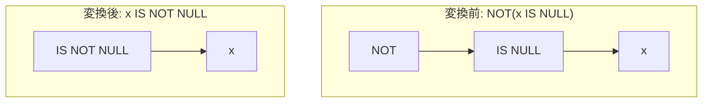

# not_is_null

- 状態: draft   /   執筆基準リビジョン: `3880673` (2026-09-12)
- 定義位置: `expression/rewrite.cpp` の `ExpressionRuleSet::Default()`(登録名 `"not_is_null"`)

## 概要

否定演算子を伴う NULL 判定 `NOT(x IS NULL)` を、単一の否定 NULL 判定演算子 `x IS NOT NULL` へ置き換える式書き換え Rule です。

SQL の三値論理において一般のブール式に対する `NOT` 適用は `UNKNOWN`（NULL）をそのまま伝播させますが、`IS NULL` 述語は被演算子が NULL であっても必ず `TRUE` または `FALSE` の二値を返す全域述語です。そのため、二値の論理否定として `x IS NOT NULL` への書き換えが厳密に成立します。式木の深さを削減し、下流の述語プッシュダウンや結合方式の判定器が解釈しやすい正規形へと統一します。

## 変換前後の関係



## 適用条件

パターン定義および登録処理は以下のとおりです（引用は `expression/rewrite.cpp`）。

```cpp
    built.Add(ExpressionRule(
        "not_is_null",
        Unary(UnaryOperation::kNot,
              Unary(UnaryOperation::kIsNull, Any("child"))),
        [](const Expression&, const ExpressionBindings& bindings) {
          return UnaryExpressionExp(bindings.at("child"),
                                    UnaryOperation::kIsNotNull);
        }));
```

マッチング条件は「`NOT` 単項演算ノードの直下が `IS NULL` 単項演算ノードであること」のみであり、ラムダ式内部に追加の guard 条件（`Expression{}` を返す分岐）は存在しません。キャプチャされた子式 `child` をそのまま引き継ぎ、演算子を `kIsNull` から `kIsNotNull` へ差し替えた単項式ノードを生成します。

## 意味論的根拠とガード不要性

### 1. 三値論理における完全な二値性
三値論理の枠組みにおいて、述語 $x \text{ IS NULL}$ は $x$ の評価結果にかかわらず常に $\{0, 1\}$ の二値を出力します。したがって、$\neg (x \text{ IS NULL})$ の真理値表は $x \text{ IS NOT NULL}$ の定義と全領域において一致します。一般論理式における NULL 伝播の不整合（$\neg \text{UNKNOWN} = \text{UNKNOWN}$）が介在する余地はありません。

### 2. 評価回数と例外特性の不変性
本 Rule は部分式の消去や複製を行わず、子式 $x$ の評価回数は変換前後で厳密に 1 回のまま保存されます。また、評価順序の変更も生じません。したがって、実行時エラーの隠蔽を検査する `ExpressionCannotThrow` や、評価回数削減を制限する `SafeToReduceEvaluationCount` による guard を必要とせず、無条件に適用可能です。

## 実装の詳細

登録処理は `expression/rewrite.cpp` のルールセット構築ルーチン内で行われます。中間木ノードの再利用および演算子タグの直接指定により、$O(1)$ の時間計算量と最小限のアロケーションで新たな `UnaryExpression` を返します。

## 最適化効果

1. **式木の平坦化と評価段数の削減**: 式木から否定ノードが除去され、深さが 1 減少します。実行時における仮想関数呼び出しやバイトコード命令数が 1 段短縮されます。
2. **下流最適化におけるパターン認識の容易化**: 素の `x IS NOT NULL` 形式は、オプティマイザの各層において以下の判断基準として直接利用されます。
   - 外部結合から内部結合への変換（`outer_to_inner_join_on_null_rejecting_filter`）における NULL 排除述語の検出。
   - B+Tree インデックス走査における NULL 除外範囲指定の生成。
   - 単純比較コンパイラ（`TryCompileSimpleCompare`）における高速パスの起動。

## 関連 Rule との相互作用

- `not_is_not_null`: 本 Rule の完全な対称形であり、`NOT(x IS NOT NULL)` を `x IS NULL` へ変換します。
- `is_null_of_null_check` / `is_not_null_of_null_check`: NULL 判定が二重に重なる式木（例: `(x IS NULL) IS NULL`）を定数へ縮退させる Rule 群です。これらは部分式 $x$ の評価を消去するため `ExpressionCannotThrow` guard を必要とする点で本 Rule と性質が異なります。
- `de_morgan`: 論理積・論理和に対する否定のプッシュダウンを担当し、単項述語である NULL 判定は本 Rule に委ねられます。

## 検証テスト

`expression/rewrite_test.cpp` において以下のテストケースにより動作が検証されています。

- `ExpressionRewriteTest.NotPushdownRewritesLikeAndNullChecks`:
  `NOT(x IS NULL)` が単一の `kIsNotNull` 単項式ノードへと正規化されることを確認します。
- `ExpressionRewriteTest.NullCheckCompositionCollapsesToConstant`:
  NULL 判定に対する否定演算が定数縮退ではなくプッシュダウン Rule 群によって適切に正規化されることを検証します。
