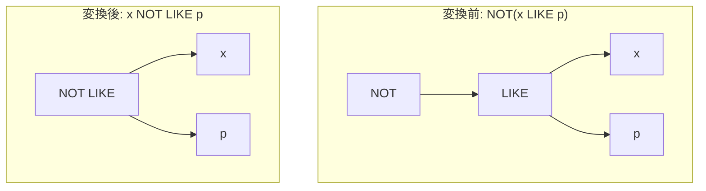

# not_like

- 状態: draft   /   執筆基準リビジョン: `3880673` (2026-09-12)
- 定義位置: `expression/rewrite.cpp` の `ExpressionRuleSet::Default()`(登録名 `"not_like"`)

## 概要

否定演算子を伴うパターン照合 `NOT(x LIKE p)` を、単一の二項演算子 `x NOT LIKE p` へ置き換える式書き換え Rule です。

SQL の三値論理において、`x LIKE p` は $x$ または $p$ が NULL のときに `UNKNOWN`（NULL）を返し、一般の否定演算 $\text{NOT}(\text{UNKNOWN})$ も `UNKNOWN` を返します。一方、`kNotLike` 二項演算子も同様の三値論理セマンティクスに基づいて実装されているため、真理値および NULL 伝播の振る舞いは完全に一致します。本 Rule は、式木から否定ノードを除去して演算子の正規形を形成します。

## 変換前後の関係



## 適用条件

パターン定義および登録処理は以下のとおりです（引用は `expression/rewrite.cpp`）。

```cpp
    built.Add(ExpressionRule(
        "not_like",
        Unary(UnaryOperation::kNot,
              Binary(BinaryOperation::kLike, Any("left"), Any("right"))),
        [](const Expression&, const ExpressionBindings& bindings) {
          return BinaryExpressionExp(bindings.at("left"),
                                      BinaryOperation::kNotLike,
                                      bindings.at("right"));
        }));
```

マッチング条件は「`NOT` 単項演算ノードの直下が `LIKE` 二項演算ノードであること」のみです。ラムダ式内部に追加の guard 分岐は存在せず、左右の部分式 `left` および `right` をそのまま引き継ぎ、演算子タグを `kLike` から `kNotLike` へ差し替えた新たな二項式を返します。

## 意味論的根拠とガード不要性

### 1. 三値論理における真理値表の一致
SQL 標準および tinylamb の評価モデルにおいて、LIKE 族の評価結果は以下のとおり定義されています。

- $x$ または $p$ のいずれかが NULL である場合:
  - $\text{LIKE}(x, p) = \text{UNKNOWN}$
  - $\neg (\text{LIKE}(x, p)) = \neg \text{UNKNOWN} = \text{UNKNOWN}$
  - $\text{NOT LIKE}(x, p) = \text{UNKNOWN}$
- $x$ および $p$ が非 NULL である場合:
  - $\neg (\text{LIKE}(x, p)) = \text{NOT LIKE}(x, p) \in \{\text{TRUE}, \text{FALSE}\}$

したがって、全定義域において変換前後の論理値は一致します。

### 2. 評価回数と例外特性の不変性
被演算子であるテキスト式 $x$ およびパターン式 $p$ の評価回数は、変換前後ともに 1 回のまま変化しません。短絡評価の導入や式の脱落を伴わないため、例外隠蔽防止のための `ExpressionCannotThrow` や、評価回数削減を防ぐ `SafeToReduceEvaluationCount` を課す必要はありません。

なお、本 Rule では `x NOT LIKE p` を不等号比較（`x != p`）へ展開することは行いません。ワイルドカードの有無に応じた定数等値化は、後続の個別ルール（`not_like_equality`）によって厳格な guard のもとで実施されます。

## 実装の詳細

`expression/rewrite.cpp` においてパターン DSL により宣言的に登録されています。マッチした式ノードのポインタを直接流用して新たな `BinaryExpression` をアロケーションするため、$O(1)$ の時間計算量で処理されます。

## 最適化効果

1. **評価パイプラインの短縮**: 式木から単項否定ノードが解消され、LIKE 評価後に NOT 評価を挟む多段呼び出しが単一の NOT LIKE 判定カーネルへと縮退します。
2. **後続ルールの起動促進**: `NOT LIKE` の明示的な形式を前提とする後続ルール（例: ワイルドカードを含まない定数に対する `not_like_equality` やプレフィックス抽出）が即座に適用可能になります。

## 関連 Rule との相互作用

- `not_not_like`: `NOT(x NOT LIKE p)` を `x LIKE p` へ復元する逆向きの二重否定消去 Rule です。
- `not_like_equality`: パターンがワイルドカードを含まないリテラルの場合に、`x NOT LIKE 'abc'` を `x != 'abc'` へ等値化します。
- `de_morgan`: 二項論理積・論理和に対する否定の押し込みを担当します。

## 検証テスト

本 Rule は以下のテストによって動作が保証されています。

- `expression/rewrite_test.cpp` の `ExpressionRewriteTest.NotPushdownRewritesLikeAndNullChecks`:
  `NOT(name LIKE 'a%')` が `kNotLike` 二項式ノードへと正規化されることを検証します。
- `expression/differential_test.cpp` の `DifferentialTest.Evaluate_LikePatterns_MatchesAcrossPaths`:
  AST 評価器とバイトコード評価器の間で、NOT LIKE の様々な文字列パターン・ワイルドカード・NULL 入力に対する評価結果が完全に一致することを網羅的に検証します。
