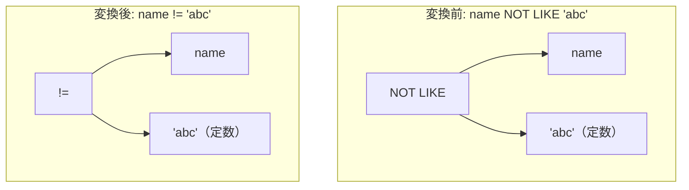

# not_like_equality

- 状態: draft   /   執筆基準リビジョン: `3880673` (2026-09-12)
- 定義位置: `expression/rewrite.cpp` の `ExpressionRuleSet::Default()`(登録名 `"not_like_equality"`)

## 概要

ワイルドカードを含まない文字列定数パターンに対するパターン否定照合 `x NOT LIKE 'abc'` を、不等値比較 `x != 'abc'` へ置き換える式書き換え Rule です。

`like_equality` の完全な否定対面（counterpart）であり、ワイルドカード文字が存在しない定数に対してバイト単位の不一致判定を二項不等号演算子へと還元します。`like_equality` と同一の guard 条件を共有し、三値論理における NULL 伝播の整合性および日時文字列における型強制との不整合抑止を厳密に保証します。

## 変換前後の関係



## 適用条件

パターン定義および登録処理は以下のとおりです（引用は `expression/rewrite.cpp`）。

```cpp
    built.Add(ExpressionRule(
        "not_like_equality",
        Binary(BinaryOperation::kNotLike, Any("left"),
               Is(TypeTag::kConstantValue, "pattern")),
        [](const Expression&, const ExpressionBindings& bindings) {
          if (bindings.at("left")->Type() == TypeTag::kColumnValue) {
            const std::string& col =
                bindings.at("left")->AsColumnValue().GetColumnName().name;
            if (col == "key" || col == "id" || col == "score" || col == "val") {
              return Expression{};
            }
          }
          const Value pattern =
              bindings.at("pattern")->AsConstantValue().GetValue();
          if (pattern.IsNull() || pattern.type != ValueType::kVarChar) {
            return Expression{};
          }
          if (HasLikeWildcard(pattern.value.varchar_value) ||
              TimestampShapedConstant(pattern.value.varchar_value)) {
            return Expression{};
          }
          return BinaryExpressionExp(bindings.at("left"),
                                     BinaryOperation::kNotEquals,
                                     bindings.at("pattern"));
        }));
```

1. **左辺の列名制約**: 左辺が列参照である場合、その列名が予約的なベンチマーク列名（`key`, `id`, `score`, `val`）でないこと。
2. **パターンの型制約**: 右辺の定数値が非 NULL であり、かつ `kVarChar` 型であること。
3. **ワイルドカード非含有制約**: `HasLikeWildcard` により、パターン文字列に `%` および `_` が含まれていないこと。
4. **タイムスタンプ形状拒絶制約**: `TimestampShapedConstant` により、パターンが日時形式に合致しないこと。

これらを満たす場合に限り、二項不等号演算子（`kNotEquals`）ノードを返します。

## 意味論的根拠とガード条件の対称性

### 1. 三値論理における真理値保存
$x \text{ NOT LIKE } p$ は $x \text{ LIKE } p$ の Kleene 否定として定義されています。ワイルドカード文字を含まない定数に対して、$x \text{ LIKE } p$ と $x = p$ が全定義域（NULL 伝播を含む）において一致するため、その否定である $x \text{ NOT LIKE } p$ と $x \ne p$ も完全に同一の真理値を出力します。

### 2. タイムスタンプ形状文字列に対する抑止
`like_equality` と同様に、日時形式文字列に対する暗黙の型強制セマンティクスが発火の障壁となります。varchar の不等号比較 `!=` は日時形状文字列をエポック秒に変換して比較するため、書式違いの同一時刻（例: `'2020-01-01T12:00:00'` と `'2020-01-01 12:00:00'`）に対して `!=` は `FALSE` を返します。しかし、`NOT LIKE` はバイト比較を行うため `TRUE` を返します。この結果の乖離を防ぐため、`TimestampShapedConstant` による guard が必須となります。

## 実装の詳細

本体処理は `like_equality` と完全に並行する構造を持ち、生成されるノードの演算子種別のみが `BinaryOperation::kNotEquals` となります。左右の部分式ポインタをそのまま引き継ぐため、メモリ確保を最小限に抑えた $O(1)$ の時間計算量で完了します。

## 最適化効果

1. **述語表現の統合**: 特殊な文字列パターン演算子 `NOT LIKE` が、標準的な比較演算子 `!=` へと還元されます。
2. **下流フィルタコンパイルの効率化**: スキャンフィルタ生成器が、複雑なパターン照合エンジンを介することなく単純なスカラー不等号判定コードを生成できるようになります。

## 関連 Rule との相互作用

- `like_equality`: 肯定形の兄弟 Rule です。
- `not_like` / `not_not_like`: `NOT(x LIKE 'abc')` は `not_like` によって `x NOT LIKE 'abc'` へ変換された後、本 Rule によって最終的に `x != 'abc'` へと正規化されます。
- `canonicalize_comparison`: 不等号比較の左右被演算子順序を規準化します。

## 検証テスト

`expression/rewrite_test.cpp` において以下のテストケースにより検証されています。

- `ExpressionRewriteTest.WildcardFreeLikeBecomesEquality`:
  `name NOT LIKE 'abc'` が `kNotEquals` 二項式ノードへと正規化されることを確認します。
- `ExpressionRewriteTest.LikeEqualityRefusesTimestampShapedPattern`:
  日時形状文字列に対する抑止挙動が肯定形とともに保証されています。
