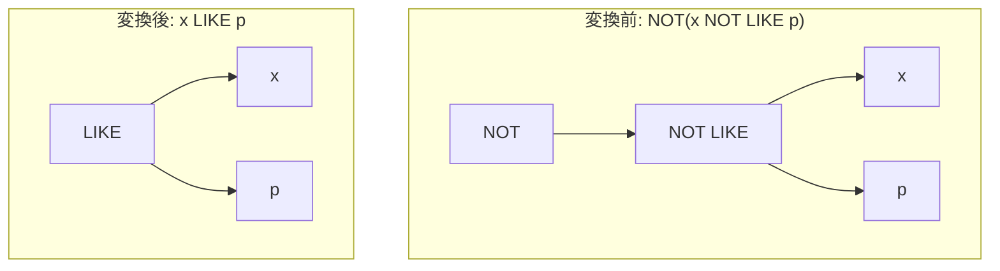

# not_not_like

- 状態: draft   /   執筆基準リビジョン: `3880673` (2026-09-12)
- 定義位置: `expression/rewrite.cpp` の `ExpressionRuleSet::Default()`(登録名 `"not_not_like"`)

## 概要

二重否定を伴うパターン照合 `NOT(x NOT LIKE p)` を、単一の二項演算子 `x LIKE p` へ復元する式書き換え Rule です。

`not_like` の逆変換に相当し、三値論理において恒等的に相殺される二重の論理反転を解消します。式木から余剰な否定ノードを取り除くことで、LIKE 述語とその定数パターンを露出させ、インデックス走査やプレフィックス抽出といった後続最適化への伝播を可能にします。

## 変換前後の関係



## 適用条件

パターン定義および登録処理は以下のとおりです（引用は `expression/rewrite.cpp`）。

```cpp
    built.Add(ExpressionRule(
        "not_not_like",
        Unary(UnaryOperation::kNot,
              Binary(BinaryOperation::kNotLike, Any("left"), Any("right"))),
        [](const Expression&, const ExpressionBindings& bindings) {
          return BinaryExpressionExp(bindings.at("left"),
                                      BinaryOperation::kLike,
                                      bindings.at("right"));
        }));
```

マッチング条件は「`NOT` 単項演算ノードの直下が `NOT LIKE` 二項演算ノードであること」のみです。ラムダ式内部に追加の guard 分岐は存在せず、左右の部分式 `left` および `right` を保持したまま、演算子タグを `kNotLike` から `kLike` へ置換した二項式ノードを生成します。

## 意味論的根拠とガード不要性

### 1. 三値論理における二重否定の恒等性
SQL の三値論理において、`kNotLike` は `kLike` の Kleene 否定として厳密に定義されています。
$x$ または $p$ が NULL のとき、$x \text{ NOT LIKE } p$ は `UNKNOWN`（NULL）を出力し、$\neg \text{UNKNOWN} = \text{UNKNOWN}$ となります。これは $x \text{ LIKE } p$ の真理値と完全に一致します。
また、$x$ および $p$ が非 NULL である場合、真偽値は $\neg (\neg P) = P$ に従い元の真理値へと還元されます。したがって、全領域において真理値の同値性が成立します。

### 2. 式の保存と全域性の維持
被演算子 $x$ および $p$ の評価回数は変換前後で 1 回のまま変化せず、部分式の脱落も生じません。したがって、実行時例外の隠蔽を防ぐための `ExpressionCannotThrow` や、評価回数削減を監視する `SafeToReduceEvaluationCount` を要件に課す必要はありません。

## 実装の詳細

本 Rule は `ExpressionRewriter` による反復リライトパスにおいて、中間生成された否定ノードを確実に消滅させる正規化ペアとして機能します。宣言的 DSL によりノード型タグが照合された後、左右の部分式ポインタを再利用して新たな `BinaryExpression` を $O(1)$ で構築します。

## 最適化効果

1. **評価段数の短縮**: 実行時における `NOT` 単項式の仮想関数呼び出しおよびスタック操作が解消されます。
2. **LIKE 最適化パスの再活性化**: 素の `x LIKE p` 形式が復元されることにより、ワイルドカードを含まない定数に対する等値化（`like_equality`）や、前方一致インデックス走査への誘導が可能になります。

## 関連 Rule との相互作用

- `not_like`: 本 Rule と対をなし、`NOT(x LIKE p)` を `x NOT LIKE p` へ変換します。
- `like_equality`: 本 Rule によって復元された `x LIKE 'abc'` を `x = 'abc'` へ等値化します。
- `de_morgan`: 連言・選言に対する否定の分配を処理し、LIKE 族に対する否定は本 Rule 群が担当します。

## 検証テスト

本 Rule は以下のテストケースにより動作が担保されています。

- `expression/rewrite_test.cpp` の `ExpressionRewriteTest.NotPushdownRewritesLikeAndNullChecks`:
  `NOT(name NOT LIKE 'a%')` が `kLike` 二項式ノードへと正規化されることを確認します。
- `expression/differential_test.cpp` の `DifferentialTest.Evaluate_LikePatterns_MatchesAcrossPaths`:
  AST 評価器とバイトコード評価器の間で、NOT LIKE および二重否定を含む式木の評価結果が完全に一致することを検証します。
