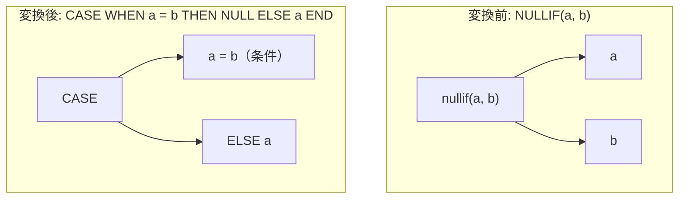

# nullif_to_case

- 状態: draft   /   執筆基準リビジョン: `3880673` (2026-09-12)
- 定義位置: `expression/rewrite.cpp` の `ExpressionRuleSet::Default()`(登録名 `"nullif_to_case"`)

## 概要

`NULLIF(a, b)` 関数呼び出しを、標準的な論理構造である searched CASE 式 `CASE WHEN a = b THEN NULL ELSE a END` へ展開（lowering）する式書き換え Rule です。

あわせて、定数比較、同一式同士の比較、および NULL 定数が関与する特殊形に対するインライン定数畳み込みを統合的に実施します。一般形への展開においては第 1 引数 $a$ の評価回数が 1 回から 2 回へ増加するため、揮発性関数や相関サブクエリに対する安全性を検証します。また、定数縮退の各ブランチにおいては、IEEE 754 NaN 比較の特性や 0 除算等の例外隠蔽抑止を目的とする厳格な事前条件を備えています。

## 変換前後の関係



特殊形として、同一式かつ安全な場合は `NULLIF(a, a) \to \text{NULL}`、右辺が NULL 定数の場合は `NULLIF(x, \text{NULL}) \to x` へと縮退します。

## 適用条件

パターン定義は `Is(TypeTag::kFunctionCallExp, "expr")` であり、関数名が `nullif` かつ引数が 2 個の場合に処理を開始します（引用は `expression/rewrite.cpp`）。

```cpp
          const auto& fn = expression->AsFunctionCallExpression();
          if (fn.FuncName() != "nullif" || fn.Args().size() != 2) {
            return Expression{};
          }
```

引数の性質に応じて以下の 5 経路に分岐します。

1. **両辺定数**: `TryEvaluateBinary(kEquals, val_a, val_b)` により直接スカラー値へ畳み込み。
2. **同一式 `Same(a, b)`**: `a` が静的に double（`StaticallyDouble`）、投げ得る（`!ExpressionCannotThrow`）、または揮発性（`!SafeToReduceEvaluationCount`）でない場合に限り NULL 定数へ畳み込み。
3. **左辺が NULL 定数**: 右辺が定数ノードである場合に限り NULL 定数へ畳み込み（未評価式の例外消去抑止）。
4. **右辺が NULL 定数**: 左辺ノード $a$ をそのまま返却。
5. **一般形**: 左辺 $a$ が `SafeToReduceEvaluationCount` を満たす場合に限り searched CASE 式へ展開。

## 意味論的根拠と安全性保証

### 1. 三値論理における CASE 式の等価性
SQL における $\text{NULLIF}(a, b)$ の厳密な意味論は、「$a = b$ が真ならば NULL、偽または UNKNOWN（NULL）ならば $a$」です。三値論理において $a = b$ が `UNKNOWN` と評価された場合、CASE 式は WHEN 節を通過せず ELSE 節の $a$ を返します。これは元の $\text{NULLIF}$ の定義と全タプルにおいて完全に一致します。

### 2. 一般形における多重評価と揮発性保護
searched CASE 式 `CASE WHEN a = b THEN NULL ELSE a END` において、式 $a$ は条件節と ELSE 節の双方に重複して配置されます。もし $a$ に `RAND()` などの揮発性関数や相関サブクエリが含まれていた場合、評価回数の増加がタプルごとの副作用や結果の揺らぎを引き起こすため、`SafeToReduceEvaluationCount(a)` により展開が禁止されます。

### 3. 特殊形縮退における NaN および例外保護
- **同一式比較**: SQL において $\text{NaN} = \text{NaN}$ は `FALSE` であるため、引数が浮動小数点数（`StaticallyDouble`）である場合、$\text{NULLIF}(\text{NaN}, \text{NaN})$ は NaN を返さなければなりません。また、引数 $a$ の評価を消去するため、例外を送出しないこと（`ExpressionCannotThrow`）が不可欠です。
- **左辺 NULL 定数**: $\text{NULLIF}(\text{NULL}, b)$ において結果は常に NULL ですが、ファジング検証により発見された `nullif(NULL, 2971756592411605 % 0)` の反例が示すように、第 2 引数 $b$ が例外を送出し得る式である場合、それを消去して NULL を返すことは許されません。したがって、$b$ が定数ノードである場合に限定されます。

## 実装の詳細

一般形への再構築処理は、条件ノードとして等号二項式 `kEquals`、結果ノードとして NULL 定数、およびフォールバックとして第 1 引数を配した searched CASE ノードを生成します。

```cpp
          return CaseExpressionExp(
              {{BinaryExpressionExp(fn.Args()[0], BinaryOperation::kEquals,
                                    fn.Args()[1]),
                ConstantValueExp(Value())}},
              fn.Args()[0]);
```

定数畳み込み分岐においては、型の不整合等により二項等号評価器が値を返せない場合、無理に変形を行わず `Expression{}` を返して安全に処理を打ち切ります。

## 最適化効果

1. **コア演算子体系への統合**: 特殊な関数呼び出し `NULLIF` が、オプティマイザの標準構文木である `CASE` と `=` へと統一され、後続の CASE 単純化（`simplify_case`）や等号比較の正規化（`canonicalize_comparison`）の適用対象となります。
2. **定数式の完全消去**: 確定的な特殊形が早期にスカラー定数または単一列参照へと還元され、実行時コストが削減されます。

## 関連 Rule との相互作用

- `simplify_case`: 本 Rule が生成した CASE 式に対し、定数条件の刈り込みや同一分岐の統合を後続パスで実施します。
- `coalesce_and_nullif_simplification`: NULLIF の定数・NULL 縮退を共有する関連 Rule です。
- `canonicalize_comparison`: 生成された等号比較ノードの左右被演算子を正規化します。

## 検証テスト

`expression/rewrite_test.cpp` において以下のテストケースにより動作が検証されています。

- `ExpressionRewriteTest.CoalesceAndNullifSimplification`:
  `NULLIF(x, x)` $\to$ NULL、`NULLIF(42, 42)` $\to$ NULL、`NULLIF(42, 99)` $\to$ 42、`NULLIF(x, NULL)` $\to$ $x$、ならびに `NULLIF(NaN, NaN)` が NaN を維持することを検証します。
- `ExpressionRewriteTest.DeterministicFunctionCse`:
  例外を送出し得る式（`CAST(-inf AS INT64)`）や非決定性関数を含む式において、不適切な定数縮退が抑止されることを確認します。
