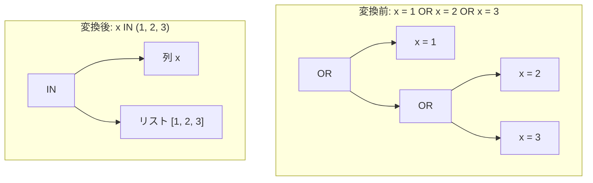

# or_of_ranges_to_in

- 状態: draft   /   執筆基準リビジョン: `3880673` (2026-09-12)
- 定義位置: `expression/rewrite.cpp` の `ExpressionRuleSet::Default()` 内
  `built.Add(ExpressionRule("or_of_ranges_to_in", ...))`

## 概要

同一の評価対象式に対する複数の等値比較を選言（`OR`）で連結した式（例: `x = 1 OR x = 2 OR x = 3`）を、単一の `IN` 式 `x IN (1, 2, 3)` に集約・統合する Rule です。

式木の簡素化に加え、論理オプティマイザのセミジョイン変換（`in_list_to_semi_join`）やストレージ層のインデックススキャン条件への適合を容易にする重要な正規化を担います。

## 変換前後の関係



他の条件が混在するケース（例: `x = 1 OR x = 2 OR y`）においても、出現順序を保持したまま `x IN (1, 2) OR y` へと部分的に束ねます。

## 適用条件

パターンは `Binary(BinaryOperation::kOr, Any("left"), Any("right"))` です。`SplitDisjuncts` で OR 木を選言リストへ展開し、以下の安全規則に従って線形走査を行います。

```cpp
// Order-preserving grouping: `(x = 1 OR x = 2 OR y) -> x IN (1, 2)
// OR y`, keeping each disjunct's original slot.
// Safety rules:
// 1. Target expression must be safe to reduce evaluation count
//    (volatiles like RAND() must not collapse evaluations).
// 2. An intervening disjunct that can throw (!ExpressionCannotThrow)
//    is a barrier: moving a later disjunct before it could evaluate
//    to TRUE and short-circuit the throw away. All active groups
//    must be sealed at the barrier.
// 3. Only mark `changed = true` when multiple disjuncts actually
//    merge into a single slot.
// 4. Empty IN lists (x IN ()) are not equality ranges and must
//    never be grouped or dereferenced via front().
```

集約の対象となるのは以下の選言要素です。

- `t = c` または `c = t`（片側が定数リテラル）であり、ターゲット式 `t` が `SafeToReduceEvaluationCount` を満たすこと。
- `t IN (c1, ...)` であり、`t` が非定数かつ `SafeToReduceEvaluationCount` を満たし、リストの全要素が定数リテラルであること。

同一のターゲット式（`Same` で判定）を持つ選言が 2 つ以上存在し、それらが単一スロットに集約された場合にのみ変換が成立します。

## 意味論的根拠と三値論理・例外保護

強 Kleene 三値論理において、`x IN (1, 2)` と `x = 1 OR x = 2` はすべての真理値（TRUE, FALSE, UNKNOWN）に対して完全一致します。`x` が NULL の場合、どちらも結果は `UNKNOWN` となり、行フィルタリングでの挙動は同一です。

本変換における例外保護と短絡評価の維持には細心の注意が払われています。

1. **評価回数の安全性**: ターゲット式が `rand()` 等の揮発性関数である場合、集約によって式の評価回数が減少し、結果が変動します。そのため `SafeToReduceEvaluationCount` が必須となります。
2. **例外発生式を跨ぐ再配置の禁止**: 論理和は左から右へ短絡評価されます。もし例外を送出し得る選言（例: `CAST('invalid' AS INT64) = 0`）が存在する場合、その後ろにある `x = 3` を前方に移動して集約してしまうと、`x = 3` が真となった場合に本来送出されるべき例外が短絡によって消去されてしまいます。このため、`!ExpressionCannotThrow` である選言に遭遇した時点でアクティブなグループをすべて封印（seal）し、障壁を跨いだ項の移動を禁止します。
3. **空リストの除外**: `x IN ()` は常に FALSE を表す特殊式であり、等値範囲のグルーピング対象からは完全に除外されます。

## 実装の詳細

内部実装では `Group` 構造体（target, original_expr, items, merge_count, slot）を管理します。

走査中にマッチするターゲットが見つかれば既存グループのアイテムリストに定数をマージし、見つからなければ新たなグループを開きます。重複する定数（例: `x = 1 OR x = 1`）は `Same` 判定により自動的に排除されます。

最後に `CombineDisjuncts` を用いて、元の位置順序を崩さずに OR 木を再構築します。

## 最適化効果

多数の OR 二項演算ノードが 1 つの IN 式ノードに圧縮され、ターゲット式の評価回数も 1 回に削減されます。

また、IN 式への正規化によって、下流の `in_list_to_semi_join` によるセミジョイン変換や、ストレージスキャンにおける多点検索（In-List Scan）への引き渡しが可能になります。

## 関連 Rule との相互作用

- `dedupe_in_list` / `empty_in_list`: 生成された IN 式に対して後続で適用され、重複排除や境界条件の簡約を行います。
- `in_single_null`: NULL のみを含む IN 式の簡約を担います。
- `factor_or_common_and`: 共通因数のくくり出しを行う逆方向の正規化ルールです。

## 検証テスト

`expression/rewrite_test.cpp` において以下のテストケースで検証されています。

- `ExpressionRewriteTest.OrOfRangesToIn`: `(x = 1 OR x = 2 OR x = 3)` が 3 要素の IN 式になること、および例外送出式を跨ぐ再配置が正しく抑止されること。
- `ExpressionRewriteTest.OrOfRangesEmptyInCrash`: 空の IN リストを含む OR 式でクラッシュしないこと。
- `ExpressionRewriteTest.OrOfRangesInterveningThrow`: 例外を送出する選言が介在する場合に、短絡によるエラー消去が発生しないこと。
