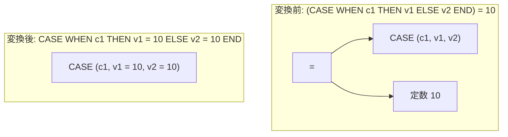

# predicate_pushdown_case

- 状態: draft   /   執筆基準リビジョン: `3880673` (2026-09-12)
- 定義位置: `expression/rewrite.cpp` の `ExpressionRuleSet::Default()` 内
  `built.Add(ExpressionRule("predicate_pushdown_case", ...))`

## 概要

`CASE` 式を外側から包んでいる述語や演算子を、`CASE` の各 `WHEN` 節の結果式および `ELSE` 節の内部へと押し込む（pushdown）Rule です。

たとえば、`(CASE WHEN c1 THEN v1 ELSE v2 END) = 10` を `CASE WHEN c1 THEN v1 = 10 ELSE v2 = 10 END` へと展開します。単項演算、二項比較演算（および LIKE / IS DISTINCT FROM）、IN 式、CAST 式の 4 種を対象として押し込みを行います。

## 変換前後の関係



## 適用条件

パターンは `Any()` であり、ノード種別に応じて以下の 4 経路で判定します。

1. **二項比較経路**: 演算子が比較演算子（`IsComparison`）、`LIKE`、`NOT LIKE`、`IS DISTINCT FROM`、`IS NOT DISTINCT FROM` のいずれかであり、片方のオペランドのみが `CASE` 式である場合。

   ```cpp
   if (!IsComparison(op) && op != BinaryOperation::kLike &&
       op != BinaryOperation::kNotLike &&
       op != BinaryOperation::kIsDistinctFrom &&
       op != BinaryOperation::kIsNotDistinctFrom) {
     return Expression{};
   }
   ```

   反対側のオペランドが `SafeToReduceEvaluationCount` を満たす必要があります。
2. **単項演算経路**: 任意の単項演算（`IS NULL`、`NOT`、単項マイナス等）が `CASE` 式を包んでいる場合。
3. **IN 式経路**: IN 式の評価対象が `CASE` 式であり、リストの全要素が `SafeToReduceEvaluationCount` を満たす場合。
4. **CAST 経路**: CAST 式の対象が `CASE` 式である場合。

論理演算子 `AND` および `OR` は本 Rule の押し込み対象から**明示的に除外**されています。

## 意味論的根拠と三値論理・例外保護

`AND` や `OR` を CASE 式の内部へ押し込んではいけない最大の理由は、**短絡評価の保護**にあります。`AND` / `OR` は左辺の評価結果によって右辺の評価をスキップします。もしこれを CASE 式の各分岐へ押し込むと、評価順序や回数が改変され、右辺が例外を送出し得る式であった場合に観測可能な挙動が変化します。

また、二項比較や IN 式において反対側のオペランド（またはリスト要素）に `SafeToReduceEvaluationCount` を課す理由は、押し込みによってそれらの式が各 `WHEN` 分岐へ複製されるためです。揮発性関数が含まれている場合、複数回評価されることで結果の一貫性が損なわれます。

両オペランドがともに `CASE` 式である場合（`case1 = case2`）は、分岐の組み合わせ数が直積で爆発するため、意図的に押し込みの対象外としています。

なお、元の CASE 式に `ELSE` 節が存在しない場合、SQL 規準に基づき `ELSE NULL` を補完した上で押し込み演算（例: `NULL = 10`）を適用するため、三値論理上の整合性は完全に維持されます。

## 実装の詳細

いずれの経路においても、各 `WHEN` 節の条件式（`first`）には手を加えず、結果式（`second`）および `ELSE` 節に対してのみ外側の演算を適用し、`CaseExpressionExp` を用いて新たな CASE 式を再構築します。条件判定のロジックそのものは一切変化しません。

## 最適化効果

CASE 式の戻り値に対する比較演算が、各分岐における直接的なブール評価へと変換されます。

これにより、各分岐内の式が `v1 = 10` のような単純な述語形となり、後続の等値簡約、定数畳み込み、あるいは `uniform_case_result` のような CASE 専用の最適化ルールが発火しやすい環境が整います。

## 関連 Rule との相互作用

- `uniform_case_result` / `deterministic_function_cse`: 分岐内に述語が押し込まれた結果、全分岐が同一の真理値（例: すべて TRUE）になった場合に CASE 式全体を単一の値へと畳み込みます。
- `simplify_case`: 定数条件となった WHEN 節の枝刈りを担当します。
- `collapse_nested_identical_cast`: CAST が押し込まれた結果として生じる冗長キャストを解消します。

## 検証テスト

`expression/rewrite_test.cpp` の `ExpressionRewriteTest.PredicatePushdownCase` において以下を検証しています。

- 単項 `IS NULL`、二項比較 `=`、`IN`、`CAST` がそれぞれ CASE 式の各分岐内へ正しく押し込まれること。
- `AND` および `OR` については短絡保護のため押し込みが行われず、元の二項演算のまま維持されること。
