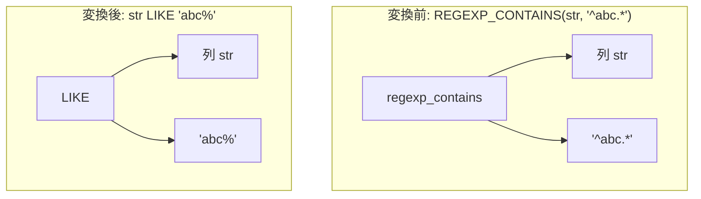

# regexp_prefix_extraction

- 状態: draft   /   執筆基準リビジョン: `3880673` (2026-09-12)
- 定義位置: `expression/rewrite.cpp` の `ExpressionRuleSet::Default()` 内
  `built.Add(ExpressionRule("regexp_prefix_extraction", ...))`

## 概要

正規表現マッチング関数（`REGEXP_CONTAINS`, `REGEXP_LIKE`, `REGEXP_MATCH`）において、検索パターンが先頭固定子 `^` から始まるリテラル接頭辞を持ち、後続が終端記号 `$` または任意長文字列ワイルドカード `.*` である場合に、正規表現評価を高速な等値比較（`=`）または `LIKE` 前方一致演算（`LIKE 'prefix%'`）へ置換する Rule です。

文字列の先頭一致条件へ単純化することで、正規表現エンジンの評価オーバーヘッドを排除し、ストレージ層の B+Tree インデックス走査範囲へとマッピング可能にすることを主目的とします。

## 変換前後の関係



## 適用条件

パターンは `Any()` であり、ラムダ式内部で正規表現関数の構造を検査します。

```cpp
if ((name == "regexp_contains" || name == "regexp_like" ||
     name == "regexp_match") &&
    fn.Args().size() == 2 && fn.Args()[0] &&
    IsConstant(fn.Args()[1])) {
  const Value pat_val = fn.Args()[1]->AsConstantValue().GetValue();
  if (pat_val.type == ValueType::kVarChar) {
```

- 対象関数は `regexp_contains` / `regexp_like` / `regexp_match` の 3 種であること。
- 第 2 引数（パターン）が非 NULL の VARCHAR 定数リテラルであること。
- パターン文字列を `ExtractRegexPrefix` により解析し、先頭が `^` で始まり、エスケープされていないメタ文字（`.` `*` `+` `?` `[` `(` `|` `\` 等）が現れるまでの接頭辞 `prefix` と、その後の `remainder` を取得します。
- `remainder` に応じて以下のように分岐します。
  - `remainder == "$"`: 完全一致として等値比較 `=` に置換（ただしタイムスタンプ形状でないこと）。
  - `remainder` が `".*"`, `".*$"`, または空文字列 `""`: 前方一致として `LIKE 'prefix%'` に置換。

## 意味論的根拠と三値論理・例外保護

完全一致 `=` への置き換えにおいては、**タイムスタンプ形状リテラルの除外**が必須の guard となります。

```cpp
if (remainder == "$" &&
    // `=` coerces timestamp-shaped varchars to epoch
    // comparison; REGEXP_LIKE compares bytes.  Refuse the
    // rewrite for timestamp-shaped matches.
    !TimestampShapedConstant(prefix)) {
  return BinaryExpressionExp(
      fn.Args()[0], BinaryOperation::kEquals,
      ConstantValueExp(Value(std::string(prefix))));
}
```

tinylamb の `=` 比較演算子は、日時・タイムスタンプ形式の文字列に対して暗黙にエポック秒への型強制変換を実施して比較します。しかし正規表現マッチは厳密なバイト列一致として動作するため、たとえば `'2020-01-01T12:00:00'` と `'2020-01-01 12:00:00'` は `=` では一致しますが正規表現では不一致となります。この乖離を防ぐため、`TimestampShapedConstant` によりタイムスタンプ形状のパターンに対する `=` 変換を拒否します。

一方、`LIKE` 演算子への変換では文字列のバイト列比較がそのまま行われるため、型強制変換による意味のズレは生じません。

また、無エスケープのメタ文字が存在した時点で接頭辞の切り出しを打ち切るため、正規表現の意味論を損なうような危険な推論は一切行われません。

## 実装の詳細

`ExtractRegexPrefix` は正規表現構文を 1 文字ずつスキャンし、`\` によるエスケープシーケンスはリテラル文字として透過させつつ、純粋なリテラル接頭辞部分のみを正確に抽出します。

パターンが要件を満たさない場合（たとえば `^` で始まらない場合や、メタ文字の後にさらに通常文字が続く場合など）は、変換を行わずに即座に `Expression{}` を返却します。

## 最適化効果

全行に対する重厚な正規表現コンパイルおよびオートマトン走査が、単純な文字列比較または LIKE 前方一致へと格下げされます。

特に `LIKE 'prefix%'` 形式は、後続のプラン生成フェーズにおいて B+Tree インデックスの範囲走査（`prefix` 以上 `prefix+1` 未満）へ直接変換可能となるため、走査行数を劇的に圧縮する決定的な最適化効果をもたらします。

## 関連 Rule との相互作用

- `like_equality`: ワイルドカード文字を含まない LIKE パターンを等値比較へとさらに簡約します。
- スキャン事前フィルタ（`scan_filter.cpp` の `TryCompileSimpleCompare`）: 変換後の `=` および `LIKE` 述語をインデックス走査およびストレージレベルの早期フィルタに適用します。

## 検証テスト

`expression/rewrite_test.cpp` の `ExpressionRewriteTest.RegexpPrefixExtraction` において以下を検証しています。

- `REGEXP_CONTAINS(str, '^abc.*')` が `str LIKE 'abc%'` へ変換されること。
- `REGEXP_LIKE(str, '^hello$')` が `str = 'hello'` へ変換されること。
- `REGEXP_MATCH(str, '^test')` が `str LIKE 'test%'` へ変換されること。
- タイムスタンプ形状の完全一致パターンにおいて `=` への変換が抑止されること（`like_equality` の連携テストを含む）。
