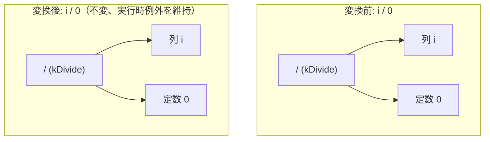

# safe_divide_rewrite

- 状態: draft   /   執筆基準リビジョン: `3880673` (2026-09-12)
- 定義位置: `expression/rewrite.cpp` の `ExpressionRuleSet::Default()` 内
  `built.Add(ExpressionRule("safe_divide_rewrite", ...))`

## 概要

`x / 0` のようなゼロ除算を含む除算式に対して、オプティマイザが「**いかなる書き換えも行わない**」ことをコードベース上で固定・明示するためのプレースホルダ Rule です。

変換ラムダは常に空の式 `Expression{}` を返し、ゼロ除算を勝手に NULL や特定定数へ畳み込む危険な最適化を排除し、実行時の例外（"division by zero"）を確実に保持することを保証します。

## 変換前後の関係

構文木の変換は行われません。



## 適用条件

パターンは `AnyBinary(Any("left"), Is(TypeTag::kConstantValue, "zero"))` です。ラムダ式の実装は以下のとおりです。

```cpp
[](const Expression&, const ExpressionBindings&) {
  return Expression{};
}
```

すべての入力に対して無条件で `Expression{}` を返却するため、式木に対する変更は一切生じません。

## 意味論的根拠と三値論理・例外保護

ゼロ除算式 `x / 0` を NULL へ畳み込む最適化は、SQL の意味論を二重の意味で破壊します。

```cpp
// x / 0 keeps the runtime "division by zero" error (removed: folding it
// to NULL turned an explicit error into a silent wrong result and made
// `WHERE i/0 > 1` drop all rows instead of raising).
```

1. **例外の不当消去**: クエリ実行時に正当に発生すべき "division by zero" 例外が静かに消去され、NULL 値という誤った計算結果に化けてしまいます。
2. **三値論理下での静かな誤結果**: WHERE 句において `WHERE i / 0 > 1` を評価した場合、例外が送出されるべきところ、NULL は `UNKNOWN` として扱われてタプルが単に除外されるため、クエリがエラーにならず誤った空結果を返してしまいます。

式書き換え層の根本原則である「式を除去する書き換えは、その式が送出するはずの例外も消去してはならない」を厳格に順守するため、定数畳み込み系ルール（`fold_binary` 等）も含めてゼロ除算は例外送出まで温存される規律となっています。本 Rule は、この禁止方針を将来の開発者に向けてコード上に宣言する役割を果たしています。

## 実装の詳細

単一の空ハンドラであり、評価コストはゼロです。

## 最適化効果

構文木変換による最適化効果はありません。実行時の例外伝播契約の完全性を維持します。

## 関連 Rule との相互作用

- `fold_binary`: 定数演算の畳み込みを行いますが、`TryEvaluate` が例外（ゼロ除算など）を送出する場合は安全に失敗し、畳み込みを行いません。
- `identity_divide_one`: `x / 1` を `x` へ簡約する Rule ですが、ゼロ除算にはマッチしません。

## 検証テスト

`expression/rewrite_test.cpp` の `ExpressionRewriteTest.DivisionByZeroConstantStaysRuntimeError` において、`5 / 0` が定数へ畳み込まれることなく構文木として保持され、実行時評価によって期待通り `std::runtime_error` が送出されることが検証されています。
