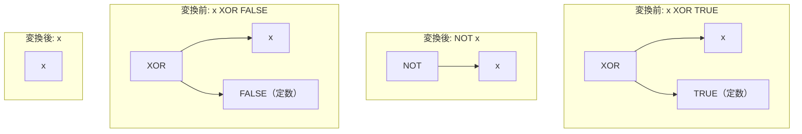

# xor_boolean_identity

- 状態: draft   /   執筆基準リビジョン: `3880673` (2026-09-12)
- 定義位置: `expression/rewrite.cpp` の `ExpressionRuleSet::Default()`(登録名 `"xor_boolean_identity"`)

## 概要

排他的論理和（XOR）の片方の被演算子がブール定数のとき、`x XOR TRUE` を論理否定 `NOT x` へ、`x XOR FALSE` を `x` 自身へ畳み込む式書き換え Rule です。

SQL の三値論理において、真理値 TRUE との XOR は真偽値反転として機能し、FALSE との XOR は恒等演算として機能します。NULL 定数に対しては三値論理上の未確定性（`UNKNOWN`）を保つため不発火とします。また、FALSE との縮退によって非ブール型の式（文字列や数値など）が真偽値文脈に不整合に露出することを防ぐため、`StaticallyNonBoolean` による型安全ガードを備えています。

## 変換前後の関係



定数が左辺に位置する場合（例: `TRUE XOR x`、`FALSE XOR x`）に対しても、演算の交換性に基づき同一の簡約が適用されます。

## 適用条件

パターン定義は `Binary(BinaryOperation::kXor, Any("left"), Any("right"))` であり、左右被演算子の定属性を `ConstantBool` ヘルパーにより検証します（引用は `expression/rewrite.cpp`）。

```cpp
bool ConstantBool(const Expression& expression, bool* value) {
  if (!IsConstant(expression)) {
    return false;
  }
  const Value constant = expression->AsConstantValue().GetValue();
  if (constant.IsNull()) {
    return false;
  }
  if (constant.type != ValueType::kInt64 ||
      (constant.value.int_value != 0 && constant.value.int_value != 1)) {
    return false;
  }
  *value = constant.value.int_value != 0;
  return true;
}
```

1. **ブール定数の同定**: 左右いずれかの被演算子が、非 NULL かつ値が 0 または 1 の `kInt64` 定数であること（tinylamb における真偽値内部表現に適合）。
2. **TRUE 定数時の分岐**: 定数値が 1（TRUE）である場合、対向側の式を `kNot` 単項演算子でラップして返却。
3. **FALSE 定数時の型安全ガード**: 定数値が 0（FALSE）である場合、対向側の式が `StaticallyNonBoolean` を満たさない（静的に非ブール型であることが確定していない）場合に限り、対向側の式ノードをそのまま返却。

定数が NULL の場合や、0/1 以外の数値定数の場合は不発火となります。

## 意味論的根拠と型安全性の保証

### 1. 三値論理における排他的論理和の真理値表
Kleene の三値論理において、$x \oplus \text{TRUE}$ および $x \oplus \text{FALSE}$ は以下の真理値表に従います。

| $x$ | $x \oplus \text{TRUE}$ | $\neg x$ | $x \oplus \text{FALSE}$ |
| :--- | :--- | :--- | :--- |
| `TRUE` | `FALSE` | `FALSE` | `TRUE` |
| `FALSE` | `TRUE` | `TRUE` | `FALSE` |
| `UNKNOWN` (NULL) | `UNKNOWN` (NULL) | `UNKNOWN` (NULL) | `UNKNOWN` (NULL) |

$x$ が NULL の場合、$\text{NULL} \oplus \text{TRUE} = \text{NULL}$ であり、$\neg \text{NULL} = \text{NULL}$ となるため、三値論理の枠組みにおいても真理値は完全に保存されます。

### 2. 非ブール型の露出防止
SQL において XOR 演算子の出力型は常に真偽値（ブール型）です。もし `lower(name) XOR FALSE` のような不正または暗黙型変換を期待する式に対し、FALSE を除去して `lower(name)` をそのまま返却すると、式全体の型がブール型から文字列型（VARCHAR）へと変質してしまいます。

```cpp
// True when an expression is statically known NOT to produce a boolean result
// (0, 1, or NULL). Boolean simplification rules (AND, OR, NOT NOT, XOR) must
// never collapse into an expression of non-boolean type (such as VARCHAR or
// DOUBLE) or non-boolean values (e.g. 2).
```

これを抑止するため、FALSE 縮退パスにおいては `StaticallyNonBoolean` による検査を行い、静的に非ブール型と判定される部分式の剥離を拒絶します。一方、TRUE 縮退パスにおいては結果が `NOT` 単項演算子によって覆われるため、出力型がブール型に保たれます。

## 実装の詳細

本体処理は、右辺のブール定数判定を優先し、該当しない場合に左辺の判定を行います。

```cpp
          if (has_right) {
            if (right) {
              return UnaryExpressionExp(bindings.at("left"),
                                        UnaryOperation::kNot);
            }
            if (StaticallyNonBoolean(bindings.at("left"))) {
              return Expression{};
            }
            return bindings.at("left");
          }
```

左右の対称性を保持しつつ、最小限のノードアロケーションで $O(1)$ の時間計算量により変換を完了します。

## 最適化効果

1. **演算段数の削減**: XOR 評価が単項の論理否定または恒等参照へと簡約され、実行時評価コストが削減されます。
2. **後続の二重否定消去・ド・モルガンの誘発**: 生成された `NOT x` 形式に対し、外層に存在する否定ノードとの間で `double_negation` や NOT プッシュダウン系ルールが連鎖的に発火可能になります。

## 関連 Rule との相互作用

- `xor_to_or_and_not`: 非定数同士の XOR を AND/OR/NOT へ展開する後続 Rule です。定数を含む XOR は本 Rule が先に消費するため、無用なサイズ肥大化を防止します。
- `double_negation`: `(NOT x) XOR TRUE` が本 Rule により `NOT(NOT x)` となった後、次パスで $x$ 自身へと還元されます。
- `boolean_identity`: AND/OR におけるブール定数との恒等簡約を担う同族 Rule 群です。

## 検証テスト

`expression/rewrite_test.cpp` において以下のテストケースにより検証されています。

- `ExpressionRewriteTest.XorBooleanIdentity`:
  `x XOR 1` が `NOT x` へ、`0 XOR x` が $x$ へ書き換わること、ならびに列同士の XOR（`x XOR y`）が不発火となることを確認します。
- `ExpressionRewriteTest.BooleanIdentityRefusesNonBoolean`:
  `lower(name) XOR FALSE`、`sqrt(x) XOR FALSE`、`(x + 1) XOR FALSE` 等の非ブール型式に対する縮退が安全に拒絶されることを確認します。
