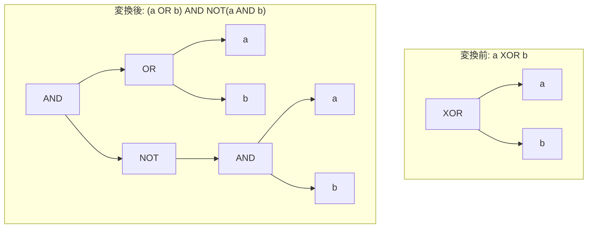

# xor_to_or_and_not

- 状態: draft   /   執筆基準リビジョン: `3880673` (2026-09-12)
- 定義位置: `expression/rewrite.cpp` の `ExpressionRuleSet::Default()`(登録名 `"xor_to_or_and_not"`。登録位置は中盤(`array_flatten_optimization` の後、`boolean_eq_true_false_three_valued` の前))

## 概要

排他的論理和 `a XOR b` を、論理和・論理積・否定の組み合わせ `(a OR b) AND NOT(a AND b)` へ展開（lowering）する式書き換え Rule です。

エンジンが実行時バックエンドやスキャンフィルタにおいて専用の XOR 演算子を直接サポートしない場合、または標準的なブール論理積・論理和の正規化パイプラインへ式を還元したい場合に機能します。SQL の三値論理においてこの代数展開は真理値を厳密に保存しますが、被演算子 $a$ および $b$ の評価回数が最大 3 回まで増加するため、揮発性関数や相関サブクエリに対する安全制約（`SafeToReduceEvaluationCount`）を課しています。

## 変換前後の関係



## 適用条件

パターン定義および登録コードは以下のとおりです（引用は `expression/rewrite.cpp`）。

```cpp
    // a XOR b -> (a OR b) AND NOT(a AND b)
    // Safe under SQL three-valued logic.
    built.Add(ExpressionRule(
        "xor_to_or_and_not",
        Binary(BinaryOperation::kXor, Any("left"), Any("right")),
        [](const Expression&, const ExpressionBindings& bindings) {
          const Expression a = bindings.at("left");
          const Expression b = bindings.at("right");
          // The expansion evaluates a and b up to three times; a volatile
          // expression or a subquery would change meaning under the rewrite.
          if (!SafeToReduceEvaluationCount(a) ||
              !SafeToReduceEvaluationCount(b)) {
            return Expression{};
          }
```

1. **パターン整合**: 二項演算子が `kXor` であること。
2. **多重評価の安全性**: 左右の被演算子 $a$ および $b$ の双方が `SafeToReduceEvaluationCount` を満たすこと（揮発性関数 `RAND()`、集約式、および相関サブクエリを含まないこと）。

なお、片側がブール定数の場合は先行して登録された `xor_boolean_identity` が先に発火するため、本 Rule が実質的に処理するのは両辺が非定数の式木となります。

## 意味論的根拠と評価回数の制御

### 1. 三値論理における恒等性の証明
Kleene の三値論理において、展開式 $(a \lor b) \land \neg(a \land b)$ は NULL（`UNKNOWN`）を含む全領域において $a \oplus b$ と真理値が一致します。
- $a = \text{TRUE}, b = \text{NULL}$ の場合:
  $(\text{TRUE} \lor \text{NULL}) \land \neg(\text{TRUE} \land \text{NULL}) = \text{TRUE} \land \neg \text{NULL} = \text{TRUE} \land \text{NULL} = \text{NULL}$
- $a = \text{FALSE}, b = \text{NULL}$ の場合:
  $(\text{FALSE} \lor \text{NULL}) \land \neg(\text{FALSE} \land \text{NULL}) = \text{NULL} \land \neg \text{FALSE} = \text{NULL} \land \text{TRUE} = \text{NULL}$
- $a = \text{NULL}, b = \text{NULL}$ の場合:
  $(\text{NULL} \lor \text{NULL}) \land \neg(\text{NULL} \land \text{NULL}) = \text{NULL} \land \neg \text{NULL} = \text{NULL} \land \text{NULL} = \text{NULL}$

したがって、二値論理のみならず SQL の不確定値モデルにおいても意味論は完全に保存されます。

### 2. 評価回数増加に伴う副作用抑止
展開後の木構造において、部分式 $a$ および $b$ はそれぞれ最大 3 回評価される可能性があります。式木内に非決定的な関数やサブクエリが含まれている場合、評価回数の変化はクエリ結果の非決定性やパフォーマンス劣化を引き起こします。

```cpp
bool SafeToReduceEvaluationCount(
    const Expression& expression) {
  if (!expression) {
    return false;
  }
  if (expression->Type() == TypeTag::kQueryExp ||
      expression->Type() == TypeTag::kAggregateExp) {
    return false;
  }
  if (expression->Type() == TypeTag::kFunctionCallExp &&
      GetFunctionVolatility(
          expression->AsFunctionCallExpression().FuncName()) !=
          Volatility::kImmutable) {
    return false;
  }
  return std::ranges::all_of(ExpressionChildren(expression),
                             SafeToReduceEvaluationCount);
}
```

`SafeToReduceEvaluationCount` は、部分木全体が決定的なスカラー演算のみで構成されていることを再帰的に確認し、安全な式木のみを展開対象とします。なお、XOR は短絡評価を行わず常に両辺を評価するため、例外消去（error erasure）のリスクは存在せず、`ExpressionCannotThrow` ガードは課されません。

## 実装の詳細

本体処理は、左右のキャプチャ式ノードを用いて `BinaryExpressionExp` および `UnaryExpressionExp` を組み合わせ、規準的な論理積・論理和ツリーを構築します。

```cpp
          return BinaryExpressionExp(
              BinaryExpressionExp(a, BinaryOperation::kOr, b),
              BinaryOperation::kAnd,
              UnaryExpressionExp(
                  BinaryExpressionExp(a, BinaryOperation::kAnd, b),
                  UnaryOperation::kNot));
```

生成された右側の否定論理積 `NOT(a AND b)` は、後続の最適化パスにおいて `de_morgan` 等の対象となり、さらに簡約が進められます。

## 最適化効果

1. **演算子セットの統一**: 独立した XOR 評価ルーチンをエンジン下位に実装する必要がなくなり、AND / OR / NOT の既存の最適化機構（連言分解、述語プッシュダウン等）へ完全に統合されます。
2. **共通因子の露出**: 展開によって生じた論理構造が、上位の選言・連言マージルールと結合してさらなる簡約を誘発します。

## 関連 Rule との相互作用

- `xor_boolean_identity`: 定数を含む単純な XOR を事前に処理し、本 Rule のサイズ増加を抑止します。
- `de_morgan`: 展開後の `NOT(a AND b)` を `NOT a OR NOT b` へとプッシュダウンします。
- `and_idempotent` / `or_idempotent`: 式の内部で同一部分式が隣接した場合の冗長項除去を担います。

## 検証テスト

本 Rule による代数的同値性は、以下のテストスイートにより支えられています。

- `expression/expression_test.cpp` の `ExpressionTest.EvaluateBinary_WithBooleanLogic_FollowsThreeValuedLogic`:
  `kXor` 演算子の三値論理真理値表（NULL 入力を含む）が AST 評価器において規格通り動作することを検証します。
- 全体的な等価性検証は、`sql_oracle_fuzzer_libfuzzer` による差分ファジングを通じて継続的に監視されています。
