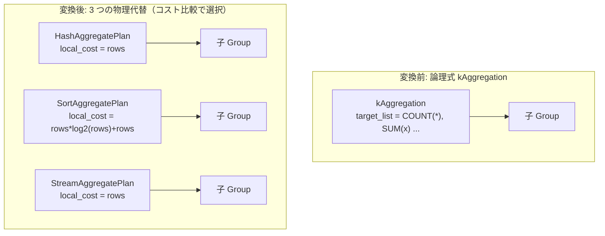

# `aggregation`

- 状態: draft   /   執筆基準リビジョン: `3880673` (2026-09-12)
- 定義位置: `plan/implementation_rules.cpp` の `DefaultImplementationRules()` 内の
  登録 `"aggregation"`（パターン: `cascades::dsl::Aggregation()`）

## 概要

論理式 `kAggregation`（集約演算）を、3 種類の物理実行プラン候補 — `HashAggregatePlan`、`SortAggregatePlan`、`StreamAggregatePlan` — の代替候補（`PlanAlternative`）へと具現化する Rule です。

単一の論理集約ノードに対して 3 つの物理代替プランを一括生成してメモ構造に登録し、コスト比較エンジン（`plan/cascades.cpp` の `SearchEngine::OptimizeGroup`）によるコスト最小化選択に委ねます。

## 変換前後の関係



生成される 3 種類の物理ノードはいずれも `plan/aggregation_plan.hpp` で定義される `AggregationPlan` を基底とし、実行戦略列挙値 `AggregationStrategy`（`kHash`, `kSort`, `kStream`）によって内部挙動が分岐します。

## 適用条件

パターンは `Aggregation()` であり、単一の子ノードを持つ論理集約ノードに合致した上で、ラムダ式内部で以下の 2 つの guard 条件を検査します。

1. **行位置要求の不在**:
   ```cpp
   // Aggregated output carries no row positions.
   if (children.size() != 1 || required.require_row_position) {
     return std::vector<PlanAlternative>{};
   }
   ```
   集約演算は複数行を単一の集約値へと不可逆的に集約するため、物理的なタプル行位置（`require_row_position`）を保持できません。親ノードから行位置要求が伝播している場合は物理プランの生成を拒絶します。

2. **集約関数の存在確認**:
   ```cpp
   const bool has_aggregate =
       std::ranges::any_of(logical.target_list, [](const auto& item) {
         return ContainsAggregateExpression(item.expression);
       });
   if (!has_aggregate) {
     return std::vector<PlanAlternative>{};
   }
   ```

## 意味論的根拠と物理実行の契約

`has_aggregate` guard が課されている理由は、物理エグゼキュータ側の実行契約を遵守するためです。

```cpp
// The aggregate executors assume every target-list item names an
// aggregate function; a target list of bare columns (the
// distinct_and_group_by_interchange representation of DISTINCT)
// would make them throw.  DISTINCT keeps its dedicated
// Distinct/SortDistinct implementations in that shape.
```

論理最適化ルール `distinct_and_group_by_interchange` は、`DISTINCT` 演算を「グループ化キーのみによる集約」という形の `kAggregation` ノードへと相互変換します。この変換によって生じたターゲットリストには素の列参照のみが並び、集約関数が含まれません。集約エグゼキュータはすべてのターゲット項目が集約関数であることを前提としているため、素の列参照のみのリストが渡されると実行時例外を引き起こします。したがって本 Rule はこの形状を排斥し、列のみの `DISTINCT` は専用の物理実装ルール（`distinct`, `sort_distinct`, `skip_scan_distinct`）に処理を委ねます。

## 実装の詳細

生成される 3 つの代替プランの構成とコスト計算は以下のとおりです。

```cpp
const double rows = children[0].estimated_rows;
Plan hash = std::make_shared<HashAggregatePlan>(children[0].plan,
                                                logical.target_list);
Plan sort = std::make_shared<SortAggregatePlan>(children[0].plan,
                                                logical.target_list);
const double sort_cost =
    (rows * std::log2(std::max(2.0, rows))) + rows;
std::vector<PlanAlternative> agg_alternatives{
    PlanAlternative{.plan = std::move(hash),
                    .local_cost = rows,
                    .estimated_rows = 1.0},
    PlanAlternative{.plan = std::move(sort),
                    .local_cost = sort_cost,
                    .estimated_rows = 1.0}};

Plan stream = std::make_shared<StreamAggregatePlan>(
    children[0].plan, logical.target_list);
agg_alternatives.push_back(PlanAlternative{.plan = std::move(stream),
                                           .local_cost = rows,
                                           .estimated_rows = 1.0});
```

- **`HashAggregatePlan`**: `local_cost = rows`。入力を行ごとに走査してハッシュ表へ集約する標準的な選択肢です。
- **`SortAggregatePlan`**: `local_cost = rows * log2(max(2.0, rows)) + rows`。入力のソートコストを加味した代替です。通常はコスト差によりハッシュ集約が優先されますが、ルール無効化やプランヒントによる選択用として保持されます。
- **`StreamAggregatePlan`**: `local_cost = rows`。ハッシュ表もソートも不要な 1 パスのストリーミング集約です。グループ化キーを持たないスカラ集約（`SELECT COUNT(*) FROM t` 等）はグループ数が常に 1 個であるため、入力の物理的な順序にかかわらず常に正当となります。

すべての代替プランにおいて、現在のスカラ集約モデルに従い推定出力行数 `estimated_rows` は `1.0` に固定されます。

## 最適化効果

子の最良プランの上に、最小コストの物理集約プラン（通常は `HashAggregatePlan` または `StreamAggregatePlan`）が配置されます。

出力行数の見積もりが `1.0` に確定するため、上流ノード（`LIMIT` や上位結合）の探索コストを大幅に抑制する効果があります。

## 関連 Rule との相互作用

- `distinct_and_group_by_interchange`: 集約関数を持たないグループ化集約を生成しますが、前述のガードによって本 Rule による誤実装が防がれます。
- `push_selection_through_aggregation` / `filter_aggregate_pushdown`: 集約の下位へと述語を押し込み、集約の入力行数を削減します。
- 並列実行切り替え: 入力行数が `kParallelAggregationMinRows`（8192）を超える場合、`AggregationPlan::EmitExecutor` が実行時に最大 16 ワーカーの `ParallelAggregationExecutor` へと自動的に切り替えます。

## 検証テスト

- `plan/optimizer_test.cpp` の `OptimizerTest.AggregateSelectBuildsAggregationPlan`: 集約 SELECT クエリが `AggregationPlan` へと正しく物理実装されること。
- `plan/optimizer_test.cpp` の `OptimizerTest.ParallelAggregationEmittedForLargeChild`: 大規模入力に対する並列集約エグゼキュータへの自動昇格。
- `plan/plan_test.cpp` の `PlanTest.AggregatePhysicalStrategiesHaveDistinctPlanContracts`: 3 つの物理戦略が異なるプラン契約を保持することの検証。
