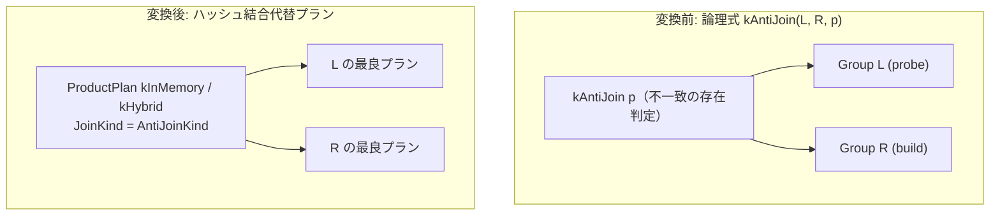

# anti_hash_join

- 状態: draft   /   執筆基準リビジョン: `3880673` (2026-09-12)
- 定義位置: `plan/implementation_rules.cpp` の `DefaultImplementationRules()` 内の
  登録 `"anti_hash_join"`（パターン: `cascades::dsl::AntiJoin()`、共有ヘルパー `JoinAlternatives` に委譲）

## 概要

論理式 `kAntiJoin`（右側の入力に一致する行が**存在しない**左側の行のみを抽出する反結合）を、`AntiJoinKind` を備えたハッシュ結合物理プラン（`ProductPlan`）へと具現化する Rule です。

`NOT EXISTS` サブクエリや、非 NULL 保証されたキーに基づく `NOT IN` サブクエリの主要な物理実行形式を提供します。

## 変換前後の関係



物理出力スキーマは左側（probe 側）のみで構成され、右側にマッチ行が 1 件でも存在する左側行はすべて除外されます。

## 適用条件

パターンは `AntiJoin()` です。ラムダ式内部で他の結合実装ルールと同様に行位置要求を検査した上で、共有ヘルパー `JoinAlternatives` を呼び出します。

```cpp
if (children.size() != 2 || required.require_row_position) {
  return std::vector<PlanAlternative>{};
}
return JoinAlternatives(memo, logical.children[1], logical.predicate,
                        children[0], children[1], context, true,
                        false, false, JoinAlternativeKind::kAnti);
```

`JoinAlternatives` 内部では、少なくとも 1 組の等値結合キー対が存在すること、および残余述語（residual predicate）が存在しないことが必須条件となります。

```cpp
// A semi/anti hash join emits only the probe side. A residual predicate
// mentioning the build side cannot be evaluated after that reduction, so
// leave such shapes for the existing relational fallback until a
// residual-aware mark join is available.
if (kind != JoinAlternativeKind::kInner && residual) {
  return {};
}
```

## 意味論的根拠と残余述語の排除

反結合の出力タプルはプローブ側（左辺）の属性のみを保持し、ビルド側（右辺）の属性はハッシュ表の照合完了後に破棄されます。

もしビルド側の列を参照する非等値の残余述語が存在する場合、ハッシュ結合の出力後にはその述語を評価するための属性値が存在しません。この形状で無理にハッシュ結合を構築すると、残余述語の評価が完全に欠落し、本来出力されるべきでないタプルが出力されたり、必要なタプルが消失したりする結果誤認を招きます。したがって、残余述語を含む反結合はハッシュ結合から排除し、残余述語を内部評価できる `anti_merge_join` またはブロック結合へと委譲します。

また、`NOT IN` 構文特有の三値論理セマンティクス（右辺に 1 つでも NULL が存在すれば全体が空結果となる挙動）は単純な等値ハッシュでは充足できません。そのような構文はオプティマイザの先行フェーズにおいて `NullAwareAntiJoinKind` へと振り分けられ、通常の等値反結合とは明確に分離されます。

## 実装の詳細

物理ノード種別の設定において、`kind == JoinAlternativeKind::kAnti` の場合は `AntiJoinKind()` が割り当てられます。

```cpp
JoinKind physical_kind = AntiJoinKind();
if (kind == JoinAlternativeKind::kSemi) {
  physical_kind = SemiJoinKind();
} else if (kind == JoinAlternativeKind::kLeftOuter) {
  // ...
```

コスト計算はハッシュ結合共通のモデル（`l_rows + r_rows`、インメモリ超過時はスピルペナルティを加算）に従います。

推定出力行数は、マッチ判定による行数削減の厳密な予測が不可能なため、保守的な安全上界として常に左側行数 `l_rows` を採用します。

```cpp
const double estimate =
    kind == JoinAlternativeKind::kAnti
        ? l_rows
        : (kind == JoinAlternativeKind::kLeftOuter || ...
```

## 最適化効果

相関サブクエリのタプル単位逐次再評価（$O(|L| \times |R|)$）を、右辺の 1 回のハッシュ構築と左辺のストリーミングプローブ（$O(|L| + |R|)$）へと線形時間化します。

右辺が空セットである場合は左辺の全行が無条件で通過し、右辺に一致が存在すれば該当行が確実に遮断されます。

## 関連 Rule との相互作用

- `semi_hash_join`: 補集合の関係にあるセミ結合（マッチする左行のみを出力）のハッシュ実装です。
- `anti_merge_join`: ソート済み入力に対する反結合の実装であり、残余述語をノード内部で評価可能です。
- `except_to_antijoin` / `outer_to_anti_join`: 論理最適化フェーズにおいて `kAntiJoin` を生成する供給元ルールです。

## 検証テスト

- `plan/optimizer_test.cpp` の `OptimizerTest.CascadesSemiAndAntiJoinImplementationsUseHashJoinKind`: `kAntiJoin` が `AntiJoinKind` を保持してプローブ側スキーマ幅で生成されること。
- `plan/optimizer_test.cpp` の `OptimizerTest.NotExistsBecomesAntiJoin` / `OptimizerTest.NotInWithNotNullKeysBecomesAntiJoin`: `NOT EXISTS` や NOT NULL キーの `NOT IN` が反結合へと変換されること。
- `plan/optimizer_test.cpp` の `HashJoinKindTest.AntiJoinKeepsUnmatchedRowsOnly`: 実行時における反結合セマンティクスの厳密な充足。
