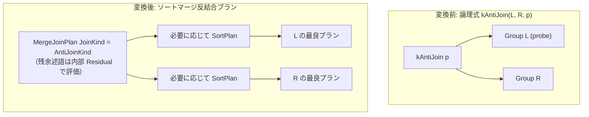

# anti_merge_join

- 状態: draft   /   執筆基準リビジョン: `3880673` (2026-09-12)
- 定義位置: `plan/implementation_rules.cpp` の `DefaultImplementationRules()` 内の
  登録 `"anti_merge_join"`（パターン: `cascades::dsl::AntiJoin()`、共有ヘルパー `MergeJoinAlternative` に委譲）

## 概要

論理式 `kAntiJoin`（右側入力に一致する行が存在しない左側の行のみを出力する反結合）を、キー順に整列された入力を走査する `MergeJoinPlan`（`AntiJoinKind` 付き）へと具現化する Rule です。

ハッシュ結合とは異なり、結合述語に含まれる非等値の残余述語（residual predicate）を結合ノード内部でペアリング時に直接評価できる特性を持ちます。

## 変換前後の関係



## 適用条件

パターンは `AntiJoin()` です。行位置要求を検査した上で、共有ヘルパー `MergeJoinAlternative` を呼び出します。

```cpp
if (children.size() != 2 || required.require_row_position) {
  return std::vector<PlanAlternative>{};
}
return MergeJoinAlternative(
    memo, logical.children[1], logical.predicate, children[0],
    children[1], context, JoinAlternativeKind::kAnti);
```

発火条件として、少なくとも 1 組の等値結合キー対が存在することに加え、残余述語が存在する場合はサブクエリを含まないことが求められます。

```cpp
// Non-inner merge joins carry the residual inside the plan node so the
// executor can apply it while pairing (outer NULL-padding and semi/anti
// matching respect it). Inner keeps the plain merge + Selection shape.
Expression merge_residual;
if (kind != JoinAlternativeKind::kInner && !residual_conjuncts.empty()) {
  if (std::ranges::any_of(residual_conjuncts, [](const Expression& conjunct) {
        return ResidualContainsQuery(conjunct);
      })) {
    return {};
  }
  merge_residual = CombineConjuncts(residual_conjuncts);
  residual_conjuncts.clear();
}
```

## 意味論的根拠と残余述語の内部評価

反結合における合致判定は「当該の左行に対して、結合述語を真にする右行が 1 件でも存在するか」です。

ハッシュ反結合ではビルド側属性が出力スキーマから即座に破棄されるため、ビルド側を参照する残余述語を照合後に評価することが原理的に不可能です。これに対し、マージ結合は両入力のタプルを走査・照合しているその瞬間にペア単位で残余述語を評価できるため、ノード内部の `Residual` として安全に組み込むことが可能です。

ただし、マージエグゼキュータは残余式を単純な AST 評価器で実行するため、残余述語にサブクエリが含まれている場合は評価器の境界を超えてしまうため、`ResidualContainsQuery` ガードにより明示的に排除します。

## 実装の詳細

推定出力行数は、反結合の特性上、保守的な安全上界として左側の行数 `l_rows` を採用します。

```cpp
if (kind == JoinAlternativeKind::kAnti) {
  estimated_rows = left.estimated_rows;
} else if (kind == JoinAlternativeKind::kSemi) {
  estimated_rows = std::min(left.estimated_rows, estimated_rows);
}
```

プラン構築時には `MergeJoinPlan` に対し、結合種別として `AntiJoinKind()`、残余述語として `merge_residual` を引き渡します。局所コストは両入力の走査コストに、ソート順が不足している場合に挿入される `SortPlan` のソートコストを加算した値となります。

## 最適化効果

両入力がすでにインデックス等によって結合キー順に整列されている場合、追加のメモリ確保を行わずに $O(|L| + |R|)$ のストリーミング走査で反結合が完結します。

さらに、ハッシュ反結合では受け入れられない非等値残余述語を含む反結合クエリに対しても、適切な物理実行計画を提供します。

## 関連 Rule との相互作用

- `anti_hash_join`: 等値キーのみからなる反結合に対する競合ルールです。入力が未ソートの場合はハッシュ反結合が優先されます。
- `semi_merge_join`: セミ結合における同様のマージ結合実装です。
- `except_to_antijoin`: `EXCEPT` 演算を反結合へと変換する論理ルールです。

## 検証テスト

- `plan/plan_test.cpp` の `PlanTest.MergeSemiAndAntiJoinPlansExposeProbeSchema`: 生成された `MergeJoinPlan` が `AntiJoinKind` を保持し、プローブ側のスキーマ幅のみを正しく公開することを確認しています。
