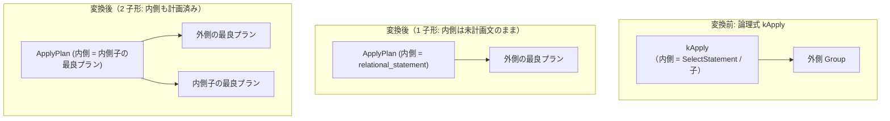

# apply

- 状態: draft   /   執筆基準リビジョン: `3880673` (2026-09-12)
- 定義位置: `plan/implementation_rules.cpp` の `DefaultImplementationRules()` 内の
  登録 `"apply"`（パターン: `Pattern::Op(kApply, {})`）

## 概要

論理式 `kApply`（相関サブクエリにおいて外側の 1 行ごとに入力パラメータを束縛して内側を実行する入れ子ループ演算）を、物理プラン `ApplyPlan` へと具現化する Rule です。

デコリレーション論理ルール（`apply_to_join` や `decorrelate_aggregate_apply` など）によって通常の結合へ解消されなかった残余の相関式に対し、実行系として正しく動作する標準的な物理フォールバックを提供します。

## 変換前後の関係



## 適用条件

パターンは `Pattern::Op(LogicalOperator::kApply, {})` であり、子の個数を限定しない任意項数マッチとして定義されています。ラムダ式内部で項数に応じた分岐を行います。

```cpp
if (children.empty()) {
  return std::vector<PlanAlternative>{};
}
auto kind = static_cast<JoinKind>(logical.join_type);
Expression predicate =
    logical.predicate ? *logical.predicate : nullptr;
Plan plan;
if (children.size() == 1) {
  plan = std::make_shared<ApplyPlan>(
      children[0].plan, logical.relational_statement, logical.table,
      std::move(predicate), kind, logical.output_schema);
} else if (children.size() == 2) {
  plan = std::make_shared<ApplyPlan>(
      children[0].plan, children[1].plan,
      logical.relational_statement, logical.table,
      std::move(predicate), kind, logical.output_schema);
} else {
  return std::vector<PlanAlternative>{};
}
```

- 子が 0 個または 3 個以上の場合は変換を拒否します。
- **1 子形**: 内側のサブクエリがオプティマイザのメモ上で計画されておらず、未計画の `SelectStatement` として保持されている場合。実行時に内側のパイプラインを動的に構築します。
- **2 子形**: 内側のサブクエリもメモ上で計画されており、内側の子 Group の最良物理プランを直接保持して反復実行します。

## 意味論的根拠と相関実行の正当性

相関サブクエリは本質的に外側のタプル値に依存して内側の結果が変化します。外側の列参照が存在するまま誤って通常の結合（ハッシュ結合など）へ変換してしまうと、外側列の束縛が失われてクエリ結果が破壊されます。

デコリレーションルール群は相関を完全に独立した結合述語に落とし込める場合にのみ発火するため、解消不能な複雑な相関関係が残った場合には、本 Rule による入れ子ループ実行が唯一の意味論的に正当な実行形態となります。

また、物理プロパティの伝播に関して、Cascades エンジンは 1 子形の `kApply` に対して親からの要求プロパティを透過させ、2 子形に対しては子の順序要求を消去する規律を持っています。

## 実装の詳細

コストおよび推定行数の算出は以下のとおりです。

```cpp
const double rows = children[0].estimated_rows * 10.0;
return std::vector<PlanAlternative>{
    PlanAlternative{.plan = std::move(plan),
                    .local_cost = children[0].estimated_rows * 2.0,
                    .estimated_rows = rows}};
```

- **局所コスト**: `children[0].estimated_rows * 2.0`。外側の 1 行ごとに内側の実行を開始する基本オーバーヘッドを定式化しています。
- **推定出力行数**: `children[0].estimated_rows * 10.0`。内側サブクエリによる行数膨張を保守的に見積もる係数として 10 倍を設定しています。

1 子形の `ApplyPlan` は、実行時において `ApplyPlan::EmitExecutor` により `SelectStatement` からサブパイプラインを起動します。この際、外側の同一パラメータに対するサブクエリ評価結果をキャッシュする相関キャッシュ機構が働き、冗長な再計算を防止します。

## 最適化効果

デコリレーション不能な難解な相関サブクエリに対しても、クエリコンパイルを破綻させることなく安定して物理実行可能なプランを提供します。

さらに、相関キャッシュの存在により、外側行に重複キーが多い場合には実行時の計算量が大幅に低減されます。

## 関連 Rule との相互作用

- `apply_to_join` / `decorrelate_aggregate_apply`: `kApply` を可能な限り結合へとデコリレーションする論理ルール群です。これらが適用できなかった相関が本 Rule に到達します。
- `push_selection_through_apply`: Apply ノードの上位にある述語を下位へ押し込みます。

## 検証テスト

- `plan/cascades_test.cpp` の `CascadesTest.ApplyToJoinDecorrelation` / `CascadesTest.DecorrelateAggregateApply`: 相関クエリの生成とデコリレーションの挙動検証。
- `executor/executor_test.cpp` の `ExecutorTest.RelationalCorrelatedDerivedSubqueryUsesApplyCache`: 相関サブクエリ実行時における Apply キャッシュの動作検証。
