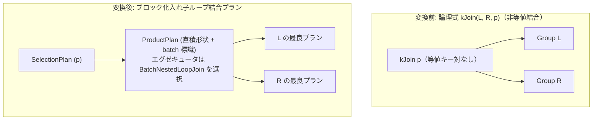

# batch_nested_loop

- 状態: draft   /   執筆基準リビジョン: `3880673` (2026-09-12)
- 定義位置: `plan/implementation_rules.cpp` の `DefaultImplementationRules()` 内の
  登録 `"batch_nested_loop"`（パターン: `Join()`、共有ヘルパー `BatchNestedLoopFor` に委譲）

## 概要

論理式 `kJoin`（内部結合）のうち等値結合キー対を持たない非等値結合を対象とし、結合述語全体を保持する直積形式の `ProductPlan` にブロック化実行標識 `PreferBatchNestedLoop()` を付与して具現化する Rule です。

タプル単位の入れ子ループ結合（`nested_loop_join`）と同一のプラン形状・同一コスト・同一の推定行数を返却するためコスト比較では同点となりますが、ルール登録順序により通常はタプル版が選ばれる検証済みフォールバックとして位置付けられています。

## 変換前後の関係



## 適用条件

パターンは `Join()`（2 つの子を持つ `kJoin`）です。ラムダ式内部で行位置要求を検査した上で、共有ビルダ `BatchNestedLoopFor` を呼び出します。

```cpp
if (children.size() != 2 || required.require_row_position) {
  return std::vector<PlanAlternative>{};
}
return BatchNestedLoopFor(logical.predicate, children[0], children[1],
                          std::nullopt,
                          /*wrap_selection=*/true);
```

`BatchNestedLoopFor` の内部では、以下の 2 つのゲート条件を課します。

1. **結合述語の存在**:
   ```cpp
   if (!condition.has_value() || !*condition) {
     return {};
   }
   ```
2. **等値結合キー対の不在**:
   ```cpp
   if (HasEquiColumnPair(predicate, left.plan, right.plan)) {
     return {};
   }
   ```

`HasEquiColumnPair` は、左右両辺の属性を跨ぐ等値比較（`=` または `IS NOT DISTINCT FROM`）が 1 組でも存在する場合に真となります。したがって、等値結合が可能なケースでは本 Rule は一切発火しません。

## 意味論的根拠とブロック化実行の境界

本ファミリ全体のゲート条件（等値キー対の不在）は、以下の理由に基づいています。

```cpp
// Shared builder for the batch_nested_loop family: a cross-shaped
// ProductPlan carrying the full predicate, marked for the blocked executor.
// The gate (usable predicate, no equi pair) keeps hash/merge shapes — and
// single-key equi NOT IN, the only source of null-aware anti joins — out of
// reach, so the rule only fires where hash/merge offer nothing:
// - inner: ties the tuple nested_loop_join exactly (same shape, cost and
//   estimate); the tuple rule is registered first and wins ties, so
//   existing plans are unchanged and the blocked form is a tested fallback.
```

等値キーが存在する結合は、ハッシュ結合やマージ結合が担当すべき領域であり、それらの方が計算量および I/O の観点で圧倒的に優れています。

また、単一キー等値の `NOT IN` は三値論理の短絡評価を必要とする `NullAwareAntiJoinKind` を生成しますが、ブロック化エグゼキュータはこの短絡論理をサポートしていません。等値キー対の存在をゲートで弾くことにより、null-aware anti 結合がブロック化エグゼキュータに誤って割り当てられる危険を原理的に排除しています。

## 実装の詳細

プランの構築は `ProductPlan` に対する設定として行われます。

```cpp
Plan join = std::make_shared<ProductPlan>(left.plan, right.plan);
std::static_pointer_cast<ProductPlan>(join)->SetJoinNotes({}, predicate);
std::static_pointer_cast<ProductPlan>(join)->PreferBatchNestedLoop();

if (wrap_selection) {
  join = std::make_shared<SelectionPlan>(join, predicate, join->GetStats());
  estimated_rows = l_rows * r_rows;
}
return {PlanAlternative{.plan = std::move(join),
                        .local_cost = (l_rows * r_rows) + l_rows + r_rows,
                        .estimated_rows = estimated_rows}};
```

物理エグゼキュータへの具現化時（`ProductPlan::EmitExecutor`）において、`batch_nested_loop_` フラグが有効であれば、タプル単位のループではなく `BatchNestedLoopJoin` エグゼキュータがインスタンス化されます。

`BatchNestedLoopJoin` は、外側のリレーションをメモリブロックにバッファリングし、内側リレーションをバッチ走査することで内側の再読み込み回数を劇的に低減します。

## 最適化効果

非等値結合に対するブロック化アルゴリズムの適用パスを確保します。

標準のルールセットではタプル版 `nested_loop_join` とコストが拮抗して登録順序によりタプル版が採用されますが、タプル版を明示的に無効化した際や、ブロック化実行が有利な状況において安定して利用可能な代替手段を提供します。

## 関連 Rule との相互作用

- `nested_loop_join`: 同一の結合形状をタプル駆動で実装するルールであり、登録順序の優位性によりデフォルトで勝利します。
- `hash_join` / `merge_join`: 等値キー対を持つ通常の内部結合を担当するルール群です。本 Rule とは適用領域が相互排他です。
- `batch_nested_loop_semi` / `batch_nested_loop_anti` / `batch_nested_loop_outer`: 同一のビルダを共有する兄弟ルール群であり、タプル版が存在しないセミ/アンチ/外部結合において新規の物理実行能力を提供します。

## 検証テスト

- `plan/optimizer_test.cpp` の `OptimizerTest.BatchNestedLoopExecutesNonEquiInnerJoin`: タプル版を無効化した際に `BatchNestedLoopJoin` が正しく選択され、同一の結合結果を出力することの確認。
- `plan/optimizer_test.cpp` の `OptimizerTest.BatchNestedLoopGateKeepsEquiJoins`: 等値結合に対してはゲートが働き、ブロック化入れ子ループが誤って適用されないことの検証。
