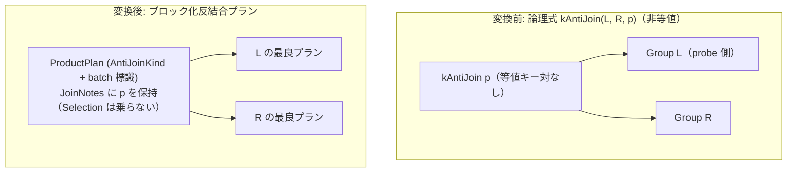

# batch_nested_loop_anti

- 状態: draft   /   執筆基準リビジョン: `3880673` (2026-09-12)
- 定義位置: `plan/implementation_rules.cpp` の `DefaultImplementationRules()` 内の登録 `"batch_nested_loop_anti"`（パターンは `cascades::dsl::AntiJoin()`、共有ヘルパー `BatchNestedLoopFor(..., AntiJoinKind(), /*wrap_selection=*/false)` に委譲）

## 概要

論理式 `kAntiJoin` のうち等値キー対を持たない非等値反結合を、probe 側スキーマに射影する `ProductPlan`（`AntiJoinKind` およびブロック化実行標識 `PreferBatchNestedLoop()` を保持）として具現化する Rule です。

非等値反結合はハッシュ結合やマージ結合で代替できず、タプル単位の入れ子ループ結合実装も存在しないため、本 Rule が唯一のコストベース実行代替を提供します。単一キー等値の `NOT IN` 由来の null-aware anti 結合はゲート条件で確実に排除され、三値論理の不整合を未然に防ぎます。

## 変換前後の関係



変換後プランの上位には `SelectionPlan` は配置されません。エグゼキュータがペアごとに述語 $p$ を評価し、右辺に一致行が存在しなかった probe 側の行のみを出力します。

## 適用条件

パターンは `AntiJoin()`（2 つの子を持つ `kAntiJoin`）です。登録ラムダ式では行位置要求の有無を検査し、共有ビルダ `BatchNestedLoopFor` へ処理を委譲します。

```cpp
if (children.size() != 2 || required.require_row_position) {
  return std::vector<PlanAlternative>{};
}
return BatchNestedLoopFor(logical.predicate, children[0], children[1],
                          AntiJoinKind(),
                          /*wrap_selection=*/false);
```

共有ビルダ `BatchNestedLoopFor` では、以下の 3 つのゲート条件を課します。

1. **述語の存在**:
   ```cpp
   if (!condition.has_value() || !*condition) {
     return {};
   }
   ```
2. **定数 FALSE / NULL の除外**:
   ```cpp
   if (!wrap_selection && predicate->Type() == TypeTag::kConstantValue) {
     const Value constant = predicate->AsConstantValue().GetValue();
     if (constant.IsNull() || !constant.Truthy()) {
       return {};
     }
   }
   ```
3. **等値結合キー対の不在**:
   ```cpp
   if (HasEquiColumnPair(predicate, left.plan, right.plan)) {
     return {};
   }
   ```

本 Rule が発火しない条件は、「子の数が 2 以外」「行位置要求（`require_row_position`）が存在する」「結合述語が存在しない」「述語が定数 `FALSE` または `NULL`」「左右の属性を跨ぐ等値キー対が 1 組以上存在する」のいずれかに該当する場合です。

## 意味論的根拠と三値論理・短絡評価の境界

非等値反結合における最大のリスクは、NULL を含む三値論理（SQL の `NOT IN` 意味論）を通常の非等値ループで誤って評価することです。

SQL の `x NOT IN (SELECT y FROM ...)` は、右辺に 1 つでも NULL が存在し、かつ左辺の $x$ が右辺のどの非 NULL 値とも一致しない場合、全体が `UNKNOWN` となり結果セットは 0 行にならなければなりません（null-aware anti 結合）。tinylamb において null-aware anti 結合が生じる経路は単一列の等値比較に基づく `NOT IN` サブクエリに限定されており、この形式は必ず等値キー対を含みます。したがって、本 Rule の「等値キー対が存在しない」というゲート条件により、null-aware anti 結合がブロック化エグゼキュータに渡ることは原理的に排除されます。

```cpp
// The gate (usable predicate, no equi pair) keeps hash/merge shapes — and
// single-key equi NOT IN, the only source of null-aware anti joins — out of
// reach, so the rule only fires where hash/merge offer nothing:
```

エグゼキュータ側の具現化処理（`executor/relational_factory.cpp`）でも、この前提がアサーションによって二重に防御されています。

```cpp
if (residual_note_ && (IsSemiJoinKind(kind_) || IsAntiJoinKind(kind_))) {
  CHECK_MSG(!IsNullAwareAntiJoinKind(kind_),
            "ProductPlan: residual predicate on null-aware anti join");
}
```

また、上位に `SelectionPlan` を配置しない理由は、反結合の射影契約にあります。`BatchNestedLoopJoin` エグゼキュータは行の照合と同時に「未マッチの左行のみを出力し、スキーマを probe 側に縮退させる」処理を行います。もしこの上に述語 $p$ を持つ `SelectionPlan` を重ねると、未マッチ行（述語 $p$ を満たすペアが存在しなかった行）が選択条件によってすべて除去されてしまい、意味論が破壊されます。

定数述語に関しては、`ON FALSE` または `ON NULL` の場合は全 probe 行が出力対象となるか論理簡約で解決されるため、入れ子ループ探索からは除外されます。

## 実装の詳細

反結合のプラン生成は、`ProductPlan` の `JoinKind` に `AntiJoinKind()` を渡すことで行われます。

```cpp
} else if (IsSemiJoinKind(*kind) || IsAntiJoinKind(*kind)) {
  join = std::make_shared<ProductPlan>(left.plan, std::vector<ColumnName>{},
                                       right.plan, std::vector<ColumnName>{},
                                       HashJoinMode::kInMemory, *kind);
```

キー列が空の直積形状ですが、結合種別として `AntiJoinKind()` を保持します。述語は `ProductPlan` の注釈（`SetJoinNotes`）として記録され、ブロック化標識が付与されます。

```cpp
std::static_pointer_cast<ProductPlan>(join)->SetJoinNotes({}, predicate);
std::static_pointer_cast<ProductPlan>(join)->PreferBatchNestedLoop();

return {PlanAlternative{.plan = std::move(join),
                        .local_cost = (l_rows * r_rows) + l_rows + r_rows,
                        .estimated_rows = estimated_rows}};
```

`wrap_selection` が `false` であるため、推定行数は `join->EmitRowCount()`（probe 側の行数）がそのまま採用されます。

物理エグゼキュータ具現化時、`ProductPlan` は `BatchNestedLoopJoin` を生成します。エグゼキュータは probe 側のバッチブロックをメモリに保持し、build 側の全タプルと総当たり比較を行い、一度も一致しなかった probe 行のみを後続へ放出します。

## 最適化効果

等値比較を持たない非等値反結合（不等号比較や複雑な式を含む反結合）に対して、実行可能な物理実行パスを供給します。

計算量は $O(|L| \times |R|)$ ですが、probe 側をブロック単位でバッファリングすることにより、内側リレーションのイテレータ走査オーバヘッドをタプル単位のループに比べて抑制します。等値キー対を持つ反結合は `anti_hash_join` や `anti_merge_join` が担当するため、探索空間の重複や競合は発生しません。

## 関連 Rule との相互作用

- `anti_hash_join` / `anti_merge_join`: 等値キー対を持つ反結合を担当する物理実装 Rule です。等値キー対の有無により本 Rule と適用領域が厳密に排他分離されます。
- `batch_nested_loop_semi`: 同一のビルダ関数 `BatchNestedLoopFor` を共有する対称的な Rule です。`SemiJoinKind` を指定して結合結果を probe 側に畳み込みます。
- `outer_to_anti_join` / `except_to_antijoin`: 論理反結合演算子 `kAntiJoin` を生成する論理 Rule であり、本 Rule に探索対象の入力を供給します。
- `mark_hash_join`: MARK 結合演算子を担当する実装 Rule です。

## 検証テスト

- `plan/optimizer_test.cpp` の `OptimizerTest.BatchNestedLoopCoversNonEquiSemiAntiAndFullJoin`: 非等値反結合が `AntiJoinKind` かつ `PrefersBatchNestedLoop()` を持つ `ProductPlan` に変換され、`BatchNestedLoopJoin` エグゼキュータによって正しい行数が出力されることを検証。
- `executor/executor_extra_test.cpp` の `BatchNestedLoopJoinTest.PredicateErrorPropagatesForAntiJoin`: 反結合実行時における述語評価中の例外やエラーが正しく上位へ伝播することを検証。
