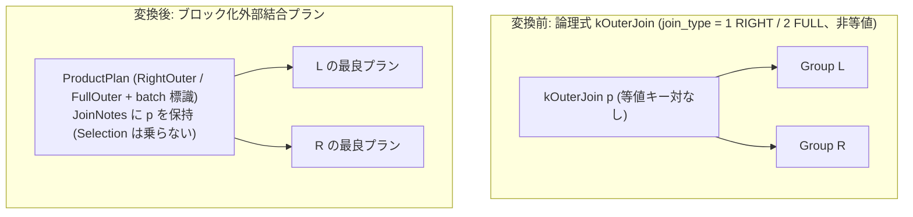

# batch_nested_loop_outer

- 状態: draft   /   執筆基準リビジョン: `3880673` (2026-09-12)
- 定義位置: `plan/implementation_rules.cpp` の `DefaultImplementationRules()` 内の登録 `"batch_nested_loop_outer"`（パターンは `cascades::dsl::OuterJoin()`、`join_type` が 1 (RIGHT) または 2 (FULL) に限定、共有ヘルパー `BatchNestedLoopFor(..., kind, /*wrap_selection=*/false)` に委譲）

## 概要

論理式 `kOuterJoin` のうち RIGHT 外部結合（`join_type = 1`）および FULL 外部結合（`join_type = 2`）の非等値結合を対象とし、結合述語全体を保持する `ProductPlan`（`RightOuterJoinKind` または `FullOuterJoinKind` およびブロック化標識 `PreferBatchNestedLoop()` を保持）として具現化する Rule です。

LEFT 外部結合はタプル単位の `outer_nested_loop` が担当するため、本 Rule では対象から除外して重複登録によるコスト同点を回避しています。非等値の RIGHT / FULL 外部結合に対して、関係代数フォールバックに頼らないコストベースの物理実行パスを確立します。

## 変換前後の関係



変換後プランの上位には `SelectionPlan` は配置されません。エグゼキュータがペアごとに述語 $p$ を評価し、一致しなかった行に対して右側または両側の NULL パディングを結合ノード内部で直接実行します。

## 適用条件

パターンは `OuterJoin()`（2 つの子を持つ `kOuterJoin`）です。`LeftOuterJoin()` と異なりパターン側にペイロード制約を持たないため、`join_type` の検証は登録ラムダ式のガード条件で行います。

```cpp
if (children.size() != 2 || required.require_row_position ||
    logical.operation != c::LogicalOperator::kOuterJoin ||
    (logical.join_type != 1 && logical.join_type != 2) ||
    !logical.predicate || !*logical.predicate) {
  return std::vector<PlanAlternative>{};
}
const JoinKind kind = logical.join_type == 1 ? RightOuterJoinKind()
                                             : FullOuterJoinKind();
return BatchNestedLoopFor(logical.predicate, children[0], children[1],
                          kind,
                          /*wrap_selection=*/false);
```

`join_type` の数値規約は `plan/cascades.hpp` で定義されており、`0 = LEFT`, `1 = RIGHT`, `2 = FULL` です。

共有ビルダ `BatchNestedLoopFor`（`wrap_selection = false`）では、さらに以下のゲート条件が適用されます。

```cpp
if (!wrap_selection && predicate->Type() == TypeTag::kConstantValue) {
  const Value constant = predicate->AsConstantValue().GetValue();
  if (constant.IsNull() || !constant.Truthy()) {
    return {};
  }
}
if (HasEquiColumnPair(predicate, left.plan, right.plan)) {
  return {};
}
```

本 Rule が発火しない条件は、「子の数が 2 以外」「行位置要求が存在する」「演算子が `kOuterJoin` でない」「LEFT 外部結合（`join_type = 0`）である」「結合述語が存在しない」「述語が定数 `FALSE` または `NULL`」「左右を跨ぐ等値キー対が存在する」のいずれかに該当する場合です。

## 意味論的根拠と物理実行の契約

本 Rule の適用条件およびプラン構造は、外部結合の意味論的整合性を保持するために厳密に統制されています。

第一に、LEFT 外部結合を意図的に除外している点です。非等値の LEFT 外部結合を本 Rule でも受容すると、同一の形状・同一のコストを持つ代替案が `outer_nested_loop`（タプル版）と本 Rule の間で重複生成され、探索空間が無駄に消費されます。LEFT は既存の `outer_nested_loop` に委ね、タプル版が存在しない RIGHT および FULL 外部結合のみを本 Rule が引き受けることで、明確な責務分担を実現しています。

```cpp
// batch_nested_loop family: non-equi joins for the blocked executor.
// ... LEFT stays with outer_nested_loop to avoid a second tie;
```

第二に、結合ノードの上位に `SelectionPlan` を配置しない契約です。外部結合の本質は「述語を満たさない不一致行をドロップせず、NULL 拡張して残す」ことにあります。もし結合ノードの上位に述語 $p$ を持つ `SelectionPlan` を配置すると、結合ノード内でせっかく NULL パディングされた不一致行が選択述語によってすべて除去され、外部結合が実質的に内部結合へと退行してしまいます。

第三に、エグゼキュータ側の実行保証です。非等値の残余述語を持つ RIGHT / FULL 直積形状を正しく実行できるのは `BatchNestedLoopJoin` エグゼキュータのみです。`relational_factory.cpp` では、この契約が厳密にチェックされます。

```cpp
// Full/right-outer residuals have no tuple nested-loop
// implementation; the blocked executor null-pads unmatched rows on
// either side. Only the batch_nested_loop rule constructs this
// shape, so any other kind here is still a planner bug.
```

## 実装の詳細

RIGHT / FULL 外部結合のプラン構築は、キー列を持たない `ProductPlan` に対し、対応する `JoinKind` を渡してインスタンス化することで行われます。

```cpp
} else {
  join = std::make_shared<ProductPlan>(left.plan, right.plan, *kind);
}
```

述語 $p$ は `SetJoinNotes` を通じて `ProductPlan` の注釈として保持され、ブロック化標識が付与されます。

```cpp
std::static_pointer_cast<ProductPlan>(join)->SetJoinNotes({}, predicate);
std::static_pointer_cast<ProductPlan>(join)->PreferBatchNestedLoop();

return {PlanAlternative{.plan = std::move(join),
                        .local_cost = (l_rows * r_rows) + l_rows + r_rows,
                        .estimated_rows = estimated_rows}};
```

`wrap_selection` が `false` であるため、推定行数は `join->EmitRowCount()` の値がそのまま使われます。

物理エグゼキュータ `BatchNestedLoopJoin` は、外側ブロックの各行に対して内側リレーションを走査しながら述語を評価します。RIGHT 外部結合では内側（右側）の未マッチ行を追跡して NULL 拡張出力し、FULL 外部結合では両側の未マッチ行を追跡してそれぞれの側を NULL 拡張出力します。

## 最適化効果

非等値述語を持つ RIGHT 外部結合および FULL 外部結合に対して、第一級の物理実行代替を提供します。

従来は関係代数フォールバックに頼らざるを得なかった非等値外部結合をコストベース最適化の探索空間に正しく組み入れ、ブロック化による I/O 効率化を享受させることができます。等値結合キー対を持つ場合は `outer_hash_join` が担当するため、ハッシュ結合が適用可能なケースを妨げることはありません。

## 関連 Rule との相互作用

- `outer_nested_loop`: 非等値 LEFT 外部結合を担当する物理実装 Rule です。本 Rule とは `join_type` の値によって排他的に分担します。
- `outer_hash_join`: 等値キー対を持つ外部結合を担当する物理実装 Rule です。ゲート条件によって適用領域が分離されます。
- `right_to_left_outer_join`: RIGHT 外部結合を LEFT 外部結合に正規化する論理 Rule です。正規化が先行した場合は `outer_nested_loop` 側へ処理が誘導されます。
- `batch_nested_loop` / `batch_nested_loop_semi` / `batch_nested_loop_anti`: 同一のビルダ関数を共有するブロック化結合ファミリの兄弟 Rule 群です。

## 検証テスト

- `plan/optimizer_test.cpp` の `OptimizerTest.OuterJoinSliceFullNonEquiJoinUsesBatchNestedLoop`: 非等値 FULL 外部結合が `BatchNestedLoopJoin` として計画され、一致行（4,950 行）および両側の未一致パディング行が正しく出力されることを検証。
- `plan/optimizer_test.cpp` の `OptimizerTest.BatchNestedLoopCoversNonEquiSemiAntiAndFullJoin`: FULL 外部結合が `FullOuterJoinKind` かつ `PrefersBatchNestedLoop()` を持つ `ProductPlan` として具現化されることを検証。
- `executor/executor_extra_test.cpp` の `BatchNestedLoopJoinTest.RightOuterEmitsUnmatchedRightRows`: RIGHT 外部結合において未マッチの右側タプルが正しく NULL 拡張されて出力されることを検証。
