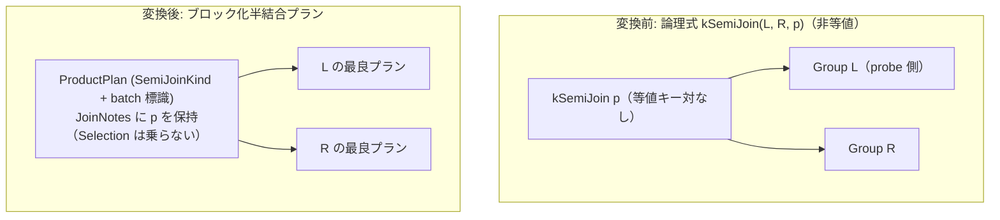

# batch_nested_loop_semi

- 状態: draft   /   執筆基準リビジョン: `3880673` (2026-09-12)
- 定義位置: `plan/implementation_rules.cpp` の `DefaultImplementationRules()` 内の登録 `"batch_nested_loop_semi"`（パターンは `cascades::dsl::SemiJoin()`、共有ヘルパー `BatchNestedLoopFor(..., SemiJoinKind(), /*wrap_selection=*/false)` に委譲）

## 概要

論理式 `kSemiJoin` のうち等値キー対を持たない非等値半結合を、probe 側スキーマに射影する `ProductPlan`（`SemiJoinKind` およびブロック化実行標識 `PreferBatchNestedLoop()` を保持）として具現化する Rule です。

半結合にはタプル単位の入れ子ループ結合実装が存在しないため、従来は関係代数フォールバックに依存していた非等値半結合に対して、コストベース探索に参加可能な第一級の物理実行代替を提供します。

## 変換前後の関係



変換後プランの上位には `SelectionPlan` は配置されません。エグゼキュータがペアごとに述語 $p$ を評価し、右辺と一致した probe 側の行のみを出力します。

## 適用条件

パターンは `SemiJoin()`（2 つの子を持つ `kSemiJoin`）です。登録ラムダ式では行位置要求の有無を検査し、共有ビルダ `BatchNestedLoopFor` を呼び出します。

```cpp
if (children.size() != 2 || required.require_row_position) {
  return std::vector<PlanAlternative>{};
}
return BatchNestedLoopFor(logical.predicate, children[0], children[1],
                          SemiJoinKind(),
                          /*wrap_selection=*/false);
```

共有ビルダ `BatchNestedLoopFor` では、以下の 3 つのゲート条件を適用します。

1. **述語の存在**:
   ```cpp
   if (!condition.has_value() || !*condition) {
     return {};
   }
   ```
2. **定数 FALSE / NULL の除外**:
   ```cpp
   if (!wrap_selection && predicate->Type() == TypeTag::kConstantValue) {
     const Value constant = predicate->AsConstantValue().GetValue();
     if (constant.IsNull() || !constant.Truthy()) {
       return {};
     }
   }
   ```
3. **等値結合キー対の不在**:
   ```cpp
   if (HasEquiColumnPair(predicate, left.plan, right.plan)) {
     return {};
   }
   ```

本 Rule が発火しない条件は、「子の数が 2 以外」「行位置要求が存在する」「結合述語が存在しない」「述語が定数 `FALSE` または `NULL`」「左右を跨ぐ等値キー対が 1 組以上存在する」のいずれかに該当する場合です。`ON TRUE` についてはブロック化エグゼキュータが正しく処理可能なため除外されません。

## 意味論的根拠と物理実行の契約

半結合の実行セマンティクスとプラン構造の整合性において、以下の 2 点が厳密に契約されています。

第一に、結合ノードの上位に `SelectionPlan` を配置しない設計です。半結合の出力スキーマは probe（左）側リレーションと同一であり、右側リレーションの属性は保持されません。また、エグゼキュータは「右辺に一致する行が 1 つでも見つかった左側タプルを一度だけ出力する」という集約・縮退処理を結合ノード内部で完結させます。この出力に対して上位で再度結合述語 $p$ を評価することは、スキーマ上右辺属性が欠落しているため不可能なだけでなく、多重度保存の観点からも破綻します。

```cpp
// Semi/anti/outer carry no Selection wrapper: the executor null-pads
// unmatched rows (outer) and reduces to the probe side (semi/anti) while
// pairing, and a Selection above would filter those rows back out.
```

第二に、定数述語のゲート処理です。述語が定数 `FALSE` または `NULL` である場合、半結合の結果は常に 0 行（空集合）となります。これは論理最適化層（`join_empty_simplification` など）で短絡されるべき形状であり、高コストな入れ子ループ物理プランを生成して探索空間を浪費することを防ぎます。一方、述語が定数 `TRUE` の場合、右辺が 1 行以上存在すれば全左行が出力され、右辺が 0 行なら 0 行となるという正しい半結合セマンティクスをブロック化エグゼキュータが処理できるため、発火を許容します。

等値キー対の不在ゲートにより、ハッシュ半結合（`semi_hash_join`）やマージ半結合（`semi_merge_join`）が適用可能な形状が確実に除外され、効率的なアルゴリズムとの競合が回避されます。

## 実装の詳細

半結合プランの生成は、キー列を持たない `ProductPlan` に対し `SemiJoinKind` を指定してインスタンス化することで行われます。

```cpp
} else if (IsSemiJoinKind(*kind) || IsAntiJoinKind(*kind)) {
  join = std::make_shared<ProductPlan>(left.plan, std::vector<ColumnName>{},
                                       right.plan, std::vector<ColumnName>{},
                                       HashJoinMode::kInMemory, *kind);
```

直積ノードの注釈として述語を渡し、ブロック化標識を設定します。

```cpp
std::static_pointer_cast<ProductPlan>(join)->SetJoinNotes({}, predicate);
std::static_pointer_cast<ProductPlan>(join)->PreferBatchNestedLoop();

const double l_rows = left.estimated_rows;
const double r_rows = right.estimated_rows;
auto estimated_rows = static_cast<double>(join->EmitRowCount());

return {PlanAlternative{.plan = std::move(join),
                        .local_cost = (l_rows * r_rows) + l_rows + r_rows,
                        .estimated_rows = estimated_rows}};
```

`wrap_selection` は `false` であるため、推定行数は `join->EmitRowCount()`（左側リレーションの行数）が設定されます。

実行時、`executor/relational_factory.cpp` において `SemiJoinKind` を持つ残余述語付き直積プランは `BatchNestedLoopJoin` エグゼキュータに降ろされます。エグゼキュータは左側ブロックの各行について右側全走査を行い、最初に条件を満たした時点で該当左行を出力して次の左行へ進むことで、重複出力のない正確な半結合を実行します。

## 最適化効果

等値キーを持たない非等値半結合に対して、コストベース探索に参加可能な物理実行プランを供給します。

計算量は $O(|L| \times |R|)$ の総当たり評価となりますが、ブロック化アルゴリズムにより内側リレーションの走査回数を削減します。等値キー対が存在する場合は `semi_hash_join` や `semi_merge_join` が優先されるため、探索の重複を生じさせずに最適化器の対応領域を拡張します。

## 関連 Rule との相互作用

- `semi_hash_join` / `semi_merge_join`: 等値キー対を持つ半結合を担当する物理実装 Rule です。ゲート条件によって適用領域が排他的に分離されます。
- `batch_nested_loop`: 同一のビルダ関数を共有する内部結合版 Rule です。タプル版との同点でフォールバックとなりますが、半結合にはタプル版が存在しないため本 Rule が主たる実行手段となります。
- `batch_nested_loop_anti`: 同一のビルダ関数を共有する反結合版 Rule です。
- `unique_semi_to_inner` / `semijoin_to_inner_plus_distinct` / `in_list_to_semi_join`: 半結合を導入・変換する論理 Rule 群であり、本 Rule への入力を生成します。

## 検証テスト

- `plan/optimizer_test.cpp` の `OptimizerTest.BatchNestedLoopCoversNonEquiSemiAntiAndFullJoin`: 非等値半結合が `SemiJoinKind` かつ `PrefersBatchNestedLoop()` を持つ `ProductPlan` に変換され、`BatchNestedLoopJoin` により 99 行の正しい結果が出力されることを検証。
