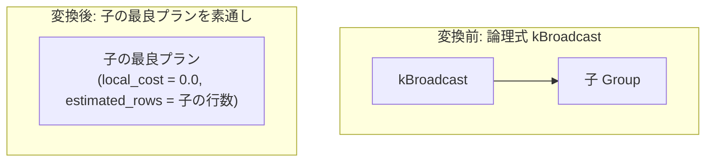

# broadcast_noop

- 状態: draft   /   執筆基準リビジョン: `3880673` (2026-09-12)
- 定義位置: `plan/implementation_rules.cpp` の `DefaultImplementationRules()` 内の登録 `"broadcast_noop"`（パターンは `cascades::dsl::Broadcast()`、実装は共有ラムダ `exchange_passthrough` に委譲）

## 概要

論理式 `kBroadcast`（特定リレーションを全実行ノードへブロードキャスト複製する分散演算子）を、子プランをそのまま透過させる物理代替として具現化する Rule です。

tinylamb は単一ノード型 DBMS であり、物理的なノード間ネットワーク転送が存在しません。そのため、本 Rule はコスト 0 かつ行数不変のプレースホルダ（no-op）として子プランをそのまま上位へ引き渡し、将来の分散実行拡張に向けた探索空間の完全性を保証します。

## 変換前後の関係



変換後の物理プランにおいて新しい物理演算子ノードは生成されず、子 Group の最良プランがそのまま返却されます。

## 適用条件

パターンは `Broadcast()`（子を 1 つ持つ `kBroadcast`）です。実装ラムダ `exchange_passthrough` では、子の個数および対象演算子種別を検査します。

```cpp
if (children.size() != 1) {
  return std::vector<PlanAlternative>{};
}
```

ラムダ内部の switch 文において、`kBroadcast` は `kExchange`、`kGather`、`kRedistribute` と並ぶ有効な演算子として受理されます。

発火しない条件は、子の数が 1 でない場合、または対象演算子が上記 4 種のいずれでもない場合です。

## 意味論的根拠と物理実行の契約

ブロードキャスト演算の本質は、分散環境において「小さい側のリレーションをクラスタ内の全ワーカーノードへ複製し、ローカル結合を成立させる」ことにあります。

単一ノード環境においては、すべてのデータが単一のアドレス空間に存在するため、ノード間複製を行う必要性が物理的に存在しません。したがって、データを一切変更せずにそのまま通過させることが、単一ノードにおける正確かつ最小コストの物理表現となります。

```cpp
// exchange_passthrough: with one node every distribution is already
// satisfied; pass through child plans at zero local cost.
```

もしこの実装 Rule が存在しない場合、論理プラン中に `kBroadcast` が導入された際に該当 Group に物理代替が 1 つも生成されず、メモ探索エンジンにおいて親 Group の計画が失敗（最良プランなし）してしまいます。本 Rule は探索の到達可能性を維持する重要なアンカーとしての責務を担っています。

また、`RequiredChildProperties` の規約において、親から要求された順序性（`ordering`）や行位置要求（`require_row_position`）は子プランへそのまま伝播します。子プランが順序要件を満たしていれば、本 Rule を経由した後もその物理特性は完全に保存されます。

## 実装の詳細

実装は分散 no-op ファミリ 4 種で共有されるラムダ式 `exchange_passthrough` によって行われます。

```cpp
return std::vector<PlanAlternative>{
    PlanAlternative{.plan = children[0].plan,
                    .local_cost = 0.0,
                    .estimated_rows = children[0].estimated_rows}};
```

- `plan`: 子プラン（`children[0].plan`）をそのまま返却します。
- `local_cost`: 0.0（ノード内での処理コストは発生しない）。
- `estimated_rows`: 子プランの推定行数をそのまま維持します。

新たな物理プランノードの割り当てやメモリコピーは一切発生しません。

## 最適化効果

分散向け演算子 `kBroadcast` を含む論理表現に対して、追加コストなし（`local_cost = 0.0`）で単一ノード用の物理実行計画を確定させます。

親ノードへの行数伝播やコスト計算を阻害せず、子プランが持つ順序特性を損なうことなくクエリ全体の最適化を完了させることができます。

## 関連 Rule との相互作用

- `exchange_noop` / `gather_noop` / `redistribute_noop`: 同一の実装ラムダ `exchange_passthrough` を共有する分散プレースホルダ Rule 群です。
- `PhysicalProperties::distribution`: 分散要求を表現する物理プロパティです。将来的にクラスタ環境が導入された際には、この要求を満たす真の分散ブロードキャスト物理演算子と競合することになります。

## 検証テスト

- `plan/cascades_test.cpp` の `CascadesTest.ExchangeNoopPassesChildThrough`: 同一の共有ラムダを用いる代表テストとして、子プランがコスト 0 でそのまま素通しされる動作を検証。
