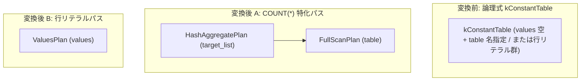

# constant_table

- 状態: draft   /   執筆基準リビジョン: `3880673` (2026-09-12)
- 定義位置: `plan/implementation_rules.cpp` の `DefaultImplementationRules()` 内の登録 `"constant_table"`（パターンは `cascades::dsl::ConstantTable()`）

## 概要

論理式 `kConstantTable`（定数テーブル葉）を物理プランとして具現化する Rule です。

行リテラル群を保持する一般的な定数テーブルを `ValuesPlan` に変換するパスと、`count_star_without_group_rewrite` によって生成された `COUNT(*)` 特化の定数テーブルを「実テーブルのフルスキャン + ハッシュ集約」に具現化するパスの 2 つを持ちます。`COUNT(*)` 形式においてカタログ統計から静的に値を確定させるのではなく、トランザクション可視の実テーブルを走査して正しく行数を計数する点が意味論的保証の核心です。

## 変換前後の関係



変換前が `values` を持たず対象テーブル名を持つ場合は A のプラン木を、それ以外の場合は B の単一 `ValuesPlan` を生成します。

## 適用条件

パターンは `ConstantTable()`（子を持たない葉ノード）です。登録ラムダ式では行位置要求の有無を検査した上で、2 つの内部形状に分岐します。

```cpp
// Row cells (M4 materialized CTEs included) carry no row positions.
if (required.require_row_position) {
  return std::vector<PlanAlternative>{};
}

if (logical.values.empty() && !logical.table.empty()) {
  // COUNT(*) 特化パス
} else {
  // 行リテラルパス
}
```

発火しない条件は、「行位置要求（`require_row_position`）が存在する場合」、あるいは A のパスにおいて「カタログに対象テーブルまたはその統計情報が存在しない場合」です。

## 意味論的根拠とトランザクション可視性・一貫性

本 Rule の設計において最も重要な論点は、A のパスにおける「カタログ統計の即値マテリアライズ禁止」という規律です。

論理最適化層の `count_star_without_group_rewrite` は、`SELECT COUNT(*) FROM t` のような単純集約を Memo 上で扱いやすくするために `kConstantTable` 葉ノードへと変換します。このとき、オプティマイザが「カタログ統計の `statistics->Rows()` をそのまま 1 行の定数値として返却する」物理プランを作ってしまうと、直近のトランザクションによる未コミットの INSERT / DELETE や、統計更新前の変更が反映されず、トランザクション分離レベルおよび ACID 特性を根本から破壊します。

```cpp
// COUNT(*) is rewritten to this leaf for optimizer purposes, but
// its result must still be computed from the transaction-visible
// table.  Catalog statistics are estimates and become stale after
// INSERT/DELETE, so materializing the count from them is wrong.
```

したがって、物理具現化においては必ず実テーブルに対する `FullScanPlan` を構築し、実行器（エグゼキュータ）が現在のトランザクションから可視であるタプルを 1 パス走査して計数するプランを強制します。

B のパス（行リテラル）に関しては、メモリ上に保持された定数値タプルをそのまま出力するため、行位置要求を持たないこと（定数セルには物理ページ内の行位置が存在しない）のみが整合性の条件となります。

## 実装の詳細

A のパス（`COUNT(*)` 特化）では、カタログコンテキストからテーブルと統計情報を取得し、スキャンとハッシュ集約を連結します。

```cpp
const auto table = context.tables.find(logical.table);
const auto statistics = context.statistics.find(logical.table);
if (table == context.tables.end() ||
    statistics == context.statistics.end()) {
  return std::vector<PlanAlternative>{};
}
Plan scan = std::make_shared<FullScanPlan>(*table->second,
                                           *statistics->second);
Plan aggregate = std::make_shared<HashAggregatePlan>(
    std::move(scan), logical.target_list);
return std::vector<PlanAlternative>{PlanAlternative{
    .plan = std::move(aggregate),
    .local_cost = static_cast<double>(statistics->second->Rows()),
    .estimated_rows = 1.0}};
```

- コストは全タプルを 1 パス走査する費用として `statistics->second->Rows()` を計上します。
- `estimated_rows` は集約結果であるため `1.0` を返します。
- 生成される `FullScanPlan` は LIMIT 沈め込み等を行わない標準の 2 引数スキャンです。

B のパス（行リテラル）では、`ValuesPlan` を直接インスタンス化します。

```cpp
Plan values = std::make_shared<ValuesPlan>(logical.output_schema,
                                           logical.values);
const auto rows = static_cast<double>(logical.values.size());
return std::vector<PlanAlternative>{
    PlanAlternative{.plan = std::move(values),
                    .local_cost = rows,
                    .estimated_rows = rows}};
```

## 最適化効果

`COUNT(*)` クエリに対して、通常の汎用集約実装（ハッシュ集約・ソート集約・ストリーミング集約の全探索）を経由することなく、特化した物理実行プランを決定論的に供給します。

行リテラルに対しては、スキャンやテーブルアクセスを伴わないインメモリの最小実行単位（`ValuesPlan`）を割り当て、探索を即座に収束させます。

## 関連 Rule との相互作用

- `count_star_without_group_rewrite`: `COUNT(*)` 集約を `kConstantTable` へ書き換える論理 Rule であり、本 Rule の A のパスへの入力を供給します。
- `aggregation`: 通常の集約を担当する物理実装 Rule です。インデックスが存在する場合は、`index_scan` によるインデックスオンリースキャンを経由した集約が本 Rule のフルスキャンよりも低コストと評価されて採用されることがあります。
- `values`: `kValues` 論理演算子を `ValuesPlan` に具現化する兄弟実装 Rule です。

## 検証テスト

- `plan/cascades_test.cpp` の `CascadesTest.CountStarWithoutGroupRewriteToConstantTable`: 単純 COUNT(*) が `kConstantTable` 葉として Memo に登録されることを検証。
- `plan/cascades_test.cpp` の `CascadesTest.ConstantTableAndGenerateSeriesAreLeafOperators`: `kConstantTable` が子を持たない葉ノードとして正しく機能することを検証。
